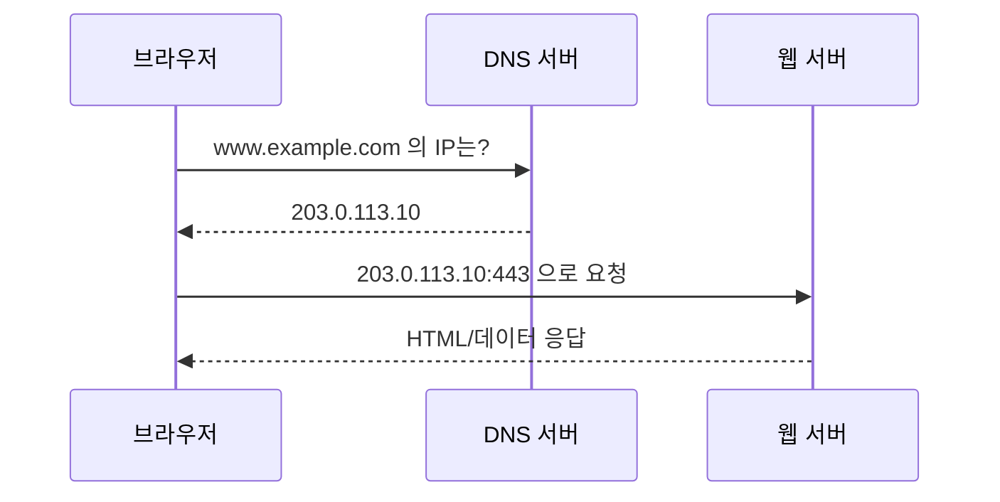

# 10장. 서버와 네트워크의 연결 이해

## 이 장에서 말하고자 하는 것

우리는 서버가 무엇인지 배웠다.  
그렇다면 이제 질문이 생긴다.

> 사용자의 요청은 어떻게 그 서버까지 도달하는가?

이 장은  
서버와 사용자를 연결하는 네트워크의 기본 원리를 이해하는 장이다.

---

## 1. 우리는 어떻게 서버에 접속하는가

사용자가 브라우저를 열고  
어떤 웹사이트에 접속한다고 가정해보자.

우리는 보통 이렇게 입력한다.

```
www.example.com
```

엔터를 누르면 화면이 나타난다.

하지만 실제로는 다음과 같은 과정이 발생한다.

1. 내 컴퓨터가 서버의 위치를 알아낸다.
2. 그 위치로 데이터를 보낸다.
3. 서버가 응답을 다시 보낸다.

이 과정을 가능하게 하는 것이 네트워크다.

---

## 2. 네트워크란 무엇인가

네트워크는

> 컴퓨터와 컴퓨터를 연결하는 구조

다.

인터넷은 전 세계의 수많은 네트워크가 연결된 거대한 구조다.

우리가 웹사이트에 접속한다는 것은  
내 컴퓨터가 인터넷을 통해  
어딘가에 있는 서버와 통신한다는 의미다.

---

## 3. 서버의 위치는 어떻게 알까 — IP 주소

서버와 통신하려면  
서버의 “위치”를 알아야 한다.

이 위치 정보가 IP 주소다.

IP 주소는

> 네트워크 안에서 장치를 구분하는 주소

다.

예:

* 203.0.113.10
* 142.250.206.78

택배를 보내려면 주소가 필요하듯,  
데이터를 보내려면 IP 주소가 필요하다.

---

## 4. 그런데 우리는 왜 IP를 입력하지 않을까 — DNS

우리는 숫자(IP) 대신 도메인을 입력한다.

```
www.google.com
```

DNS(Domain Name System)는

> 사람이 기억하기 쉬운 도메인 이름을  
> 컴퓨터가 통신 가능한 IP 주소로 변환해주는 시스템

이다.

### DNS 흐름 다이어그램



요약하면:

도메인 입력 → DNS 조회 → IP 확인 → 서버 연결

---

## 5. 모든 IP가 인터넷에 공개되어 있을까

IP에는 두 종류가 있다.

이걸 이해하기 위해 전화번호로 비유해보자.

- **공인 IP** → 일반 전화번호. 누구든 그 번호로 전화를 걸 수 있다.
- **사설 IP** → 회사 내선번호. 회사 안에서만 통하고, 외부에서는 그 번호로 전화할 수 없다.

---

### 1) 공인 IP

인터넷 전체에서 유일한 주소다.

외부 어디서든 이 IP로 직접 접근할 수 있기 때문에  
웹 서버처럼 외부에 공개해야 하는 서버에 사용한다.

예: `1.2.3.4`

---

### 2) 사설 IP

내부 네트워크 안에서만 쓰이는 주소다.

외부에서는 이 IP로 직접 접근할 수 없기 때문에  
DB 서버처럼 외부에 노출되면 안 되는 시스템에 사용한다.

예: `192.168.0.10`

---

### 그러면 같은 IP를 공인으로도 쓰고 사설로도 쓰는 건가?

아니다.

사설 IP로 쓸 수 있는 범위는 처음부터 정해져 있다.  
아래 범위에 해당하면 무조건 사설 IP다.

- `10.0.0.0` ~ `10.255.255.255`
- `172.16.0.0` ~ `172.31.255.255`
- `192.168.0.0` ~ `192.168.255.255`

집에서 공유기에 연결했을 때  
`192.168.0.x` 같은 IP를 본 적이 있을 거다.

그게 바로 사설 IP다.
이 범위의 IP는 인터넷에서 직접 사용할 수 없다.

즉,

> 공인과 사설은 내가 고르는 게 아니라  
> IP 주소 자체가 어느 범위에 속하느냐로 이미 정해져 있는 것이다.

---

## 6. 사설 IP 서버가 외부와 통신해야 하는 경우 — NAT

앞에서 사설 IP는 외부에서 직접 접근할 수 없다고 했다.

그러면 이런 의문이 든다.

> 사설 IP를 쓰는 서버는 인터넷이 아예 안 되는 건가?

결론부터 말하면, 그렇지 않다.

---

### 사설 IP 서버도 외부와 통신이 필요한 순간이 있다

생각보다 흔한 상황이다.

- 결제/문자/인증 같은 **외부 API를 호출**해야 할 때
- 서버의 **OS나 패키지를 업데이트**해야 할 때
- 도커 이미지 같은 것을 **외부에서 내려받아야** 할 때

이런 경우, 사설 IP 그대로는 인터넷에 요청을 보낼 수 없다.

그래서 등장하는 것이 **NAT(Network Address Translation)** 다.

---

### NAT는 뭘 하는 건가

쉽게 말하면,

> 내부 사설 IP를 외부 공인 IP로 바꿔치기해서  
> 인터넷과 통신할 수 있게 해주는 기술이다.

회사 내선번호로는 외부에 전화를 걸 수 없지만,  
회사 대표번호를 통해 나가면 외부 통화가 가능한 것과 같다.

예를 들어:

- 내부 서버 IP: `10.0.0.5` (사설)
- 외부로 나갈 때: `1.2.3.4` (공인)로 변환되어 통신

---

### 그래서 NAT가 주는 이점은?

내부 서버는 필요할 때 인터넷을 사용할 수 있으면서도,  
외부에서 직접 들어오는 접근은 기본적으로 차단된다.

즉, **나가는 건 되지만 들어오는 건 안 되는 구조**다.

이게 바로 사설 IP + NAT 조합이  
보안 측면에서 많이 쓰이는 이유다.

---

## 7. IP만 알면 서버에 접속할 수 있을까?

서버의 IP를 알면 그 서버까지는 찾아갈 수 있다.

하지만 한 가지 문제가 있다.

---

### 서버 안에는 여러 서비스가 동시에 돌아갈 수 있다

예를 들어 하나의 서버에서 이런 것들이 동시에 실행되고 있다고 해보자.

- 웹사이트를 보여주는 서비스
- 관리자가 원격으로 접속하는 서비스
- 데이터를 저장하고 꺼내는 데이터베이스

IP는 하나인데, 서비스는 여러 개다.

그러면 자연스럽게 이런 의문이 든다.

> 같은 IP로 들어왔는데,  
> 이 요청이 웹사이트를 보려는 건지,  
> 원격 접속을 하려는 건지,  
> 데이터베이스에 접근하려는 건지  
> 서버는 어떻게 구분할까?

---

### 그래서 포트(Port)가 존재한다

앞에서 IP를 택배 주소에 비유했다.

택배 주소로 건물까지는 찾을 수 있지만,  
그 건물 안에 카페도 있고 사무실도 있고 병원도 있다면  
몇 호로 가야 하는지도 알아야 한다.

> **IP = 건물까지의 주소**  
> **포트 = 건물 안의 호수**

서버도 마찬가지다.  
같은 IP라도 포트 번호에 따라 다른 서비스로 연결된다.

대표적인 포트 번호:

| 포트 번호 | 서비스 | 쉽게 말하면 |
|-----------|--------|-------------|
| 80 | HTTP | 일반 웹사이트 |
| 443 | HTTPS | 보안 웹사이트 |
| 22 | SSH | 원격 접속 |
| 3306 | MySQL | 데이터베이스 |

그래서 실제로 브라우저가 웹사이트에 접속할 때는  
IP만 쓰는 게 아니라 포트까지 포함해서 요청을 보낸다.

예: `1.2.3.4:443` → 이 서버의 보안 웹사이트 서비스로 연결해줘

다만 브라우저가 443 같은 기본 포트는 자동으로 붙여주기 때문에  
우리가 직접 입력할 일은 거의 없다.

---

## 8. 전체 흐름 다시 정리

웹사이트 접속 과정은 다음과 같다.

1. 도메인 입력
2. DNS가 IP 반환
3. 브라우저가 IP의 특정 포트로 요청 전송
4. 서버가 응답 반환

이 모든 과정은 네트워크 규칙 위에서 동작한다.

---

## 9. 이 장의 핵심 정리

1. 서버와 사용자는 네트워크로 연결된다.
2. 서버의 위치는 IP 주소로 식별된다.
3. 우리는 도메인을 입력하지만 실제 통신은 IP로 이루어진다.
4. 공인 IP와 사설 IP는 이미 정해진 주소 대역이다.
5. NAT는 내부 IP를 외부 IP로 변환한다.
6. 포트는 하나의 서버 안에서 서비스를 구분하는 번호다.

---

다음 장에서는
이 개념을 바탕으로
클라우드 안에서 나만의 네트워크를 만드는 방법,
VPC와 서브넷 구조를 살펴본다.
