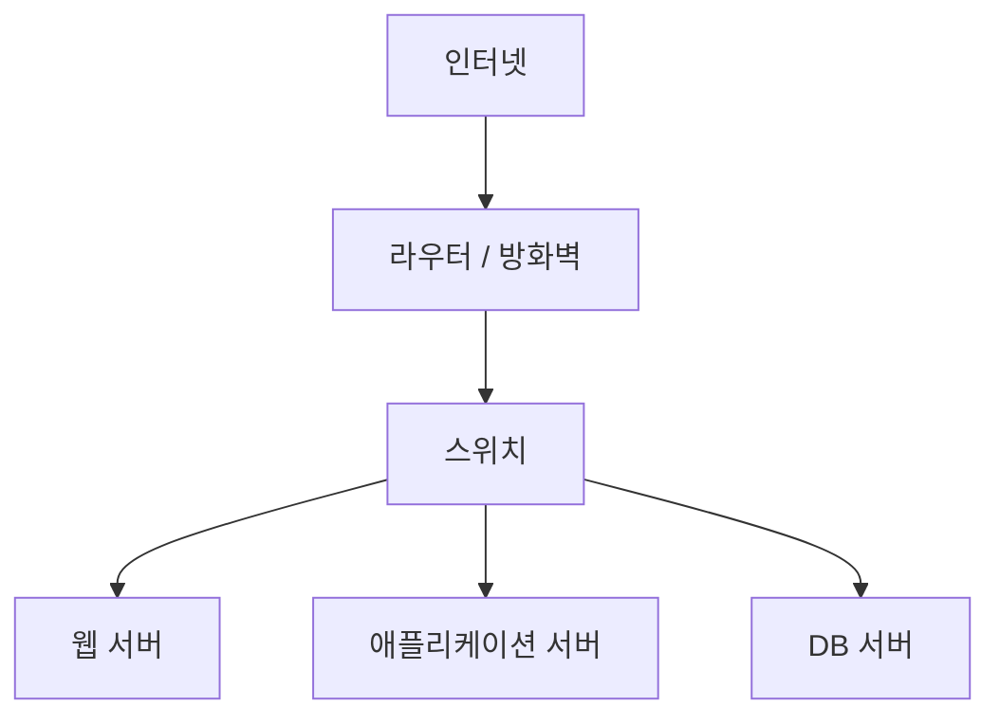
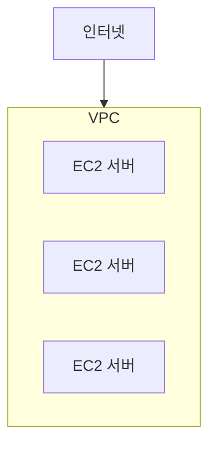
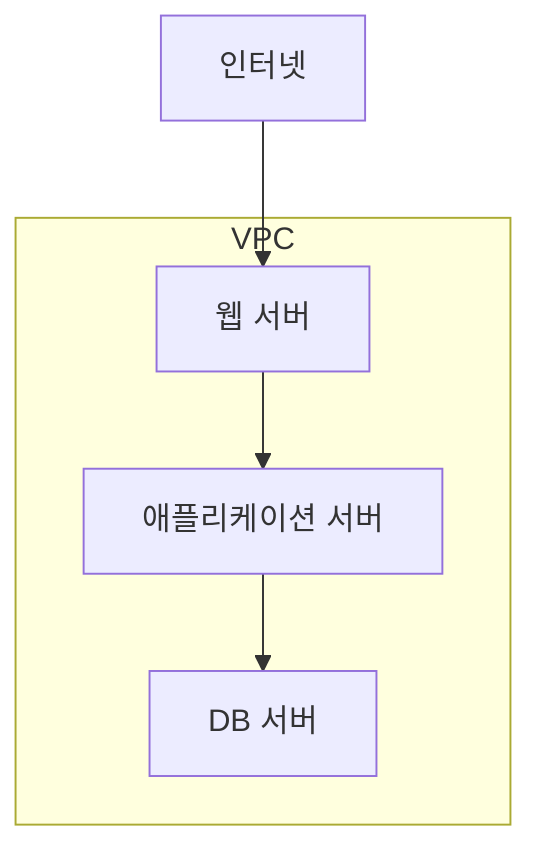

# 15장. 서버는 어디에 연결되는가

## 이 장에서 말하고자 하는 것

앞 장에서 우리는 **EC2 인스턴스**를 생성했다.

이제 서버는 준비되었다.

그렇다면 다음 질문이 생긴다.

> 이 서버는 인터넷 어디에 존재하는 걸까?

서버는 단순히  
**“클라우드 어딘가에 떠 있는 컴퓨터”** 가 아니다.

모든 서버는 반드시  
**어떤 네트워크 안에 연결되어 있어야 한다.**

이 장에서는

* 서버가 네트워크 안에서 어떻게 배치되는지
* AWS에서 이 네트워크가 어떻게 구성되는지

를 이해한다.

---

# 1. 서버는 반드시 네트워크 안에 있어야 한다

서버는 혼자 존재할 수 없다.

왜냐하면 서버의 목적은  
**다른 시스템과 통신하는 것**이기 때문이다.

예를 들어 웹 서비스는 보통 다음과 같이 동작한다.


1. 사용자가 서버에 요청을 보낸다
2. 서버는 데이터베이스에 데이터를 요청한다
3. 결과를 사용자에게 전달한다

이 모든 과정은  
**네트워크 연결이 있어야만 가능하다.**

즉,

> 모든 서버는 반드시 어떤 네트워크 안에 존재한다.

---

# 2. 온프레미스에서는 어떻게 네트워크를 만들까

먼저 우리가 익숙한 **온프레미스 환경**을 생각해보자.

보통 회사 내부 네트워크는 다음과 같은 구조를 가진다.



이 구조의 특징은 다음과 같다.

* 회사 내부에 **하나의 네트워크 공간**이 존재한다
* 서버들은 이 네트워크 안에 배치된다
* 일부 서버만 외부 인터넷과 연결된다

즉 서버는 항상

> **특정 네트워크 공간 안에 배치된다.**

---

# 3. 클라우드에서도 같은 문제가 발생한다

이제 클라우드 환경을 생각해보자.

AWS에는 수많은 회사들이 서버를 운영하고 있다.

만약 AWS가 모든 서버를  
**같은 네트워크에 연결한다면** 어떤 일이 발생할까?

* 다른 회사 서버와 충돌
* IP 주소 충돌
* 보안 문제

이 문제를 해결하기 위해 AWS는

> 고객마다 **독립된 네트워크 공간**을 제공한다.

이 네트워크가 바로 **VPC**다.

---

# 4. VPC란 무엇인가

VPC는 **Virtual Private Cloud**의 약자다.

간단히 말하면

> 클라우드 안에서 고객이 사용하는  
> **독립된 네트워크 공간**

이다.

개념적으로 보면 다음과 같다.



VPC 안에는 여러 서버를 배치할 수 있고  
이 서버들은 서로 통신할 수 있다.

그리고 중요한 점이 하나 있다.

> **EC2 인스턴스는 반드시 하나의 VPC 안에서 생성된다.**

즉 AWS에서 서버를 만들면  
항상 어떤 **네트워크 공간(VPC)** 안에 위치하게 된다.

---

# 5. VPC 안의 서버는 IP 주소를 가진다

네트워크에서는  
각 장비를 구별하기 위해 **IP 주소**를 사용한다.

예를 들어 다음과 같은 주소가 있다.

```
10.0.1.10
10.0.2.15
10.0.3.20
```

VPC 안에서 생성된 서버는  
이처럼 **하나의 IP 주소**를 할당받는다.

이 IP 주소를 이용해  
서버들은 서로 통신한다.

예를 들어


* 웹 서버 → 애플리케이션 서버
* 애플리케이션 서버 → 데이터베이스

이 모든 통신은  
**IP 주소를 기반으로 이루어진다.**

---

# 6. 모든 서버가 인터넷에 노출될 필요는 없다

대부분의 서비스는  
모든 서버가 인터넷에 연결될 필요가 없다.

예를 들어 다음 구조를 생각해보자.



이 구조에서

* 웹 서버 → 외부에서 접근 가능
* 애플리케이션 서버 → 내부 통신만 수행
* DB 서버 → 외부 접근 차단

이 방식은 대부분의 서비스에서 사용하는 구조다.

이렇게 하면

* 보안 강화
* 네트워크 분리
* 내부 시스템 보호

가 가능하다.

---

# 7. VPC는 사용할 IP 주소 범위를 가진다

VPC는 하나의 네트워크 공간이기 때문에  
**사용할 수 있는 IP 주소 범위**가 필요하다.

그래서 VPC를 생성할 때  
다음과 같은 범위를 지정한다.

```
10.0.0.0/16
```

이 범위 안에서  
각 서버에 IP 주소가 할당된다.

이 표기법을 **CIDR**이라고 부른다.

CIDR은 간단히 말하면

> 네트워크에서 사용할 **IP 주소 범위를 표현하는 방법**

이다.

이 개념은 다음 장에서  
조금 더 자세히 살펴본다.

---

# 8. 이 장의 핵심 정리

1. 모든 서버는 네트워크 안에서 동작한다.
2. 온프레미스에서는 회사 내부 네트워크를 사용한다.
3. AWS에서는 이 네트워크 역할을 **VPC**가 담당한다.
4. EC2는 반드시 VPC 안에서 생성된다.
5. VPC 안의 서버는 **IP 주소**를 가진다.
6. 일부 서버만 인터넷과 연결된다.
7. VPC는 사용할 **IP 주소 범위(CIDR)** 를 가진다.
