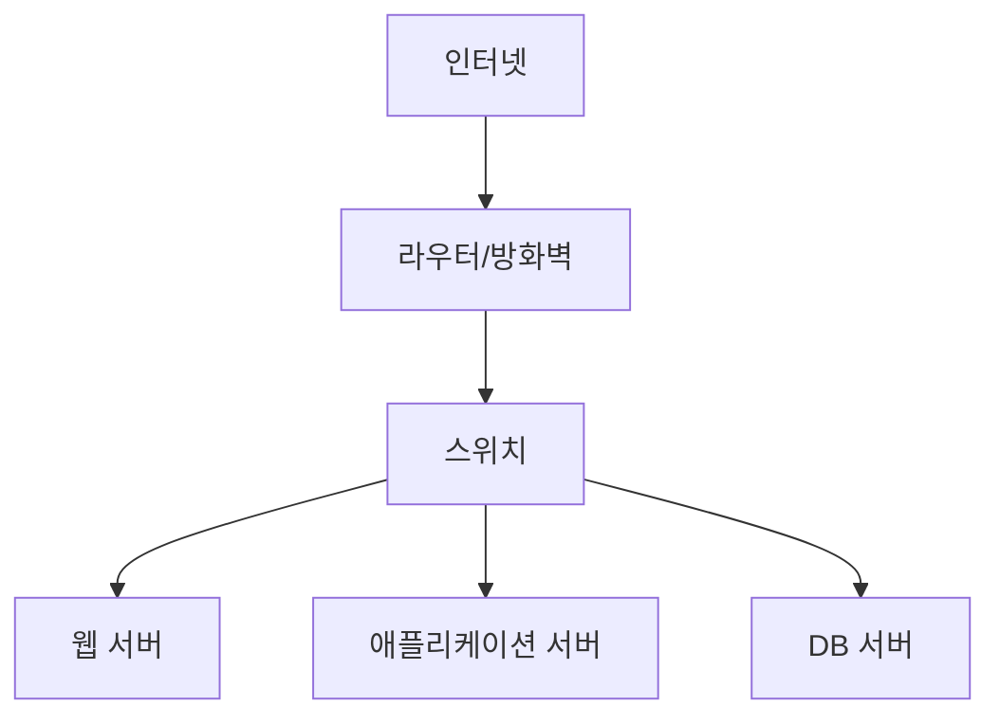
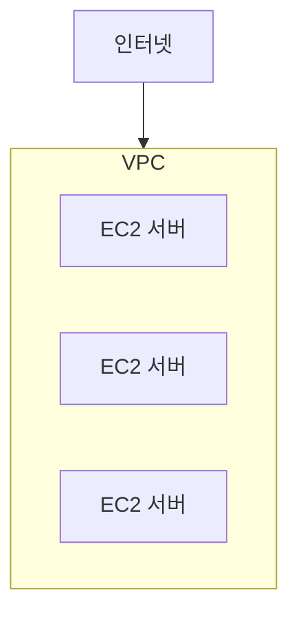
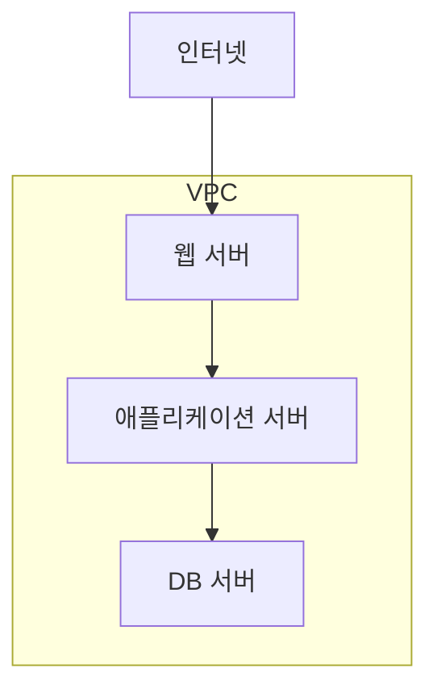

# 15장. 서버는 어디에 연결되는가

## 이 장에서 말하고자 하는 것

앞 장에서 우리는 EC2를 생성했다.

이제 서버는 준비되었다.

그렇다면 다음 질문이 생긴다.

> 이 서버는 인터넷 어디에 존재하는 걸까?

서버는 단순히 “클라우드 어딘가”에 떠 있는 것이 아니다.  
모든 서버는 반드시 **네트워크 안에 연결되어 있어야 한다.**

이 장에서는  
클라우드에서 서버가 어떤 네트워크 구조 안에서 동작하는지 이해한다.

---

## 1. 서버는 반드시 네트워크 안에 있어야 한다

서버는 혼자 존재할 수 없다.

왜냐하면 서버의 목적은  
다른 시스템과 통신하는 것이기 때문이다.

예를 들어 웹 서비스는 다음과 같이 동작한다.


사용자는 서버에 요청을 보내고  
서버는 데이터베이스와 통신한다.

이 모든 것은 **네트워크 연결**이 있어야 가능하다.

---

# 2. 온프레미스에서는 어떻게 네트워크를 만들까

온프레미스 환경을 생각해보자.

보통 회사 내부에는 다음과 같은 네트워크가 있다.



이 구조에서 특징은 다음과 같다.

* 회사 내부 네트워크가 존재한다.
* 내부 서버들은 사설 IP를 사용한다.
* 외부에서 접근 가능한 서버는 제한된다.

즉, 서버는 항상 **네트워크 공간 안에 배치된다.**

---

# 3. 클라우드에서도 같은 문제가 발생한다

이제 클라우드로 돌아가 보자.

AWS에는 수많은 고객이 존재한다.

만약 AWS가 모든 서버를  
같은 네트워크에 연결한다면 어떻게 될까?

* 다른 회사 서버와 충돌
* IP 주소 충돌
* 보안 문제 발생

이 문제를 해결하기 위해  
AWS는 고객마다 **독립된 네트워크 공간**을 제공한다.

이 네트워크가 바로 **VPC**다.

---

# 4. VPC란 무엇인가

VPC는 **Virtual Private Cloud**의 약자다.

VPC는 다음과 같이 이해할 수 있다.

> 클라우드 안에서 고객이 사용하는 독립된 네트워크 공간

즉,

* 다른 고객과 완전히 분리된 네트워크
* 내부 서버를 안전하게 배치할 수 있는 공간
* 외부 연결을 제어할 수 있는 구조

개념적으로 보면 다음과 같다.



EC2 인스턴스는  
반드시 하나의 VPC 안에 생성된다.

---

# 5. 왜 사설 IP가 등장하는가

VPC 안에 있는 서버들은  
인터넷에 바로 연결되는 것이 아니다.

먼저 **내부 네트워크에 배치된다.**

이때 사용되는 IP가  
**사설 IP 주소**다.

예를 들어:

```
10.0.1.10
10.0.2.15
10.0.3.20
```

이 주소는 인터넷에서 직접 접근할 수 없다.

이 구조 덕분에:

* 내부 서버 보호
* 네트워크 분리
* 보안 관리

가 가능해진다.

---

# 6. 그렇다면 외부에서 서버에 접근하려면?

웹 서비스는  
외부 사용자가 접속해야 한다.

따라서 일부 서버는  
인터넷과 연결되어야 한다.

이때 다음 구조가 만들어진다.



* 웹 서버 → 외부 접근 가능
* 애플리케이션 서버 → 내부 통신
* DB 서버 → 외부 차단

이 구조는 대부분의 서비스에서 사용된다.

---

# 7. VPC가 IP 범위를 가지는 이유

네트워크에는 항상  
사용할 수 있는 IP 주소 범위가 필요하다.

그래서 VPC를 만들 때  
다음과 같은 IP 범위를 지정한다.

```
10.0.0.0/16
```

이 범위 안에서  
각 서버에 IP가 할당된다.

이 표기법을 **CIDR**이라고 부른다.

CIDR은 단순히

> 네트워크에서 사용할 IP 주소 범위를 표현하는 방식

이다.

이 내용은 다음 장에서 조금 더 자세히 살펴본다.

---

# 8. 이 장의 핵심 정리

1. 모든 서버는 네트워크 안에서 동작한다.
2. 온프레미스에서는 회사 내부 네트워크를 사용한다.
3. 클라우드에서는 이 역할을 VPC가 수행한다.
4. VPC는 고객마다 독립된 네트워크 공간이다.
5. VPC 내부 서버는 사설 IP를 사용한다.
6. 일부 서버만 외부와 연결된다.