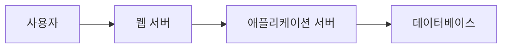
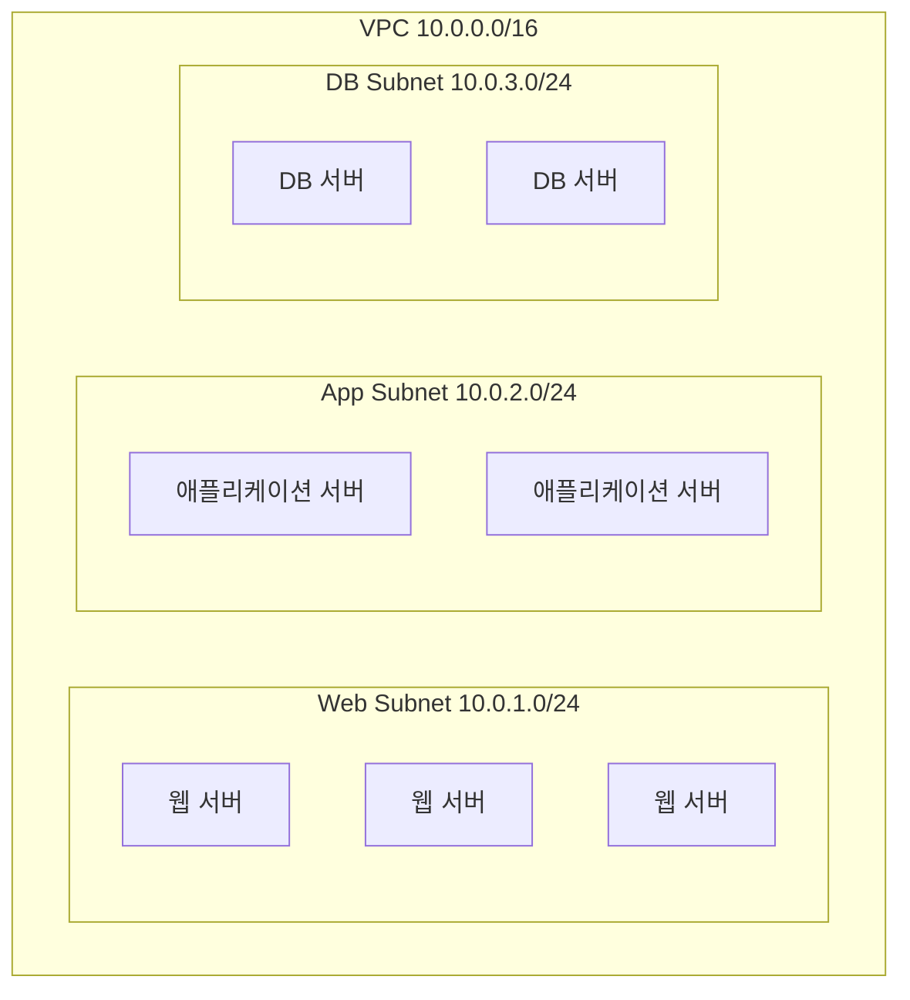
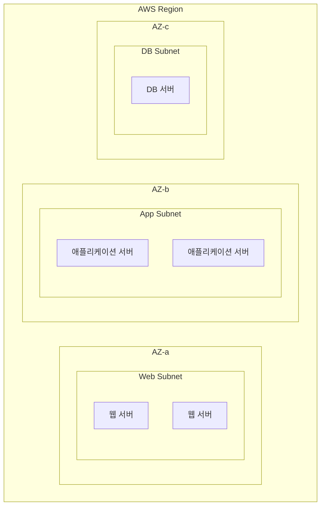

# 17장. 서브넷 (Subnet)

## 이 장에서 말하고자 하는 것

앞 장에서 우리는 VPC를 만들 때  
다음과 같은 **IP 주소 범위**를 지정하는 것을 보았다.

```
10.0.0.0/16
```

이 범위는 하나의 **큰 네트워크 공간**이다.

하지만 실제 서비스에서는  
이 네트워크를 그대로 사용하는 경우는 거의 없다.

보통 이 큰 네트워크를  
**여러 개의 작은 네트워크로 나누어 사용한다.**

이 장에서는

> 네트워크를 왜 나누는지  
> 그리고 그 구조가 무엇인지

를 이해한다.

---

## 1. 왜 네트워크를 나눌까

웹 서비스는 보통 여러 종류의 서버로 구성된다.



예를 들어 다음과 같은 서버들이 있다.

* 웹 서버
* 애플리케이션 서버
* 데이터베이스 서버

만약 이 모든 서버가  
같은 네트워크에 존재한다면

```
10.0.0.0/16
```

이 네트워크 안에 모든 서버가 섞이게 된다.

이렇게 되면

* 서버 역할을 구분하기 어렵고
* 네트워크 정책을 나누기 어렵고
* 관리가 복잡해진다.

그래서 보통 서버 역할에 따라  
**네트워크를 여러 개로 나누어 사용한다.**

---

## 2. 이렇게 나눈 네트워크를 서브넷이라고 한다

앞에서 살펴본 것처럼  
하나의 네트워크를 여러 개로 나누면  
구조를 훨씬 쉽게 관리할 수 있다.

이처럼

> 하나의 큰 네트워크를  
> 여러 개의 작은 네트워크로 나누는 것을

**서브넷 (Subnet)** 이라고 한다.

여기서 중요한 점은 다음이다.

> 서브넷은 서버 한 대를 위한 공간이 아니다  
> 여러 서버를 배치하기 위한 네트워크 공간이다

예를 들어

* 웹 서버들이 모여 있는 네트워크
* 애플리케이션 서버들이 모여 있는 네트워크
* 데이터베이스 서버들이 있는 네트워크

이 각각이 하나의 **서브넷**이 될 수 있다.

---

## 3. 서브넷 구조 예시

예를 들어 다음과 같은 VPC가 있다고 하자.

```
10.0.0.0/16
```

이 네트워크를 다음처럼 나눌 수 있다.

```
10.0.1.0/24
10.0.2.0/24
10.0.3.0/24
```

각 네트워크는 서로 다른 서버 그룹을 담을 수 있다.



이 구조에서 중요한 점은 다음이다.

* 서브넷 안에는 **여러 서버가 존재할 수 있다**
* 서버 역할에 따라 **네트워크를 나눌 수 있다**

---

## 4. AWS에서 서브넷과 AZ의 관계

AWS에서는 서브넷을 생성할 때  
**어느 AZ에 속할지** 함께 선택한다.

즉

```
서브넷 생성
→ AZ 선택
```

이 함께 이루어진다.

예를 들어 다음과 같은 구조가 가능하다.



이처럼 서로 다른 AZ에  
서브넷을 배치하면

* 장애 대응
* 서비스 안정성 향상

과 같은 효과를 얻을 수 있다.

---

## 5. 실무에서 많이 사용하는 서브넷 구조

실제 AWS 환경에서는  
다음과 같은 구조가 많이 사용된다.

```
10.0.0.0/16  ← VPC
```

이 네트워크를 다음과 같이 나눈다.

```
10.0.1.0/24  ← Web Subnet
10.0.2.0/24  ← App Subnet
10.0.3.0/24  ← DB Subnet
```

즉 대부분의 환경에서는

> **VPC는 크게 만들고 (/16)**  
> **서브넷을 /24 단위로 나누어 사용한다.**

이렇게 하면

* 네트워크 확장성이 좋아지고
* 구조를 이해하기 쉬워지고
* 관리가 쉬워진다.

---

## 6. 이 장의 핵심 정리

1. VPC는 하나의 큰 네트워크 공간이다.
2. 큰 네트워크는 여러 개의 작은 네트워크로 나눌 수 있다.
3. 이 작은 네트워크를 **서브넷(Subnet)** 이라고 한다.
4. 서브넷 안에는 여러 서버가 배치될 수 있다.
5. AWS에서는 서브넷 생성 시 **AZ를 선택한다.**
6. 보통 **/16 VPC → /24 서브넷** 구조를 많이 사용한다.
