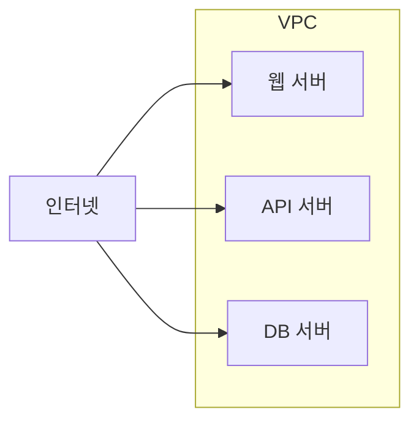
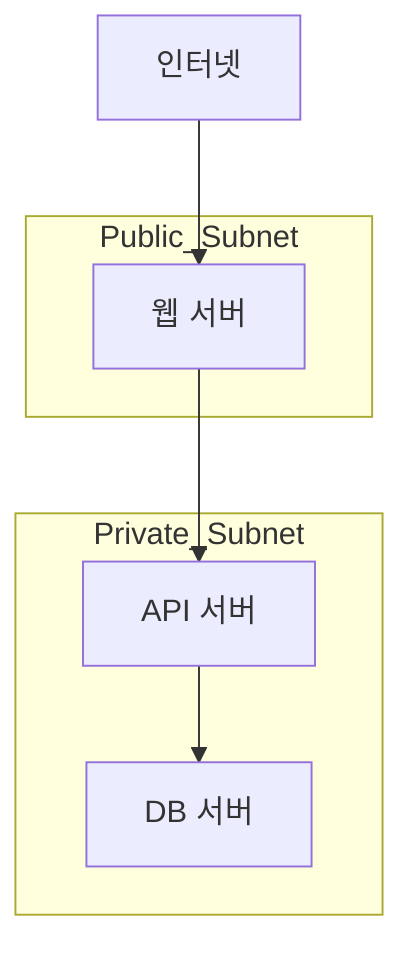
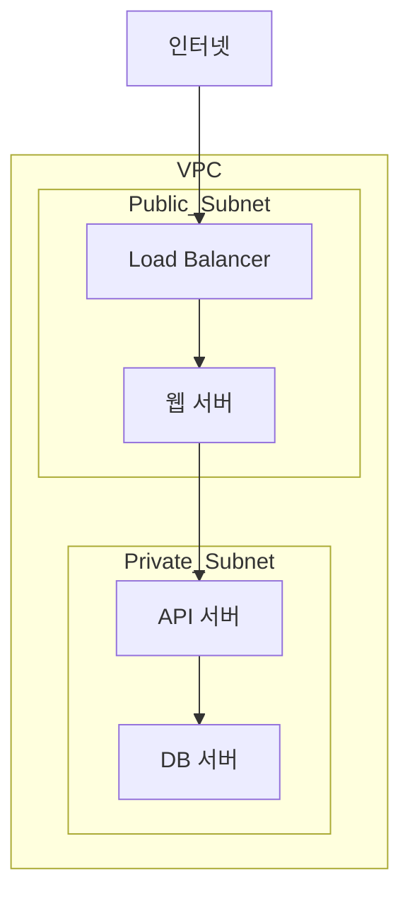

# 17장. 퍼블릭 서브넷과 프라이빗 서브넷

## 이 장에서 말하고자 하는 것

앞 장에서 우리는  
VPC 안의 네트워크를 **서브넷으로 나누는 방법**을 배웠다.

그렇다면 다음 질문이 생긴다.

> 서버는 어떤 서브넷에 배치해야 할까?

모든 서버를 인터넷에 직접 연결하는 것은  
보안상 매우 위험하다.

그래서 실제 서비스에서는  
서버의 역할에 따라 네트워크를 나누어 배치한다.

이때 사용하는 구조가

* 퍼블릭 서브넷
* 프라이빗 서브넷

이다.

---

## 1. 모든 서버를 인터넷에 연결하면 생기는 문제

예를 들어 다음과 같은 구조를 생각해보자.

이 구조에서는 모든 서버가  
인터넷에서 직접 접근 가능하다.

이 경우 다음과 같은 문제가 발생할 수 있다.

* 데이터베이스 서버가 외부 공격 대상이 될 수 있다.
* 내부 서비스가 외부에 노출될 수 있다.
* 보안 관리가 매우 어려워진다.

그래서 서버를 **외부 서버와 내부 서버로 구분한다.**

---

# 2. 서버 역할에 따른 네트워크 구조

대부분의 서비스는 다음과 같은 구조를 사용한다.

이 구조의 특징은 다음과 같다.

* 웹 서버만 인터넷과 직접 연결된다.
* 내부 서버는 외부에서 직접 접근할 수 없다.
* 서버 간 통신은 내부 네트워크에서 이루어진다.

---

# 3. 퍼블릭 서브넷이란

퍼블릭 서브넷은

> 인터넷과 직접 연결된 네트워크 영역

이다.

이 서브넷에 있는 서버는  
인터넷에서 접근할 수 있다.

예를 들어 다음과 같은 서버가 위치한다.

* 웹 서버
* 로드 밸런서
* Bastion 서버

특징

* 퍼블릭 IP를 사용할 수 있다.
* 외부 요청을 직접 받을 수 있다.

---

# 4. 프라이빗 서브넷이란

프라이빗 서브넷은

> 인터넷에서 직접 접근할 수 없는 네트워크 영역

이다.

이 서브넷에 있는 서버는  
외부에서 직접 접속할 수 없다.

주로 다음과 같은 서버가 배치된다.

* 애플리케이션 서버
* 데이터베이스 서버
* 내부 처리 서버

특징

* 외부 접근 차단
* 내부 서버와만 통신

---

# 5. 실제 서비스 구조 예시

실제 서비스는 보통 다음과 같이 구성된다.

이 구조는 다음과 같은 장점을 가진다.

* 외부 노출 서버 최소화
* 데이터베이스 보호
* 내부 네트워크 보안 강화

---

# 6. 퍼블릭과 프라이빗 서브넷을 구분하는 기준

서브넷이 퍼블릭인지 프라이빗인지는  
**인터넷 연결 여부**로 결정된다.

* 인터넷과 직접 연결 → 퍼블릭 서브넷
* 인터넷과 직접 연결되지 않음 → 프라이빗 서브넷

이 연결을 담당하는 장치가  
**Internet Gateway**다.

---

# 7. 이 장의 핵심 정리

1. 모든 서버를 인터넷에 노출하는 것은 위험하다.
2. 서버 역할에 따라 네트워크를 분리해야 한다.
3. 퍼블릭 서브넷은 인터넷과 직접 연결된다.
4. 프라이빗 서브넷은 외부에서 접근할 수 없다.
5. 실제 서비스는 퍼블릭과 프라이빗 서브넷을 함께 사용한다.
