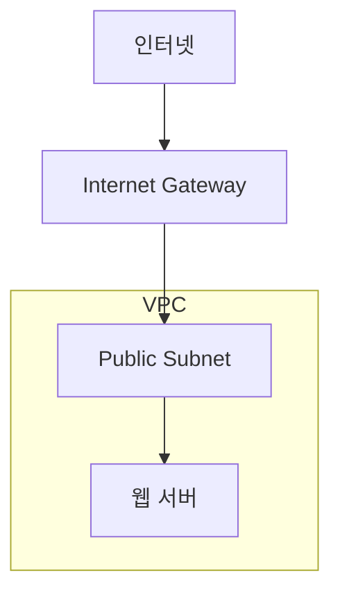
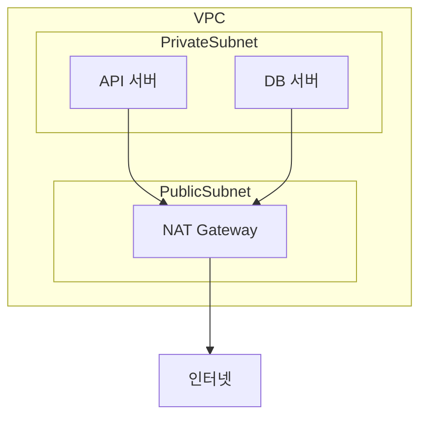
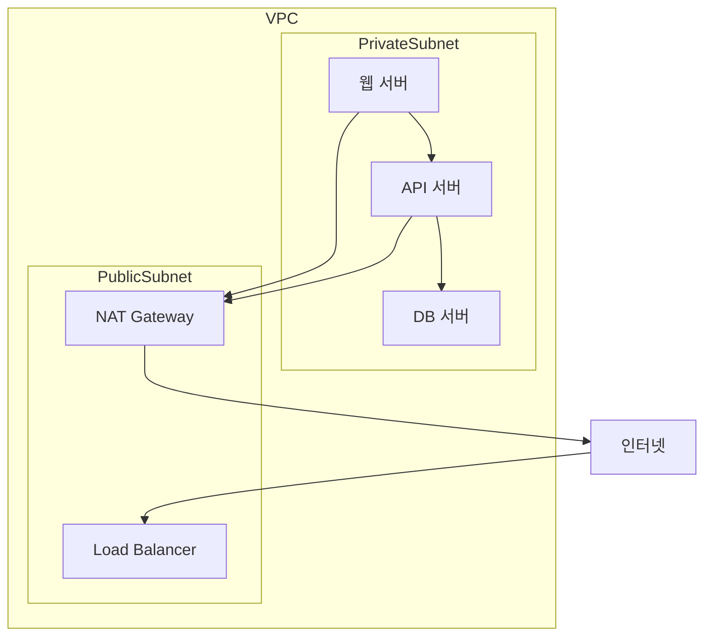

# 18장. 인터넷 연결 구조 이해하기

## 이 장에서 말하고자 하는 것

앞 장에서 우리는  
퍼블릭 서브넷과 프라이빗 서브넷을 배웠다.

퍼블릭 서브넷은  
인터넷에서 직접 접근 가능한 네트워크다.

프라이빗 서브넷은  
인터넷에서 직접 접근할 수 없는 네트워크다.

그렇다면 다음 질문이 생긴다.

> 퍼블릭 서브넷은 어떻게 인터넷과 연결되는 것일까?  
> 프라이빗 서브넷에 있는 서버는 인터넷을 전혀 사용할 수 없는 것일까?

이 장에서는  
AWS 네트워크에서 인터넷 연결을 담당하는 구조를 이해한다.

---

## 1. 인터넷과 연결하려면 출구가 필요하다

VPC는 하나의 독립된 네트워크다.

이 네트워크 안에 있는 서버들은  
기본적으로 **외부 인터넷과 연결되지 않는다.**

외부와 통신하려면  
네트워크의 **출구 역할을 하는 장치**가 필요하다.

온프레미스 환경에서는 보통 다음과 같은 장치가 있다.

* 라우터
* 방화벽
* 게이트웨이

AWS에서는 이 역할을  
**Internet Gateway**가 담당한다.

---

## 2. Internet Gateway

Internet Gateway는

> VPC를 인터넷과 연결하는 장치

이다.

개념적으로 보면 다음과 같은 구조다.



이 구조에서는

* Internet Gateway가 VPC의 출구 역할을 한다.
* 퍼블릭 서브넷에 있는 서버는 인터넷과 통신할 수 있다.

---

## 3. 퍼블릭 IP의 역할

퍼블릭 서브넷의 서버는  
**퍼블릭 IP 주소**를 가질 수 있다.

예를 들어:

```
웹 서버
사설 IP : 10.0.1.10
퍼블릭 IP : 52.10.25.100
```

외부 사용자는 퍼블릭 IP로 접속하고  
AWS 네트워크 내부에서 사설 IP로 연결된다.

이 구조 덕분에  
내부 네트워크와 인터넷이 연결된다.

---

## 4. 프라이빗 서브넷 서버의 문제

프라이빗 서브넷은  
인터넷에서 직접 접근할 수 없다.

하지만 프라이빗 서버도  
인터넷이 필요한 경우가 있다.

예를 들어

* 운영체제 패키지 업데이트
* 외부 API 호출
* 소프트웨어 다운로드

이런 작업을 위해서는  
외부 인터넷으로 나가는 경로가 필요하다.

---

## 5. NAT Gateway

이 문제를 해결하기 위해  
AWS에서는 **NAT Gateway**를 사용한다.

NAT Gateway는

> 프라이빗 서브넷 서버가 인터넷으로 나갈 수 있게 해주는 장치

다.

개념 구조는 다음과 같다.



이 구조에서는

* 내부 서버 → 인터넷 접속 가능
* 인터넷 → 내부 서버 직접 접근 불가

즉,

> 내부 서버는 외부로 나갈 수 있지만
> 외부에서 직접 들어올 수는 없다.

---

## 6. 실제 서비스 네트워크 구조

대부분의 AWS 서비스는  
다음과 같은 구조로 구성된다.



이 구조는 다음과 같은 특징을 가진다.

* 외부 접근 서버 최소화
* 내부 서버 보호
* 필요한 경우에만 인터넷 사용

---

## 7. 이 장의 핵심 정리

1. VPC는 기본적으로 인터넷과 연결되어 있지 않다.
2. Internet Gateway는 VPC를 인터넷과 연결하는 장치다.
3. 퍼블릭 서브넷 서버는 퍼블릭 IP를 통해 외부와 통신한다.
4. 프라이빗 서브넷 서버는 외부에서 직접 접근할 수 없다.
5. NAT Gateway를 사용하면 내부 서버가 인터넷을 사용할 수 있다.