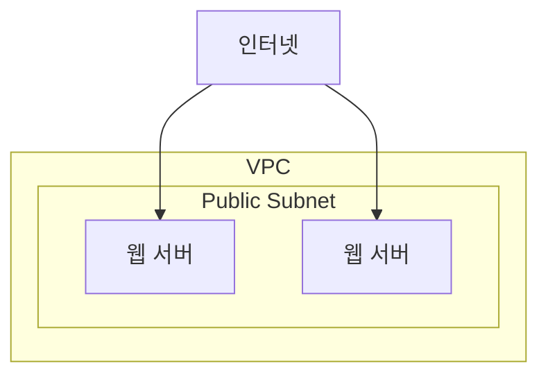
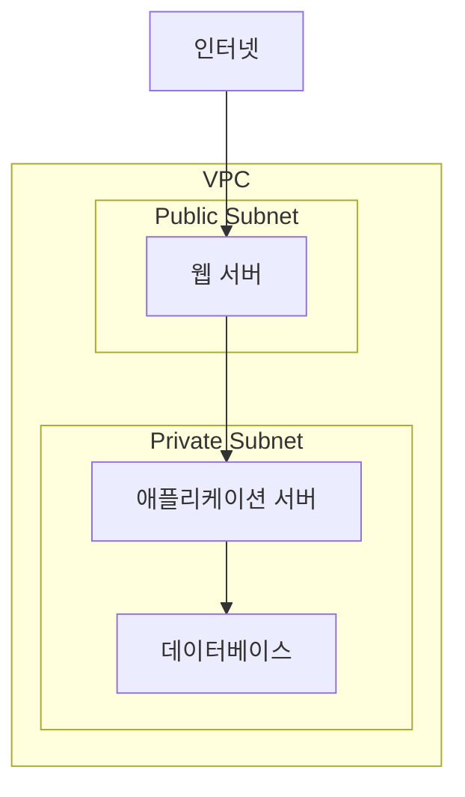
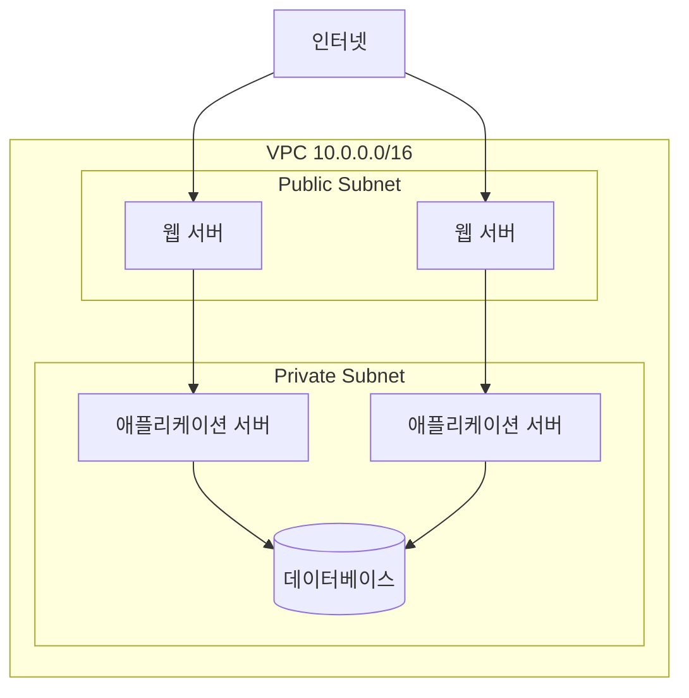

# 18장. 퍼블릭 서브넷과 프라이빗 서브넷

## 이 장에서 말하고자 하는 것

앞 장에서 우리는  
VPC 안의 네트워크를 **서브넷으로 나누는 방법**을 살펴보았다.

예를 들어 다음과 같은 구조였다.

```text
10.0.0.0/16  ← VPC
```

```text
10.0.1.0/24
10.0.2.0/24
10.0.3.0/24
```

이렇게 네트워크를 나누면  
서버 역할에 따라 구조를 분리할 수 있다.

하지만 여기서 한 가지 질문이 생긴다.

> 모든 서브넷이 인터넷과 연결되어야 할까?

실제 서비스에서는  
**모든 서버가 인터넷에 노출될 필요는 없다.**

그래서 AWS에서는 서브넷을 보통 두 가지로 나눈다.

* 퍼블릭 서브넷 (Public Subnet)
* 프라이빗 서브넷 (Private Subnet)

---

## 1. 모든 서버가 인터넷에 연결될 필요는 없다

웹 서비스를 다시 생각해보자.


이 구조에서

* 사용자는 **웹 서버에만 접근한다**
* 애플리케이션 서버는 **웹 서버와만 통신한다**
* 데이터베이스는 **외부에서 접근할 필요가 없다**

즉

```text
인터넷 ↔ 웹 서버
웹 서버 ↔ 애플리케이션 서버
애플리케이션 서버 ↔ 데이터베이스
```

이런 구조가 된다.

그래서 서버의 역할에 따라  
**인터넷 접근 여부를 나누게 된다.**

---

## 2. 퍼블릭 서브넷 (Public Subnet)

퍼블릭 서브넷은  
**인터넷과 직접 연결된 서브넷**이다.

즉 외부 사용자가 접근할 수 있는 서버가 위치한다.

예를 들어

* 웹 서버
* 로드밸런서
* Bastion 서버

같은 서버들이 여기에 위치한다.

예시 구조는 다음과 같다.



퍼블릭 서브넷의 특징은 다음과 같다.

* 인터넷에서 접근 가능
* 외부 트래픽이 들어오는 서버 위치
* 보통 웹 계층이 위치

---

## 3. 프라이빗 서브넷 (Private Subnet)

프라이빗 서브넷은  
**인터넷에서 직접 접근할 수 없는 서브넷**이다.

외부에서는 접근할 수 없고  
VPC 내부 서버만 접근할 수 있다.

예를 들어 다음 서버들이 위치한다.

* 애플리케이션 서버
* 데이터베이스
* 내부 서비스 서버

예시 구조는 다음과 같다.



이 구조에서는

* 사용자는 **웹 서버에만 접근**
* 내부 서버는 **외부에서 직접 접근 불가**

이렇게 되어  
보안이 훨씬 강해진다.

---

## 4. 왜 퍼블릭과 프라이빗을 나눌까

이렇게 네트워크를 나누면  
다음과 같은 장점이 있다.

### 보안 강화

데이터베이스 같은 서버는  
외부에서 직접 접근할 필요가 없다.

그래서 프라이빗 서브넷에 배치한다.

### 네트워크 구조 명확화

서버 역할이 명확하게 나뉜다.

```text
Public Subnet  → 웹 서버
Private Subnet → 애플리케이션 서버
Private Subnet → 데이터베이스
```

### 공격 범위 축소

외부에서 접근 가능한 서버가  
**최소화된다.**

---

## 5. 실제 서비스에서의 구조

실제 AWS 환경에서는  
다음과 같은 구조가 매우 일반적이다.



이 구조는 대부분의 웹 서비스에서  
기본적으로 사용되는 아키텍처다.

---

## 6. 이 장의 핵심 정리

1. 모든 서브넷이 인터넷과 연결될 필요는 없다.
2. 인터넷과 연결된 서브넷을 **퍼블릭 서브넷**이라고 한다.
3. 인터넷에서 직접 접근할 수 없는 서브넷을 **프라이빗 서브넷**이라고 한다.
4. 보통 웹 서버는 퍼블릭 서브넷에 배치한다.
5. 애플리케이션 서버와 데이터베이스는 프라이빗 서브넷에 배치한다.
