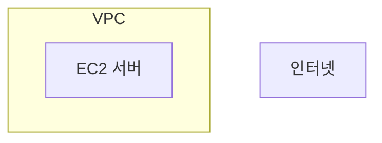
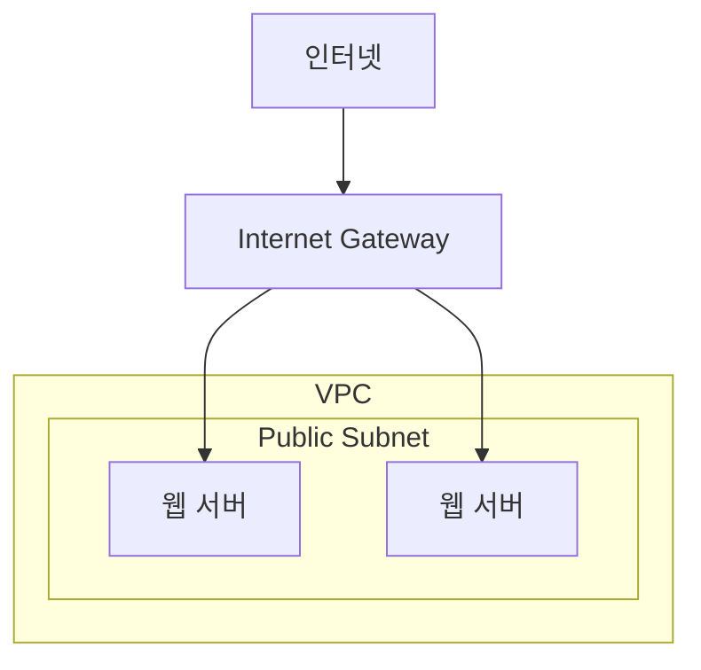

# 19장. 인터넷 게이트웨이 (Internet Gateway)

## 이 장에서 말하고자 하는 것

앞 장에서 우리는 서브넷을 다음과 같이 나누는 구조를 살펴보았다.

* 퍼블릭 서브넷 (Public Subnet)
* 프라이빗 서브넷 (Private Subnet)

퍼블릭 서브넷에는  
외부 사용자가 접근해야 하는 서버가 위치한다.

예를 들어

* 웹 서버
* 로드밸런서

같은 서버들이다.

그렇다면 여기서 한 가지 질문이 생긴다.

> 퍼블릭 서브넷에 있는 서버는  
> **어떻게 인터넷과 연결될까?**

이 연결을 담당하는 것이

> **인터넷 게이트웨이 (Internet Gateway)**

이다.

---

## 1. VPC는 기본적으로 인터넷과 연결되어 있지 않다

AWS에서 VPC를 생성하면  
그 네트워크는 기본적으로 **인터넷과 연결되어 있지 않다.**

즉 다음과 같은 상태다.



이 상태에서는

* 인터넷에서 서버에 접근할 수 없고
* 서버도 인터넷으로 나갈 수 없다.

즉 VPC는 기본적으로  
**외부와 분리된 네트워크**다.

---

## 2. 인터넷 게이트웨이란 무엇인가

VPC를 하나의 **회사 내부 네트워크**라고 생각해보자.

회사 내부 네트워크도  
외부 인터넷과 통신하려면  
**출입구**가 필요하다.

AWS에서 이 역할을 하는 것이

> **인터넷 게이트웨이 (Internet Gateway)**

이다.

인터넷 게이트웨이는

> **VPC와 인터넷을 연결하는 장치**

라고 이해하면 된다.

---

## 3. 퍼블릭 서브넷과 인터넷 게이트웨이

퍼블릭 서브넷에는  
인터넷과 통신해야 하는 서버가 위치한다.

예를 들어 웹 서버가 여기에 배치된다.

인터넷에서 들어오는 트래픽은  
먼저 **인터넷 게이트웨이**를 통과한 뒤  
VPC 내부 서버로 전달된다.

구조를 보면 다음과 같다.



이 구조에서 네트워크 흐름은 다음과 같다.

```
Internet
↓
Internet Gateway
↓
Public Subnet
↓
Web Server
```

즉 퍼블릭 서브넷의 서버들은  
인터넷 게이트웨이를 통해  
인터넷과 통신할 수 있다.

---

## 4. 하지만 이것만으로는 충분하지 않다

인터넷 게이트웨이를 연결했다고 해서  
모든 서버가 자동으로 인터넷과 통신하는 것은 아니다.

왜냐하면 네트워크에는

> **트래픽이 어디로 이동할지 결정하는 규칙**

이 필요하기 때문이다.

이 역할을 하는 것이

> **라우팅 테이블 (Route Table)**

이다.

---

## 6. 이 장의 핵심 정리

1. VPC는 기본적으로 인터넷과 연결되어 있지 않다.
2. 인터넷과 통신하려면 **인터넷 게이트웨이**가 필요하다.
3. 인터넷 게이트웨이는 **VPC와 인터넷을 연결하는 장치**다.
4. 퍼블릭 서브넷의 서버는 인터넷 게이트웨이를 통해 인터넷과 통신한다.
5. 실제 네트워크 경로는 **라우팅 테이블**을 통해 결정된다.
