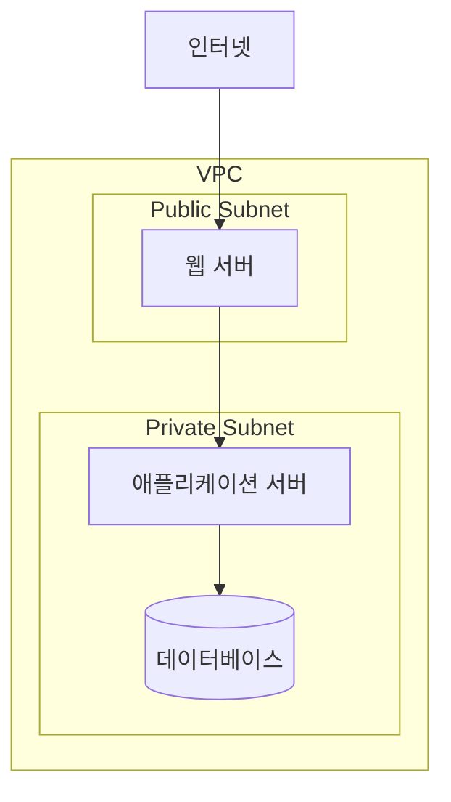
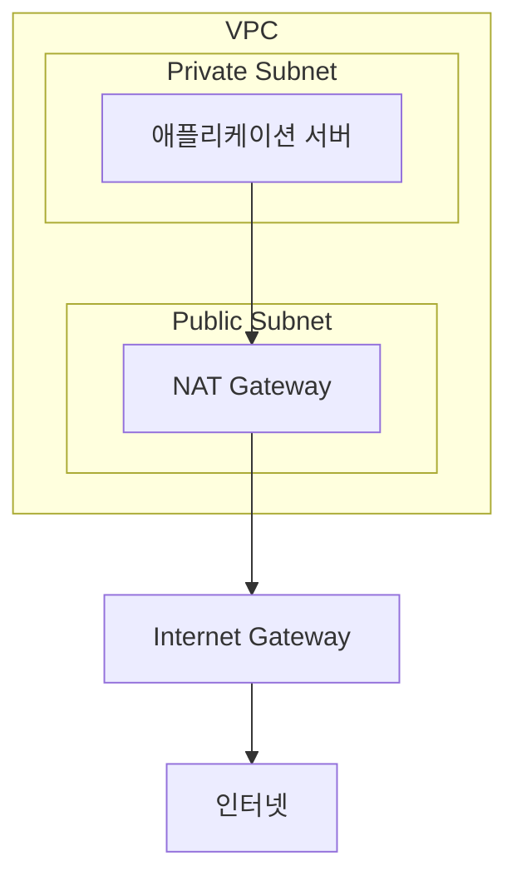
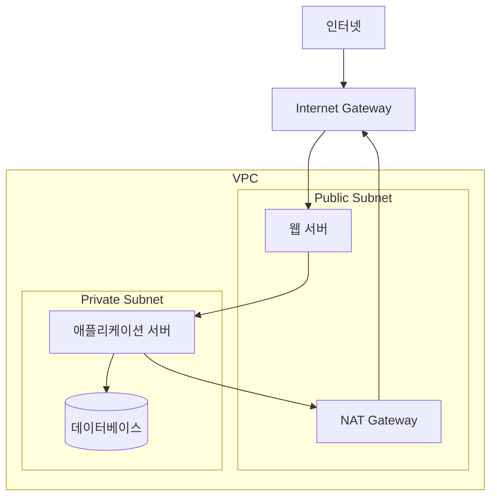

# 21장. NAT Gateway

## 이 장에서 말하고자 하는 것

앞 장에서 우리는  
**라우팅 테이블(Route Table)** 을 통해  
트래픽이 어디로 이동하는지 결정된다는 것을 살펴보았다.

또한 다음과 같은 사실도 알게 되었다.

* 퍼블릭 서브넷 → 인터넷 게이트웨이로 연결 가능
* 프라이빗 서브넷 → 인터넷 게이트웨이로 직접 연결되지 않음

여기서 한 가지 질문이 생긴다.

> 프라이빗 서브넷의 서버는  
> **인터넷으로 나갈 수 없을까?**

예를 들어 서버가 다음 작업을 해야 할 수도 있다.

* 패키지 다운로드
* 외부 API 호출
* OS 업데이트

이처럼 **인터넷으로 나가는 통신**이 필요한 경우가 있다.

이 문제를 해결하는 것이

> **NAT Gateway**

이다.

---

## 1. 프라이빗 서브넷의 문제

프라이빗 서브넷의 서버는  
인터넷에서 직접 접근할 수 없다.

예를 들어 다음과 같은 구조가 있다고 하자.



이 구조에서

```text
App → Internet
```

같은 요청은  
**인터넷 게이트웨이를 직접 사용할 수 없다.**

---

## 2. NAT란 무엇인가

NAT는

> **Network Address Translation**

의 약자다.

간단히 말하면

> 내부 IP 주소를  
> **외부 IP 주소로 변환하는 기술**

이다.

예를 들어 다음과 같은 상황을 생각해보자.

```text
App Server
10.0.2.10
```

이 서버가 인터넷으로 요청을 보내면  
외부에서는 이 주소를 알 수 없다.

그래서 NAT는

```text
10.0.2.10
→ 공인 IP
```

으로 변환하여  
인터넷과 통신하게 만든다.

---

## 3. NAT Gateway의 역할

AWS에서는 이 NAT 기능을

> **NAT Gateway**

가 수행한다.

NAT Gateway는 보통  
**퍼블릭 서브넷에 위치한다.**

그리고 구조는 다음과 같다.



이 구조에서

```text
Private Subnet → Internet
```

통신이 가능해진다.

---

## 4. 중요한 특징

NAT Gateway는 다음 특징을 가진다.

### 내부 → 외부 가능

프라이빗 서브넷의 서버는  
인터넷으로 요청을 보낼 수 있다.

예

```text
App → Internet
```

---

### 외부 → 내부 불가능

인터넷에서는  
프라이빗 서브넷의 서버에  
직접 접근할 수 없다.

즉

```text
Internet → App
```

은 불가능하다.

---

## 5. 라우팅 테이블과 NAT Gateway

프라이빗 서브넷의 라우팅 테이블에는  
보통 다음 규칙이 추가된다.

| Destination | Target      |
| ----------- | ----------- |
| 10.0.0.0/16 | local       |
| 0.0.0.0/0   | NAT Gateway |

이 규칙의 의미는 다음과 같다.

> 인터넷으로 가는 트래픽은  
> **NAT Gateway로 보낸다**

그래서 프라이빗 서브넷의 서버는

```text
App → NAT Gateway → Internet
```

경로로 인터넷과 통신하게 된다.

---

## 6. 전체 네트워크 구조 정리

지금까지 살펴본 AWS 네트워크 구조를  
전체적으로 보면 다음과 같다.



이 구조에서

* 외부 사용자는 **웹 서버에 접근**
* 내부 서버는 **인터넷으로 요청 가능**
* 데이터베이스는 **외부에서 접근 불가**

가 된다.

---

## 7. 이 장의 핵심 정리

1. 프라이빗 서브넷의 서버는 인터넷 게이트웨이를 직접 사용할 수 없다.
2. NAT는 내부 IP를 외부 IP로 변환하는 기술이다.
3. AWS에서는 **NAT Gateway**가 이 역할을 수행한다.
4. NAT Gateway는 보통 **퍼블릭 서브넷에 위치한다.**
5. 프라이빗 서브넷은 `0.0.0.0/0 → NAT Gateway` 라우팅을 사용한다.
6. NAT Gateway를 통해 **프라이빗 서브넷 → 인터넷 통신이 가능해진다.**