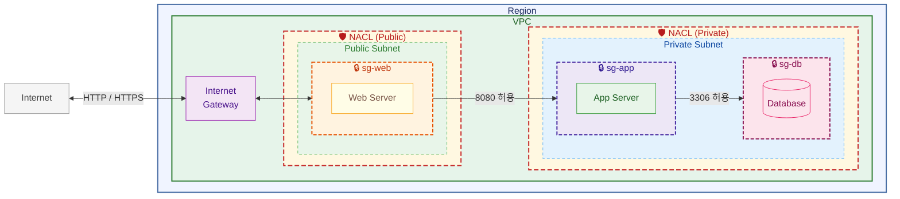

# 23장. NACL (Network ACL)

## 이 장에서 말하고자 하는 것

앞 장에서 우리는 보안 그룹을 통해  
서버 단위로 접근을 제어하는 방법을 배웠다.

이제 각 서버는  
누가, 어떤 포트로 접근할 수 있는지 제어할 수 있다.

그런데 한 가지 더 생각해볼 수 있다.

> 서버 단위가 아니라  
> 네트워크 자체를 한 번에 제어할 수는 없을까?

예를 들어 특정 IP나 대역을  
서버마다 막는 것이 아니라  
아예 네트워크 입구에서 막고 싶은 경우다.

이럴 때 사용하는 것이

> **NACL (Network ACL)**

이다.

---

## 1. NACL이란 무엇인가

NACL은

> **서브넷 단위에서 동작하는 접근 제어 기능**

이다.

보안 그룹이 서버 앞에서 동작한다면  
NACL은

> **서브넷 입구에서 먼저 필터링**

한다고 보면 된다.

---

## 2. 흐름으로 이해하기

트래픽이 서버까지 도달하는 과정은 다음과 같다.

```text
Internet → NACL → 보안 그룹 → 서버
```

즉

1. NACL에서 먼저 검사
2. 보안 그룹에서 한 번 더 검사

이렇게 두 단계로 제어된다.

---

## 3. 동작 방식

NACL은 보안 그룹과 다르게  
규칙을 처리하는 방식이 있다.

### ✔ 번호 순서대로 검사

NACL은

> **낮은 번호부터 순서대로 규칙을 확인한다**

### 예시

| 번호  | 설정        |
| --- | --------- |
| 100 | 모든 트래픽 차단 |
| 200 | 80 포트 허용  |

이 경우 결과는 다음과 같다.

```text
100번에서 이미 차단됨 → 80도 접근 불가
```

👉 핵심

> 먼저 매칭되는 규칙이 적용된다

---

## 4. 보안 그룹과의 차이

보안 그룹과 NACL은 비슷해 보이지만  
동작 방식이 다르다.

| 구분    | 보안 그룹    | NACL      |
| ----- | -------- | --------- |
| 적용 대상 | EC2 (서버) | Subnet    |
| 규칙 방식 | 허용만 가능   | 허용 + 차단   |
| 상태    | Stateful | Stateless |

여기서 특히 중요한 것은 두 가지다.

### 허용 + 차단

보안 그룹은 허용만 설정하면 되지만
NACL은

> 허용과 차단을 모두 직접 설정할 수 있다

---

### Stateless

보안 그룹은 응답 트래픽이 자동 허용되지만
NACL은

> 인바운드와 아웃바운드를 각각 따로 설정해야 한다

---

## 5. 어떻게 사용하는가

NACL은 보통  
서브넷 단위에서 전체를 제어할 때 사용한다.

예를 들어

* 특정 IP 대역 차단
* 외부 공격 차단

이런 경우

> 네트워크 입구에서 한 번에 막는다

---

## 6. 구조로 이해하기



---

## 7. 정리하면서 이해하기

> 보안 그룹 → 서버 접근 제어  
> NACL → 네트워크 접근 제어

즉

* 보안 그룹은 “이 서버에 접근 가능?”
* NACL은 “이 네트워크에 들어올 수 있음?”

---

## 8. 이 장의 핵심 정리

1. NACL은 서브넷 단위에서 동작하는 접근 제어 기능이다.
2. 트래픽은 NACL → 보안 그룹 순서로 검사된다.
3. NACL은 규칙을 **번호 순서대로 검사한다.**
4. 허용과 차단을 모두 설정할 수 있다.
5. Stateless 구조라서 인바운드/아웃바운드를 각각 설정해야 한다.