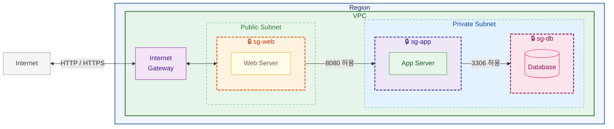

# 26장. 보안 그룹 (Security Group)

## 이 장에서 말하고자 하는 것

앞 장에서 우리는  
서버들이 서로 통신할 수 있는 구조를 만들었다.

이제 서버는 연결되어 있다.

하지만 여기서 중요한 문제가 하나 있다.

> 이 서버에 누가 접근할 수 있는가?

이걸 제어하는 것이

> **보안 그룹(Security Group)**

이다.

---

## 1. EC2를 만들면 반드시 설정해야 하는 것

AWS에서 EC2를 생성할 때  
반드시 설정해야 하는 것이 있다.

> **보안 그룹**

서버는 생성되는 순간부터  
외부 접근을 제어해야 하기 때문이다.

---

## 2. 보안 그룹은 무엇을 기준으로 동작할까

보안 그룹은 다음 3가지 기준으로 동작한다.

```text
IP 또는 보안그룹 ID
포트
프로토콜
```

### 예시

```text
IP: 0.0.0.0/0
포트: 80, 443
프로토콜: TCP
```

👉 의미

> 모든 IP에서 웹 서버 접근 허용

### 💡 참고 (중요)

보안 그룹은 IP뿐만 아니라

> **다른 보안 그룹을 허용 대상으로 설정할 수 있다**

예

```text
허용 대상: sg-web
```

👉 의미

> 웹 서버만 접근 가능

보통은 IP로 설정하기보다

> **보안 그룹 ID로 설정하는 것이 더 안전하다**

이유:

* IP는 변경될 수 있음
* 보안 그룹은 변경되지 않음

---

## 3. 기본 동작 방식

보안 그룹은 기본적으로

> ❌ 아무도 접근 못함 (기본 차단)

상태에서 시작한다.

그리고

> ✅ 필요한 것만 열어준다

이걸

> **화이트리스트 방식**

이라고 한다.

---

## 4. 인바운드 / 아웃바운드

보안 그룹은 두 가지 방향을 가진다.

### 인바운드 (Inbound)

> 외부 → 서버로 들어오는 트래픽

### 아웃바운드 (Outbound)

> 서버 → 외부로 나가는 트래픽

---

## 5. 실제 보안 그룹 설정

이제 우리가 만든 구조에  
보안 그룹을 적용해보자.



### ① 웹 서버 (sg-web)

웹 서버는 외부 사용자들이 접근해야 한다.

그래서 다음을 허용한다.

```text
허용 대상: 0.0.0.0/0 (모든 IP)
포트: 80 (HTTP), 443 (HTTPS)
프로토콜: TCP
```

👉 의미

> 누구든지 웹 서버에 접속 가능


### ② 앱 서버 (sg-app)

앱 서버는 외부에서 접근하면 안 된다.

그래서 이렇게 설정한다.

```text
허용 대상: sg-web (웹 서버)
포트: 8080
프로토콜: TCP
```

👉 의미

> 웹 서버만 앱 서버에 접근 가능

### ③ DB 서버 (sg-db)

DB는 가장 중요한 데이터가 있기 때문에  
더 강하게 제한해야 한다.

```text
허용 대상: sg-app (앱 서버)
포트: 3306 (MySQL)
프로토콜: TCP
```

👉 의미

> 앱 서버만 DB 접근 가능

---

## 6. 흐름으로 이해하기

이 설정을 적용하면

### 가능한 흐름

```text
사용자 → 웹 서버 (80, 443)
웹 서버 → 앱 서버 (8080)
앱 서버 → DB (3306)
```

### 불가능한 흐름

```text
인터넷 → 앱 서버 ❌
인터넷 → DB ❌
웹 서버 → DB ❌
```

---

## 7. 이 장의 핵심 정리

1. 보안 그룹은 EC2 생성 시 반드시 설정해야 한다.
2. 보안 그룹은 **IP(또는 보안그룹), 포트, 프로토콜** 기준으로 동작한다.
3. 기본은 차단이며 허용만 가능하다.
4. IP 대신 **보안 그룹을 허용 대상으로 설정할 수 있다.**
5. 보안 그룹을 사용하면 더 안전하고 관리가 쉽다.

---

## 💡 추가로 알아두기

지금까지는 EC2 기준으로 설명했지만

> **네트워크 통신이 필요한 AWS 리소스는  
> 대부분 보안 그룹을 동일하게 사용한다**

예를 들어

* RDS (데이터베이스)
* ElastiCache (Redis)
* Load Balancer
* 일부 컨테이너 서비스 (ECS 등)

👉 이런 리소스들도 모두

> 누가(IP 또는 보안그룹)  
> 어느 포트로 접근할 수 있는지

를 보안 그룹으로 제어한다.


> 보안 그룹은 EC2만의 기능이 아니라  
> **AWS 네트워크 접근 제어의 기본 개념**이다
