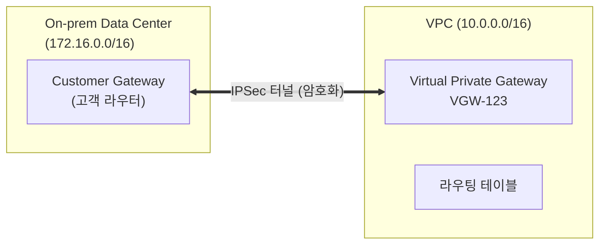

# 27장. AWS Site-to-Site VPN

## 이 장에서 말하고자 하는 것

지금까지 우리는 AWS 내부에서 VPC 간 연결을 다뤘다.  
하지만 실제 환경에서는 AWS만 사용하는 경우는 드물다.

회사 내부 데이터센터(IDC)나 기존 시스템과  
AWS를 함께 사용하는 경우가 많다.

그래서 이런 요구가 생긴다.

```text
회사 내부망 ↔ AWS VPC 연결
```

이걸 해결하는 가장 기본적인 방법이

> **AWS Site-to-Site VPN**

이다.

---

## 1. VPN이란 무엇인가

VPN은

> 인터넷 위에 암호화된 통신 경로를 만들어  
> 두 네트워크를 안전하게 연결하는 방식

이다.

즉, 물리적으로는 인터넷을 사용하지만  
논리적으로는 내부망처럼 동작한다.

---

## 2. 구조로 이해하기




이 구조는 다음과 같이 이해하면 된다.

회사 네트워크에서 라우터를 통해 인터넷으로 나가고  
그 트래픽이 AWS의 VPN 장비(VGW)에 도착한 뒤  
VPC 내부로 전달된다.

---

## 3. 구성 요소

VPN 연결에서 중요한 구성은 두 가지다.

Customer Gateway는 회사 쪽 장비다.  
실제 VPN 터널을 생성하는 라우터나 방화벽이 여기에 해당한다.

Virtual Private Gateway는 AWS 쪽 장비다.  
VPC에 붙어 있는 VPN의 진입 지점이다.

즉, 이 둘이 연결되어 하나의 터널을 만든다.

```text
회사 장비 ↔ AWS 장비
```

---

## 4. 어떻게 동작하는가

VPN 연결은 단순 연결이 아니라  
암호화된 터널을 생성한다.

```text
CGW → Internet → VGW
```

이 구간 전체가 IPSec으로 보호된다.

그래서 외부 인터넷을 지나가더라도  
데이터는 안전하게 보호된다.

결과적으로

> AWS를 회사 내부망처럼 사용할 수 있게 된다

---

## 5. 라우팅 구조

VPN에서도 핵심은 라우팅이다.

회사와 AWS 양쪽 모두  
상대 네트워크를 VPN으로 보내도록 설정해야 한다.

VPC 쪽 라우팅은 다음과 같다.

```text
Destination        Target
172.16.0.0/16      vgw-123
```

이 의미는

> 회사 네트워크로 가는 트래픽은 VPN으로 보내라

회사 쪽 라우팅은 다음과 같다.

```text
Destination        Target
10.0.0.0/16        VPN 터널
```

이 의미는

> AWS 네트워크는 VPN으로 보내라

그래서 실제 흐름은 이렇게 된다.

```text
회사 서버 → 라우팅 확인 → VPN 터널 → AWS VPC
```

---

## 6. 왜 VPN을 사용하는가

단순히 인터넷으로 통신할 수도 있지만  
VPN을 사용하는 이유는 명확하다.

인터넷 방식은 공용 IP 기반이라 외부에 노출되고  
보안 측면에서 취약하다.

반면 VPN은 사설 IP 기반으로 통신하고  
암호화가 적용되기 때문에 훨씬 안전하다.

즉

> 인터넷 → 공개된 통신  
> VPN → 내부망처럼 동작

---

## 7. 중요한 특징

AWS VPN은 기본적으로 두 개의 터널을 제공한다.

```text
터널 2개 (Active / Standby)
```

하나의 터널에 문제가 생기면  
자동으로 다른 터널을 사용한다.

그래서 기본적인 고가용성이 확보된다.

하지만 VPN은 인터넷 기반이기 때문에

* 지연 시간이 일정하지 않을 수 있고
* 대역폭에 한계가 있다

---

## 8. 언제 사용하는가

VPN은 다음과 같은 상황에서 적합하다.

```text
빠르게 연결이 필요할 때
비용을 최소화해야 할 때
온프레미스와 기본 연결이 필요할 때
```

예를 들어

* AWS 초기 도입
* 개발 환경 연결
* 백업 네트워크

---

## 9. 한 줄로 정리

> Site-to-Site VPN은 인터넷 위에 암호화된 터널을 만들어  
> 온프레미스와 AWS를 연결하는 방식이다

---

## 10. 이 장의 핵심 정리

1. 온프레미스와 AWS를 연결해야 하는 상황이 존재한다
2. VPN은 인터넷 위에 암호화된 터널을 만드는 방식이다
3. Customer Gateway와 Virtual Private Gateway가 연결된다
4. 라우팅을 통해 트래픽이 VPN으로 전달된다
5. 사설 네트워크처럼 안전하게 통신할 수 있다
6. 기본적으로 이중 터널로 고가용성을 제공한다
7. 인터넷 기반이기 때문에 성능 제한이 존재한다