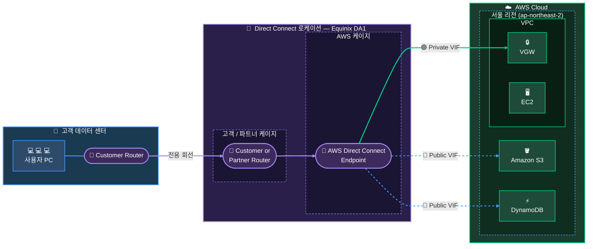

# 28장. AWS Direct Connect

## 이 장에서 말하고자 하는 것

앞 장에서 우리는 Site-to-Site VPN을 통해  
온프레미스와 AWS를 연결하는 방법을 배웠다.

VPN은 빠르게 구축할 수 있고 편리하지만  
인터넷을 기반으로 하기 때문에 성능과 안정성에 한계가 있다.

그래서 실제 운영 환경에서는 이런 요구가 생긴다.

```text
인터넷을 거치지 않고 AWS와 안정적으로 연결하고 싶다
```

이 요구를 해결하는 방법이

> **AWS Direct Connect**

이다.

---

## 1. Direct Connect란 무엇인가

Direct Connect는

> AWS와 고객 네트워크를 전용 회선으로 연결하는 서비스

다.

VPN이 인터넷 위에 암호화된 터널을 만드는 방식이라면  
Direct Connect는

> AWS까지 이어지는 전용 네트워크 경로를 구성하는 방식

이다.

즉, 통신 경로 자체를 바꾼다.

---

## 2. 왜 Direct Connect가 필요한가

VPN에서는 트래픽이 반드시 인터넷을 지나간다.

```text
회사 → 인터넷 → AWS
```

이 구조에서는

* 네트워크 품질이 인터넷 상태에 영향을 받고
* 지연 시간이 일정하지 않으며
* 대역폭에도 한계가 생긴다

---

Direct Connect는 이 구조를 다음과 같이 바꾼다.

```text
회사 → 전용 회선 → AWS 네트워크
```

이 차이로 인해

> 더 안정적이고, 더 예측 가능한 네트워크를 만들 수 있다

---

## 3. 구조로 이해하기



---

## 4. 구조의 핵심 이해

이 구조에서 가장 중요한 것은  
Direct Connect Location이다.

많이 헷갈리는 부분이 바로 여기다.

> 왜 AWS에 직접 연결하지 않고 중간 지점을 거칠까?

AWS는 리전 단위는 공개하지만  
실제 내부 데이터센터의 물리 위치나  
고객이 직접 연결할 수 있는 지점은 공개하지 않는다.

또한 모든 고객이 임의로 AWS 내부에 직접 연결하는 구조는  
보안과 운영 측면에서 관리가 어렵다.

그래서 AWS는

> 공식적으로 연결 가능한 접속 지점(DX Location)

을 제공한다.

이걸 흐름으로 보면

```text
회사 → DX Location → AWS 내부망 → VPC
```

이 된다.

즉

> DX Location은 AWS 네트워크로 들어가는 공식 입구다

---

## 5. 어떻게 동작하는가

전체 흐름을 보면 단순하다.

```text
회사 → 라우터 → 전용선 → DX Location → AWS → VPC
```

라우팅 방식은 VPN과 동일하다.

차이는 “경로”뿐이다.

### VPC 라우팅

```text
172.16.0.0/16 → VGW 또는 TGW
```

### 온프레미스 라우팅

```text
10.0.0.0/16 → Direct Connect
```

즉

> 트래픽을 어디로 보낼지는 라우팅이 결정하고  
> Direct Connect는 그 경로를 전용선으로 제공한다

---

## 6. Virtual Interface (VIF)

Direct Connect에서는 하나의 물리 회선을  
여러 네트워크로 나누어 사용할 수 있다.

이 개념이 VIF다.

예를 들어

```text
Private VIF → VPC 연결
Public VIF → AWS 퍼블릭 서비스
Transit VIF → Transit Gateway 연결
```

즉

> 하나의 물리 연결 위에 여러 논리 네트워크를 구성할 수 있다

---

## 7. 언제 사용하는가

Direct Connect는 단순 연결보다는  
다음과 같은 요구가 있을 때 사용한다.

```text
대용량 데이터 전송
지연 시간 민감 서비스
안정적인 네트워크 필요
```

예를 들어

* 금융 시스템
* 대규모 데이터 처리
* 하이브리드 클라우드 환경

---

## 8. VPN과 함께 사용하는 이유

Direct Connect는 안정적이지만  
물리 회선이기 때문에 장애 가능성이 존재한다.

그래서 실무에서는

```text
기본 경로 → Direct Connect
백업 경로 → VPN
```

구조를 많이 사용한다.

즉

> 성능은 Direct Connect, 장애 대비는 VPN

---

## 9. 한 줄로 정리

> Direct Connect는 AWS까지 이어지는 전용 네트워크 경로를 만드는 서비스다

---

## 10. 이 장의 핵심 정리

1. VPN은 인터넷 기반이라 성능 한계가 있다
2. Direct Connect는 전용 회선으로 AWS와 연결한다
3. Direct Connect Location을 통해 AWS 네트워크에 접속한다
4. 라우팅 방식은 VPN과 동일하다
5. VIF를 통해 하나의 회선을 여러 용도로 사용할 수 있다
6. 고성능과 안정성이 필요한 환경에서 사용된다
7. VPN과 함께 사용해 안정성을 확보한다