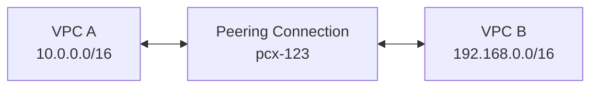

# 89장. VPC Peering

## 이 장에서 말하고자 하는 것

VPC는 기본적으로 서로 격리된 네트워크다.

즉, 아무 설정도 하지 않으면

```text
VPC A (10.0.0.0/16)
VPC B (192.168.0.0/16)

→ 서로 통신 불가
```

하지만 실제 환경에서는

* 서비스 간 통신
* 계정 간 연결
* 네트워크 분리 후 연동

이 필요하다.

그래서 가장 먼저 사용하는 방식이

> **VPC Peering**

이다.

---

## 1. VPC Peering이란 무엇인가

VPC Peering은

> 두 개의 VPC를 직접 연결하는 기능

이다.

이 연결은 인터넷을 거치지 않고
AWS 내부 네트워크를 통해 통신한다.

---

## 2. 구조로 이해하기



이 구조는 단순하다.

* VPC A와 VPC B 사이에
* Peering이라는 “전용 통로”가 하나 생긴다

---

## 3. 왜 사용하는가

인터넷을 통해 연결할 수도 있지만
그 방식은 문제가 많다.

```text
VPC → Internet → VPC
```

이 경우

* 외부 네트워크를 거침
* 보안 취약
* 지연 발생

반면 VPC Peering은

```text
VPC → AWS 내부망 → VPC
```

이기 때문에

* 빠르고
* 안전하고
* 안정적이다

---

## 4. 중요한 개념: 라우팅

여기서 가장 중요한 포인트가 있다.

> Peering을 만들었다고 바로 통신되는 것이 아니다

왜냐하면

> 네트워크는 “어디로 보내야 할지” 알아야 하기 때문이다

---

### 라우팅 테이블 설정

#### VPC A

```text
Destination        Target
10.0.0.0/16        local
192.168.0.0/16     pcx-123
```

#### VPC B

```text
Destination        Target
192.168.0.0/16     local
10.0.0.0/16        pcx-123
```

### 의미

```text
192.168.0.0/16 → Peering으로 보내라
```

즉

> 상대 VPC의 IP 대역을 Peering 연결로 전달

👉 핵심

> Peering은 “통로”, 라우팅은 “방향 지정”

---

## 5. 동작 흐름

실제로 트래픽이 이동하는 흐름은 다음과 같다.

```text
VPC A (10.0.0.10)
→ 라우팅 테이블 확인
→ 192.168.0.0/16 발견
→ pcx-123으로 전달
→ VPC B로 도착
```

즉

> 라우팅 테이블이 없으면 Peering이 있어도 통신 불가

---

## 6. 반드시 알아야 할 제약

VPC Peering은 간단하지만 중요한 제한이 있다.

### 1) CIDR 대역이 겹치면 안 된다

```text
VPC A: 10.0.0.0/16
VPC B: 10.0.0.0/16 ❌
```

이 경우 AWS는 어디로 보내야 할지 구분할 수 없다.

### 2) 전이적 라우팅 불가


이 구조에서

```text
VPC1 → VPC3 ❌
```

이유

> Peering은 직접 연결된 VPC끼리만 통신 가능

### 3) 연결 수 증가 문제

VPC가 많아지면

```text
n(n-1)/2
```

만큼 연결 필요

예:

```text
VPC 4개 → 6개 연결
```

👉 관리 복잡

---

## 7. 언제 사용하는가

VPC Peering은 다음 상황에서 적합하다.

```text
VPC 2~3개 정도
단순한 구조
직접 통신 필요
```

예:

* 서비스 A ↔ 서비스 B
* 개발 ↔ 운영 환경
* 계정 간 간단 연결

---

## 8. 한 줄로 정리

> VPC Peering은 두 VPC를 직접 연결하는 가장 간단한 방식이지만  
> 규모가 커지면 한계가 있다

---

## 9. 이 장의 핵심 정리

1. VPC는 기본적으로 서로 통신할 수 없다
2. VPC Peering은 두 VPC를 직접 연결하는 기능이다
3. 인터넷을 거치지 않고 AWS 내부망으로 통신한다
4. 반드시 라우팅 테이블 설정이 필요하다
5. CIDR이 겹치면 사용할 수 없다
6. 전이적 라우팅이 불가능하다
7. 소규모 VPC 연결에 적합하다