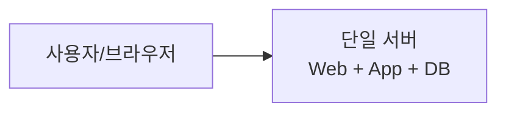
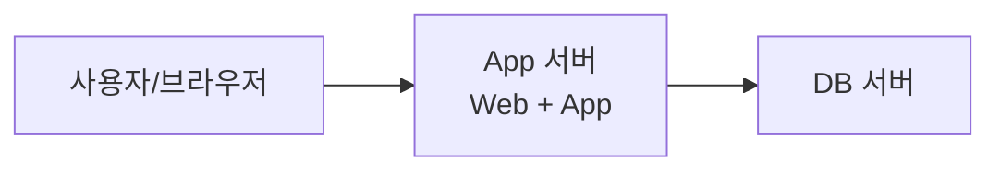
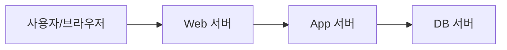
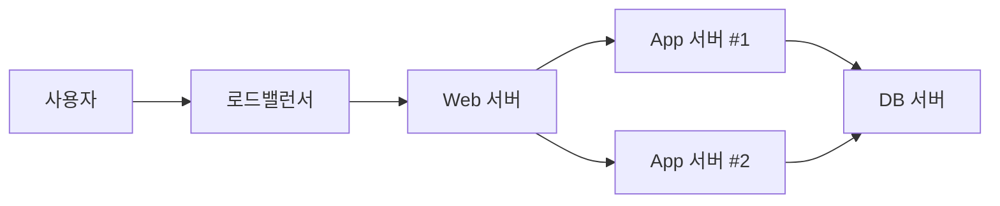

# 8장. 서버 아키텍처의 기초 이해

## 이 장에서 말하고자 하는 것

클라우드는 새로운 개념처럼 보이지만,  
결국 그 위에서 동작하는 것은 “서버”다.

클라우드를 이해하려면  
먼저 서버가 무엇이고,  
웹 서비스가 어떻게 구성되는지 이해해야 한다.

이 장의 목적은 다음 세 가지다.

1. 서버의 기본 개념 이해
2. 웹 서비스의 구성 요소 이해
3. 클라우드 위에 올라가는 구조를 머릿속에 그릴 수 있게 만들기

---

## 1. 서버란 무엇인가

서버(Server)는 특별한 장비가 아니다.

> 다른 컴퓨터의 요청을 받아 처리하는 컴퓨터

이다.

웹 브라우저로 어떤 사이트에 접속하면  
브라우저는 서버에 요청(Request)을 보내고,  
서버는 처리 결과를 응답(Response)으로 반환한다.

이 구조를 **클라이언트-서버 구조**라고 한다.

* 클라이언트 → 요청을 보내는 쪽
* 서버 → 요청을 처리하는 쪽

---

## 2. 웹 서비스는 어떻게 동작하는가

게시판 서비스를 예로 들어보자.

1. 사용자가 브라우저에서 글 작성 버튼 클릭
2. 브라우저가 서버에 HTTP 요청 전송
3. 서버가 요청을 처리
4. 데이터베이스에 저장
5. 결과를 다시 사용자에게 응답

이 과정은 하나의 서버가 아니라  
여러 역할의 서버가 나누어 수행한다.

---

## 3. 서버의 역할 분리

서비스가 커질수록 서버의 역할을 나누게 된다.

### 1) 웹 서버

* HTTP 요청을 받아 처리
* 정적 파일 제공 (이미지, CSS, JS)
* 애플리케이션 서버로 요청 전달

대표적인 웹 서버 소프트웨어:

* Nginx
* Apache

---

### 2) 애플리케이션 서버

* 실제 비즈니스 로직 처리
* 로그인 검증
* 게시글 저장 처리
* API 응답 생성

예:

* Node.js
* Java (Spring)
* PHP
* Python (Django)

---

### 3) 데이터베이스 서버

* 데이터 저장
* 조회, 수정, 삭제 수행

대표적인 DB:

* MySQL
* PostgreSQL
* MariaDB

---

### 4) 캐시 서버

* 자주 사용하는 데이터를 메모리에 저장
* 응답 속도 향상

예:

* Redis
* Memcached

---

### 왜 역할을 나누는가

* 성능 향상
* 부하 분산
* 보안 분리
* 확장성 확보
* 장애 영향 최소화

---

## 4. 서버 운영체제(OS)

서버도 운영체제가 필요하다.

대표적인 서버 OS는 다음과 같다.

### 1) Linux 계열

* Ubuntu
* Rocky Linux
* Debian
* CentOS (구버전)

특징:

* 오픈소스
* 라이선스 비용 없음
* 서버에 최적화
* 클라우드에서 가장 많이 사용

---

### 2) Windows Server

* Microsoft 환경에 적합
* .NET 기반 서비스와 궁합이 좋음
* 라이선스 비용 존재

---

### 클라우드에서 Linux가 많은 이유

* 비용 절감
* 자동화 도구와의 호환성
* 컨테이너 생태계
* 안정성

---

## 5. 서버는 항상 한 대로 운영할까 (Tier 구조)

초기에는 한 대로 시작할 수 있다.  
하지만 확장성과 안정성을 위해 구조를 분리한다.

---

### 1) 단일 서버 구조 (All-in-One)

* 웹 + 앱 + DB 모두 한 서버

장점:

* 간단
* 초기 구축 빠름

단점:

* 장애 시 전체 중단
* 확장 어려움

---

### 2) 2-Tier 구조

* 애플리케이션 서버와 DB 서버 분리

장점:

* DB 보호 가능
* 앱 서버 확장 가능

---

### 3) 3-Tier 구조

* 웹 서버 / 애플리케이션 서버 / DB 서버 분리

장점:

* 역할 명확
* 확장 유연
* 보안 분리 가능

---

### 실무 확장 예시

이 구조가 클라우드에서 가장 흔한 형태다.

---

## 6. 클라우드와 서버의 연결

클라우드는 서버 구조를 바꾸는 것이 아니다.

* 웹 서버
* 앱 서버
* DB 서버
* 캐시 서버

이 구성은 그대로 유지된다.

차이점은:

* 물리 장비를 직접 소유하지 않음
* 서버를 빠르게 생성 가능
* 자동 확장 가능
* 관리형 DB 사용 가능

즉,

> 클라우드는 기존 서버 아키텍처를  
> 더 유연하게 운영할 수 있게 만든 환경이다.

---

## 7. 이 장의 핵심 정리

1. 서버는 요청을 처리하는 컴퓨터다.
2. 웹 서비스는 여러 역할의 서버로 구성된다.
3. Tier 구조는 확장성과 보안을 위한 설계 방식이다.
4. Linux는 클라우드에서 가장 많이 사용되는 서버 OS다.
5. 클라우드는 서버 구조 위에서 동작한다.