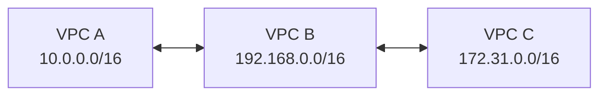
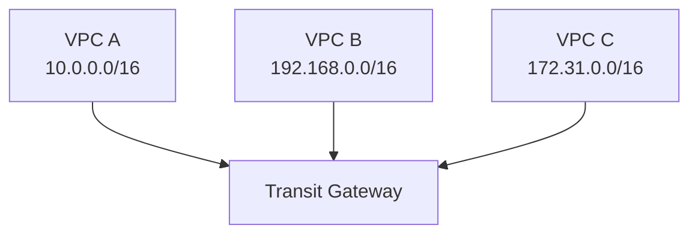

# 90장. Transit Gateway

## 이 장에서 말하고자 하는 것

앞 장에서 우리는 VPC Peering을 통해  
두 개의 VPC를 연결하는 방법을 배웠다.

Peering은 단순하고 빠르지만  
VPC가 많아지면 문제가 발생한다.

* 연결 수가 급격히 증가하고
* 서로 직접 연결되지 않은 VPC는 통신할 수 없다

이 문제를 해결하기 위해 등장한 것이

> **Transit Gateway (TGW)**

이다.

---

## 1. Transit Gateway란 무엇인가

Transit Gateway는

> 여러 네트워크를 하나의 중앙에서 연결하는 서비스

다.

쉽게 말하면

> AWS에서 제공하는 중앙 라우터

라고 보면 된다.

---

## 2. 왜 필요한가

VPC Peering 구조를 다시 생각해보자.



이 구조에서 많은 사람들이 이렇게 생각한다.

```text
VPC A → VPC C 가능할 것 같지만 ❌
```

이유는 단순하다.

> 중간 VPC를 통해 전달할 수 없기 때문이다

또한 VPC가 많아질수록 연결 수는 계속 증가한다.

```text
n(n-1)/2
```

즉, Peering은 규모가 커질수록 관리가 어려워진다.

---

## 3. Transit Gateway 구조

이 문제를 해결하기 위해 구조를 바꾼다.



이 구조의 핵심은

```text
VPC → TGW → VPC
```

이다.

각 VPC가 서로 직접 연결되는 것이 아니라  
모두 TGW라는 중앙 지점을 통해 연결된다.

---

## 4. 어떻게 동작하는가

Transit Gateway를 이해할 때 가장 중요한 것은 라우팅이다.

각 VPC는 목적지를 TGW로 보내고  
TGW가 최종 목적지를 결정한다.

### VPC A 라우팅 테이블

```text
Destination        Target
192.168.0.0/16     tgw-123
172.31.0.0/16      tgw-123
```

### Transit Gateway 라우팅

```text
Destination        Target
10.0.0.0/16        VPC A
192.168.0.0/16     VPC B
172.31.0.0/16      VPC C
```

### 흐름

```text
VPC A → TGW → VPC C
```

즉,

> VPC는 TGW로 보내고, TGW가 목적지를 찾아준다

---

## 5. Peering과의 차이

구조 차이가 핵심이다.

```text
Peering → VPC ↔ VPC 직접 연결
TGW → VPC → TGW → VPC
```

Peering은 단순한 연결이고  
TGW는 실제로 라우팅을 수행하는 장비다.

---

## 6. 어떤 장점이 있는가

Transit Gateway를 사용하면 구조가 크게 바뀐다.

먼저, 전이적 라우팅이 가능해진다.

```text
VPC A → TGW → VPC C 가능
```

그리고 연결 구조가 단순해진다.

```text
VPC 10개 → TGW 하나만 연결
```

또한 모든 라우팅을 중앙에서 관리할 수 있다.

결과적으로 네트워크가 커질수록  
오히려 관리가 쉬워진다.

---

## 7. 언제 사용하는가

Transit Gateway는 다음과 같은 상황에서 사용한다.

```text
VPC가 여러 개
네트워크가 복잡함
중앙 관리가 필요함
```

예를 들어

* 서비스별 VPC 분리
* 계정 단위 분리
* 대규모 시스템

---

## 8. 한 줄로 정리

> Transit Gateway는 여러 VPC를 하나로 묶는 중앙 라우터다

---

## 9. 이 장의 핵심 정리

1. VPC Peering은 규모가 커지면 한계가 있다
2. Transit Gateway는 중앙 허브 역할을 한다
3. 모든 VPC는 TGW를 통해 연결된다
4. VPC는 목적지를 TGW로 보내고 TGW가 라우팅한다
5. 전이적 라우팅이 가능하다
6. 대규모 네트워크에 적합하다