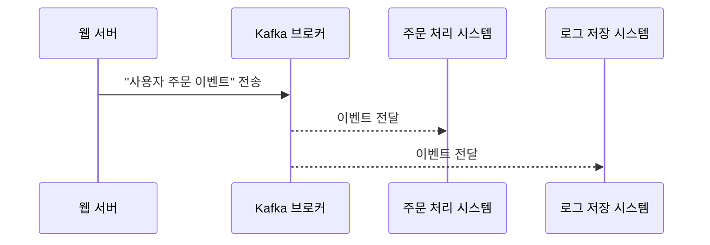
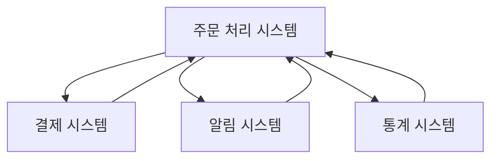
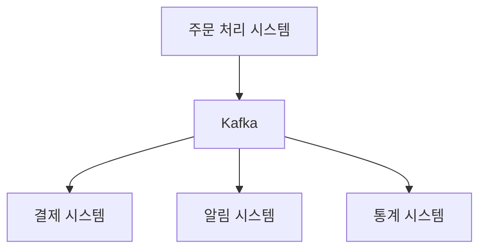

# 1장. Kafka란 무엇인가

## 1.1 Kafka는 어떤 서비스인가요?

Kafka는 쉽게 말하면 **"데이터 택배 시스템"** 입니다.  
여러 개의 시스템 사이에서, 어떤 시스템은 데이터를 보내고(생산자),  
다른 시스템은 그 데이터를 받아서 처리합니다(소비자).  
Kafka는 이 사이에서 **데이터를 안전하게, 빠르게, 실시간으로 전달하는 역할**을 해요.

예를 들어, 여러분이 영상을 하나 클릭했다고 해봅시다.  
그 행동 정보는 "클릭 이벤트"라는 데이터가 되어 Kafka를 통해 전송되고,  
분석 시스템이나 로그 저장 시스템이 그걸 받아서 처리할 수 있습니다.

---

## 1.2 Kafka는 왜 필요한가요?

**문제 상황 예시**  
과거에는 서비스들이 서로 직접 데이터를 주고받았어요.  
하지만 시스템이 많아질수록 데이터 연결이 복잡해지고, 실시간 처리도 어려워졌어요.

**Kafka의 해결 방식**
Kafka를 가운데에 두면 각 시스템은 Kafka와만 연결하면 됩니다.  
그 결과로…

- 시스템 간 연결이 단순해지고
- 데이터 유실 없이 안정적으로 처리되고
- 실시간 반응이 가능해집니다!

---

## Kafka는 다른 메시지 시스템보다 어떤 점이 좋을까요?

Kafka는 단순한 메시지 큐가 아니라, **대규모 실시간 데이터 처리에 특화된 플랫폼**입니다.  
Kafka만의 대표적인 장점은 다음과 같습니다:

### ✅ Kafka의 주요 장점

- 🔄 **데이터를 오래 저장할 수 있어요**  
  대부분의 메시지 큐는 메시지를 읽으면 바로 사라지지만, Kafka는 **디스크에 오래 보관**할 수 있어요.  
  같은 데이터를 여러 번 읽거나, 늦게 도착한 시스템도 처리할 수 있습니다.

- ⚡ **매우 빠릅니다**  
  Kafka는 디스크에 데이터를 쓰면서도 초당 수십만 건의 메시지를 처리할 수 있을 만큼 **성능이 뛰어납니다**.  
  내부 구조가 성능에 최적화되어 있어요.

- 🧵 **여러 소비자가 동시에 읽을 수 있어요**  
  예를 들어, 같은 메시지를 "로그 저장 시스템"과 "분석 시스템"이 **동시에 처리**할 수 있어요.

- 🧩 **확장성과 내결함성이 좋아요**  
  Kafka는 여러 대의 서버가 묶여서 하나의 클러스터를 이루기 때문에, 서버 한 대가 꺼져도 시스템이 계속 작동합니다.  
  **수평 확장도 유연하게 가능합니다.**

- 💡 **고가용성(High Availability)** 지원  
  Kafka는 각 데이터(파티션)를 여러 서버에 복제(replication)해 저장함으로써, 하나의 서버가 고장 나도 데이터 손실 없이 운영이 가능합니다.

---

### 🌍 Kafka를 사용하는 유명 기업들

Kafka는 수많은 글로벌 기업에서 사용하고 있습니다. 그 예시는 다음과 같습니다:

- **LinkedIn**: Kafka의 창시자. 실시간 사용자 활동 로그 처리에 활용
- **Netflix**: 수백 개의 마이크로서비스 사이에서 메시지 전달용으로 사용
- **Uber**: 위치 데이터, 배차 시스템, 요금 시스템 등 실시간 흐름 관리
- **Airbnb**: 사용자 행동 분석과 로그 집계 처리에 Kafka 사용
- **카카오**: 대규모 실시간 로그 수집 및 분산 처리에 활용
- **쿠팡**: 주문, 결제, 배송 상태 이벤트 처리 및 모니터링 시스템 구성

> 💡 Kafka는 단순한 데이터 전달 도구를 넘어,  
> **"데이터 흐름의 중심 허브"** 로 실시간 데이터 기반 시스템을 만드는 데 핵심적인 역할을 합니다.

---

## 1.4 Kafka 간단한 예시 (시퀀스 다이어그램)

---

## 1.5 Kafka를 도입하면 무엇이 단순해지나요?

Kafka가 없던 시절에는 각 서버가 필요한 다른 서버에 **직접 데이터를 전송**했기 때문에  
통신 구조가 점점 복잡해지고 관리하기 어려워졌습니다.

예를 들어, 주문 처리 시스템이 결제 시스템, 알림 시스템, 통계 시스템에 각각 메시지를 보내야 했다면…

이런 구조는 다음과 같은 문제를 갖습니다:

- 새로운 시스템을 추가할 때마다 **기존 시스템 코드를 수정**해야 함
- 연결이 많아질수록 **복잡도 증가**
- 메시지 실패 시 **재전송 처리 어려움**

---

Kafka를 도입하면, 주문 처리 시스템은 Kafka에게만 메시지를 보내면 됩니다.  
필요한 시스템은 Kafka로부터 **알아서 메시지를 구독**하면 됩니다.

이런 구조의 장점은:

- 메시지 생산자는 **단 하나의 대상(Kafka)** 에만 전송하면 됨
- **새로운 소비자 추가가 쉬움** (Kafka에서 구독만 하면 됨)
- 시스템 간 **결합도가 낮아짐** → 유지보수 편해짐
- 장애가 나도 메시지는 Kafka에 저장되어, **나중에 다시 처리 가능**

> 💡 Kafka는 시스템 간 통신을 거미줄 구조에서 **중앙 집중 허브 방식**으로 바꾸어 줍니다.