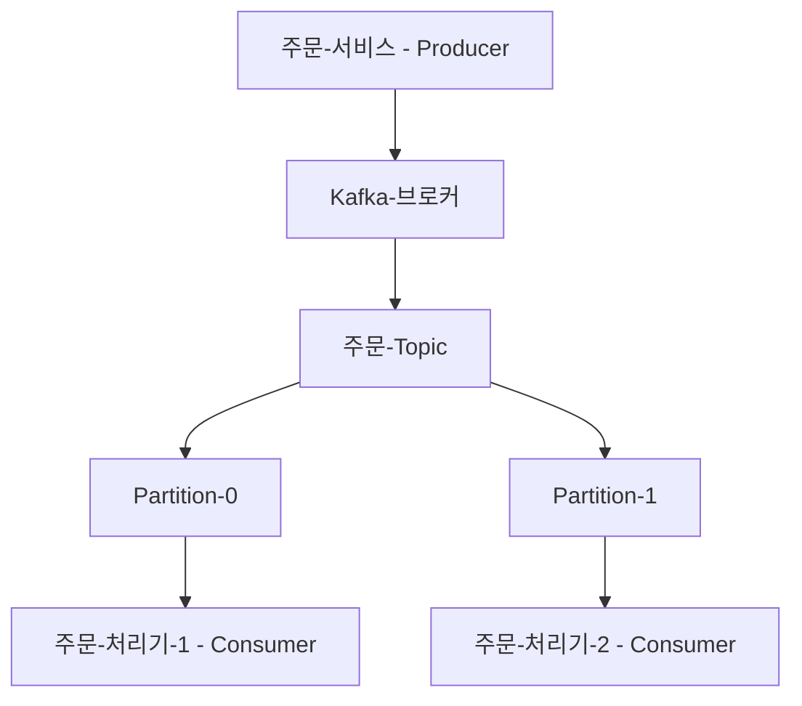
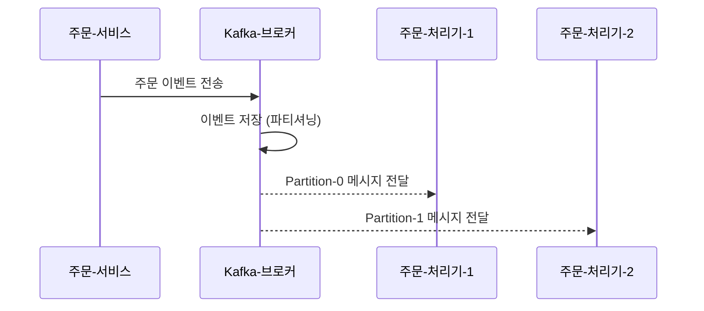

# 2장. Kafka 기본 구조 이해하기

> 이 장에서는 Kafka의 전체 구조를 한눈에 조망해봅니다.  
> 각 구성 요소에 대한 상세 설명은 다음 장들에서 다룰 예정이에요.

---

## 2.1 Kafka의 구성 요소

Kafka는 다음과 같은 주요 요소들로 구성돼 있어요:

- **Producer (생산자)**  
  Kafka로 메시지를 보내는 시스템 (예: 주문 서비스)

- **Consumer (소비자)**  
  Kafka에서 메시지를 읽고 처리하는 시스템 (예: 주문 처리기)

- **Topic (토픽)**  
  메시지를 구분하기 위한 이름 공간 (폴더 개념)

- **Partition (파티션)**  
  Topic을 나눈 물리적 단위. 병렬 처리를 위해 사용됨

- **Broker (브로커)**  
  Kafka 서버. 메시지를 저장하고 분배함

---

## 2.2 Zookeeper는 뭐고, KRaft는 뭘까?

과거 Kafka는 **Zookeeper**라는 시스템을 통해 클러스터 상태를 관리했어요.  
하지만 설정이 복잡하고 운영 비용도 컸죠.

그래서 Kafka 2.8부터는 **KRaft (Kafka Raft Metadata Mode)** 라는 구조가 도입됐어요.

### ✅ KRaft의 특징
- Kafka 자체가 클러스터 메타데이터를 관리 (Zookeeper 필요 없음)
- 장애 복구와 구성 단순화에 유리
- Kafka 3.3 이후로는 **기본 모드로 전환되는 추세**

---

## 2.3 Kafka 구조 예시 (관계 다이어그램)

Kafka에서 메시지는 다음 흐름으로 전달돼요:

- 주문 서비스는 Kafka에 메시지를 보냄
- Kafka는 Topic 내 파티션에 메시지를 저장
- 각 Consumer는 **한 개의 Partition만 소비**함 (같은 Consumer Group으로 동작)

---

## 2.4 메시지 흐름 예시 (시퀀스 다이어그램)

- 하나의 Topic을 여러 Consumer가 병렬로 처리함
- 메시지를 받은 후 Consumer는 Kafka에 "오프셋 커밋"을 할 수도 있음

---

## ✅ 정리

- Kafka는 Producer → Topic/Partition → Consumer 구조로 동작합니다
- 메시지를 효율적이고 병렬적으로 처리할 수 있도록 설계되어 있어요
- 이 장에서는 구조 개요만 다뤘고,  
  **다음 장부터 각 요소를 깊이 있게 살펴볼 거예요!**