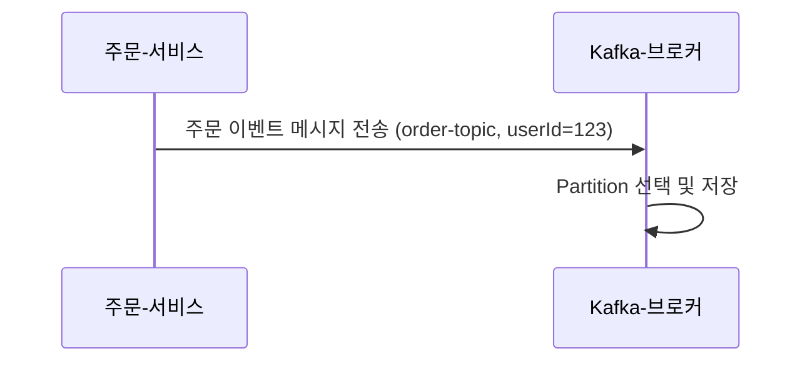

# 3장. Kafka 프로듀서

> Kafka에서 데이터를 보내는 쪽, 바로 **Producer**의 역할에 대해 알아봅니다.  
> 메시지를 어디로, 어떻게, 얼마나 안전하게 보낼지 이해하는 것이 핵심입니다.

---

## 3.1 Kafka에 메시지를 보내는 역할: Producer

Kafka에서 **Producer**는 데이터를 Kafka로 **전송하는 주체**입니다.  
예를 들어 쇼핑몰에서 주문이 발생하면, `주문 서비스`는 Kafka에 **“주문 발생” 이벤트**를 보냅니다.

```
[주문 서비스] → Kafka
```

이처럼 Kafka에 데이터를 전송하는 모든 시스템은 Producer라고 불립니다.

---

## 3.2 Producer는 어디로 데이터를 보낼까? → Topic

Kafka는 데이터를 구분해서 저장할 수 있도록 **Topic(토픽)** 이라는 개념을 사용해요.

> Topic은 **메시지의 종류에 따라 분류된 폴더 같은 개념**이에요.  
> 예: 주문 → `order-topic`, 결제 → `payment-topic`, 로그인 → `login-topic`

Producer는 Kafka에 메시지를 보낼 때 **어떤 Topic에 넣을지 명시**해야 합니다.

---

## 3.3 Topic은 왜 Partition으로 나뉘나요?

하나의 Topic 안에는 실제로는 **여러 개의 Partition(파티션)** 으로 나뉘어 있어요.  
이유는 단 하나: **성능 향상과 병렬 처리**를 위해서입니다.

```
order-topic
├── Partition 0
├── Partition 1
└── Partition 2
```

- Kafka는 메시지를 여러 파티션에 분산시켜 저장합니다  
- 여러 Consumer가 **각각 파티션을 병렬로 읽어서 처리**할 수 있어요

---

## 3.4 Partition은 어떻게 정해질까?

Producer가 메시지를 보낼 때 Kafka는 다음 중 하나로 **Partition을 선택**합니다:

### 🔸 Key가 없는 경우
- Kafka는 파티션을 **무작위 또는 라운드로빈 방식**으로 선택합니다
- 순서 보장이 필요 없는 데이터에 적합합니다

### 🔸 Key가 있는 경우 (예: userId, 주문번호 등)
- Kafka는 Key 값을 **해시(Hash)** 해서 항상 **같은 Partition**에 메시지를 넣습니다

```
userId=123 → Partition 0  
userId=456 → Partition 2  
userId=123 → Partition 0 (다시!)
```

> 이렇게 하면 **같은 유저의 메시지는 같은 파티션으로 들어가서 순서를 지킬 수 있어요**

### 👀 Key는 누가 지정하나요?
- Key는 **Producer가 직접 지정하는 값**이에요
- userId, 주문 ID, 장바구니 ID 등 **같은 대상에 대한 메시지를 묶고 싶을 때** 지정합니다

---

## 3.5 메시지를 잘 보내려면? → 설정이 중요해요

Producer는 성능과 신뢰성을 조절할 수 있는 **다양한 설정 옵션**이 있어요.  
그중에서도 가장 중요한 `acks`부터 살펴볼게요.

---

### 📌 `acks`: 메시지를 성공으로 판단하는 기준

Kafka는 메시지를 보내놓고 끝나는 게 아니라, **브로커가 잘 받았는지** 확인할 수 있어요.  
그 기준을 정하는 게 `acks`입니다.

| 설정값 | 의미 | 장단점 |
|--------|------|--------|
| `0` | 응답을 안 기다림 | 매우 빠름 / 유실 위험 있음 |
| `1` | 브로커가 받았다고 하면 OK | 기본값 / 보통 안전 |
| `all` | 확실히 저장됐다고 할 때까지 기다림 | 가장 안전 / 가장 느릴 수 있음 |

> 예:  
> - 실시간 클릭 로그 → `acks=1` (속도 우선)  
> - 결제, 주문 이벤트 → `acks=all` (신뢰성 우선)

> 💬 Kafka 내부에 “복제 구조”가 있어서 `acks=all`이 완전히 저장될 때까지 기다려주는 구조인데,  
> 이건 뒤에서 다룰 **Kafka 고가용성 구조** 챕터에서 자세히 설명할게요.

---

### 🔧 기타 설정 요약

| 설정 옵션 | 설명 |
|-----------|------|
| `retries` | 메시지 전송 실패 시 재시도 횟수 |
| `linger.ms` | 메시지를 얼마나 기다렸다가 한 번에 보낼지 (ms 단위) |
| `batch.size` | 한 번에 묶어서 보낼 수 있는 메시지의 최대 크기 (byte 단위) |
| `compression.type` | 메시지를 압축해서 전송하는 방식 (압축률/속도 트레이드오프)

---

### 📌 처리량을 높이는 설정: `linger.ms` + `batch.size`

Kafka는 메시지를 하나씩 보내지 않고, **여러 개를 묶어서** 한 번에 보내요.  
이걸 제어하는 게 `linger.ms`와 `batch.size`예요.

#### 🕒 `linger.ms`

- Kafka가 **최대 몇 밀리초 동안 기다렸다가** 메시지를 보낼지 결정  
- 기다리는 동안 더 많은 메시지를 모아 전송 가능  
- 처리량 ↑ / 지연 시간은 소폭 증가

#### 📦 `batch.size`

- 한 번에 전송할 수 있는 **묶음(batch)의 최대 크기**  
- 큼 → 처리량 좋음 / 작음 → 자주 전송됨

> ✅ 함께 사용하면 "많이 모았거나 시간이 지나면 보낸다"는 정책이 됨

---

### 🗜️ `compression.type`: 메시지를 압축하면 뭐가 좋을까?

Kafka에서는 메시지를 **압축해서** 전송할 수 있어요.

- 네트워크 전송량 줄어듦  
- 디스크 저장 공간 절약  
- 처리량 증가 (네트워크 병목 감소)

| 압축 방식 | 장점 | 단점 | 추천 상황 |
|-----------|------|------|------------|
| `none` | CPU 적음 | 전송량 많음 | 테스트 환경, 저부하 |
| `gzip` | 압축률 최고 | 느림 / CPU 높음 | 네트워크 비용 절감 필요 |
| `snappy` | 빠름 / 적당한 압축 | 표준 | 일반적인 로그 처리 |
| `lz4` | 매우 빠름 / 압축률 양호 | | 고속 처리 요구 |
| `zstd` | 압축률+속도 최고 | 최신 Kafka 필요 | 최신 시스템 + 큰 데이터 |

---

## 3.6 메시지 전송 흐름 요약

```
1. Producer가 Kafka에 연결
2. 보낼 Topic을 선택
3. (필요하면 Key 지정)
4. Kafka가 Partition을 선택하고 저장
```

---

## 3.7 시각화로 정리



---

## ✅ 정리

- Producer는 Kafka에 메시지를 전송하는 주체입니다
- Topic은 메시지를 구분하는 주소, Partition은 병렬 처리를 위한 단위입니다
- Key를 지정하면 메시지를 고정된 Partition으로 보내 순서를 유지할 수 있어요
- `acks` 설정은 신뢰성과 속도 균형을 결정하는 중요한 포인트예요
- `linger.ms`, `batch.size`, `compression.type` 등 설정을 통해 **성능 최적화**가 가능합니다

---

다음 장에서는 Kafka에서 메시지를 꺼내서 처리하는 Consumer에 대해 배워볼 거예요.