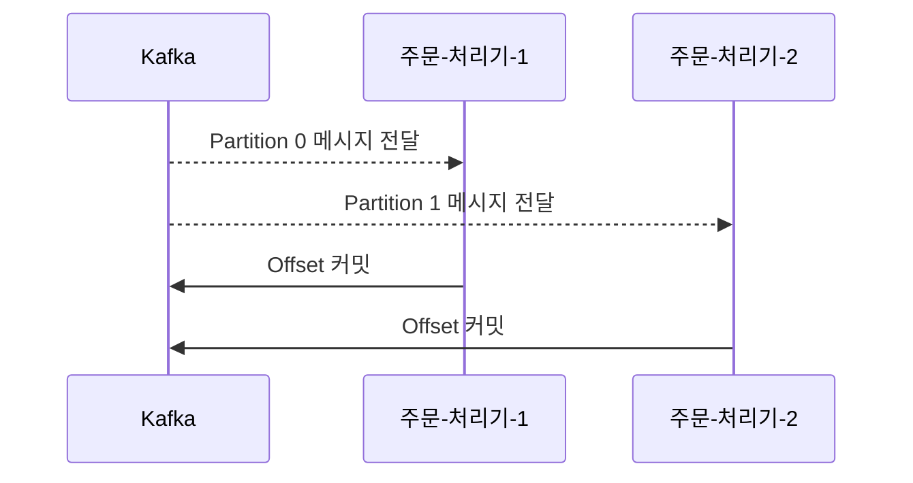

# 4장. Kafka 컨슈머

> Kafka에서 데이터를 받아서 사용하는 쪽, 즉 **Consumer**의 역할을 설명합니다.  
> 메시지를 어떻게 구독하고, 어떤 방식으로 처리하며, 여러 Consumer가 있을 때 어떤 구조로 동작하는지 알아봅니다.

---

## 4.1 Consumer란 무엇인가요?

**Consumer**는 Kafka에서 **메시지를 꺼내서 처리하는 주체**입니다.  
Producer가 보낸 데이터를 실제로 사용하는 쪽이에요.

```
Kafka → [결제 처리 시스템]  
      → [이메일 발송 시스템]  
      → [DB 저장기]
```

Kafka는 메시지를 보관하는 **중간 통신소**,  
Consumer는 이 메시지를 꺼내서 처리하는 **작업자**라고 보면 돼요.

---

## 4.2 Kafka는 왜 메시지를 push하지 않고, pull 방식일까?

Kafka는 메시지를 직접 밀어주는 **push 방식이 아니라**,  
**Consumer가 스스로 가져가는 pull 방식**을 사용해요.

> 💡 즉, Kafka는 “여기 메시지를 쌓아둘게. 필요하면 네가 가져가!”라는 식이에요.

### ✅ pull 방식의 장점

| 항목 | 설명 |
|------|------|
| 소비 속도 조절 가능 | Consumer가 자기 속도에 맞춰 가져감 (과부하 방지) |
| 장애 복구 쉬움 | Consumer가 꺼졌다 켜져도 이어서 읽을 수 있음 |
| 유연한 재처리 | 필요한 경우 동일 메시지를 다시 소비 가능 (로그 기반 처리에 유리)

---

## 4.3 Consumer Group이란?

Kafka는 여러 Consumer가 있을 때,  
**“같은 작업을 함께 처리하는 묶음”** 으로 **Consumer Group**이라는 개념을 사용해요.

> 단순히 Consumer 여러 개가 돌아가는 게 아니라,  
> Kafka는 **Consumer Group을 기준으로 Partition을 나누어 할당**해요.

```
order-topic
├── Partition 0 → Consumer A
├── Partition 1 → Consumer B
```

> 위 구조는 “Consumer Group A” 안에서의 분산 처리 방식이에요.

---

### 🧩 왜 Group으로 묶을까요?

| 이유 | 설명 |
|------|------|
| 병렬 처리 | 여러 Consumer가 하나의 Topic을 나눠서 동시에 처리할 수 있어요  
| 작업 분담 | Kafka가 자동으로 Partition을 나눠줘서 코드 수정 없이 확장 가능  
| 장애 복구 | Offset 정보를 Kafka가 Group 단위로 저장해서 이어서 처리 가능

---

### 📌 초보자 궁금증! Consumer는 무조건 Group에 속해야 하나요?

Kafka에서는 Consumer가 **Group에 속하지 않아도 동작은 가능**하지만,  
**실무에서는 대부분 Group을 설정해서 사용**해요.

| 조건 | 설명 |
|------|------|
| Group ID 있음 | Offset 저장, 자동 리밸런싱, 병렬 처리 가능 ✅ |
| Group ID 없음 | 매번 처음부터 읽고, 병렬성 없음 ❌ |

> ✅ 실무에서는 안정적인 메시지 처리와 재시작을 위해 Group ID 설정은 필수예요!

---

### 🔄 Group은 여러 Topic도 처리할 수 있어요

하나의 Consumer Group은 **여러 Topic을 동시에 구독**할 수 있어요.

```
Consumer Group A
├── 구독 Topic: order-topic, payment-topic
├── Consumer 1: order-topic Partition 0, payment-topic Partition 0
├── Consumer 2: order-topic Partition 1, payment-topic Partition 1
```

> 예: “주문/결제 통합 시스템”에서는 두 Topic을 함께 구독해서 하나의 Group으로 처리 가능해요.

---

## 4.4 한 Group 내부의 메시지 분배 구조

Kafka는 **Topic의 Partition을 기준으로**, Group 내부의 Consumer에게 메시지를 나눠줘요.

- 하나의 Partition은 **하나의 Consumer만** 읽을 수 있음 (같은 Group 안에서)  
- 하나의 Consumer는 **여러 Partition을 담당**할 수 있음

---

### ⚖️ Consumer 수 vs Partition 수 – 몇 개가 맞을까?

| 상태 | 설명 | 결과 |
|------|------|------|
| Consumer 수 = Partition 수 | ✅ 가장 이상적. 병렬 처리 최대화 |
| Consumer 수 < Partition 수 | ✅ 문제 없음. 한 Consumer가 여러 Partition 처리 |
| Consumer 수 > Partition 수 | ❌ 남는 Consumer는 대기 (idle) 상태가 됨 |

> Kafka는 Partition 수보다 많은 Consumer가 있어도 **하나의 Partition을 두 Consumer가 동시에 소비할 수 없기 때문이에요.**

---

## 4.5 메시지를 읽은 뒤에는? → Offset 개념

Kafka는 메시지를 읽을 때마다  
**“어디까지 읽었는지”** 를 기억하는 구조를 제공합니다.  
이걸 **Offset(오프셋)** 이라고 해요.

- Kafka는 각 Group이 **Topic/Partition 별로 어디까지 읽었는지** 따로 저장해줘요
- 덕분에 Consumer가 꺼졌다 켜져도 **중단된 위치부터 이어서** 소비할 수 있어요

---

## 4.6 자동 커밋 vs 수동 커밋

Offset을 Kafka에 저장하는 방법에는 두 가지가 있어요:

| 방식 | 설명 | 장단점 |
|------|------|--------|
| 자동 커밋 | Kafka가 일정 시간마다 자동 저장 | 간편하지만 메시지가 처리되기 전에 커밋될 수도 있음 |
| 수동 커밋 | 개발자가 직접 “이제 처리 완료”라고 표시 | 정밀 제어 가능, 실무에서 선호되는 방식 |

---

### 🧨 커밋을 하지 않으면 생기는 문제들

Offset 커밋을 안 하면 Kafka는 **어디까지 메시지를 읽었는지 모르게 돼요.**  
그 결과 다음과 같은 문제가 발생할 수 있어요:

#### 🔁 메시지 재처리 (중복 처리)

- Consumer가 처음부터 다시 읽기 시작하면  
  **이미 처리한 메시지를 또 처리**해서 중복 결제 등 문제가 생길 수 있어요

#### ❌ 메시지 누락

- 메시지를 처리하긴 했지만 **커밋 전에 Consumer가 죽으면**,  
  Kafka는 “읽지 않은 것”으로 간주하지 않아 **누락될 가능성**이 있어요

#### 📉 장애 대응 어려움

- Kafka는 Offset을 기준으로 복구를 수행하기 때문에  
  커밋이 없다면 **어디부터 다시 읽어야 할지 알 수 없어요**

> 💬 Offset 커밋은 단순한 저장이 아니라, **정확한 데이터 흐름을 보장하는 핵심 요소**예요.

---

## 4.7 전체 구조 요약



---

## ✅ 정리

- Kafka는 **pull 방식**으로 메시지를 소비합니다 (Consumer가 직접 가져감)
- 여러 Consumer는 **Group으로 묶어** 하나의 작업을 나눠 병렬로 처리할 수 있어요
- 하나의 Group이 **여러 Topic을 동시에 구독**하는 것도 가능해요
- Kafka는 **Offset**을 통해 어디까지 읽었는지를 기억해주며, 복구와 재처리에 유리해요
- **Consumer 수와 Partition 수의 조합**에 따라 병렬성과 효율이 달라져요
- **Offset 커밋을 하지 않으면 재처리, 누락, 복구 실패 등의 문제가 발생**할 수 있어요
- **자동/수동 커밋**을 통해 메시지 처리 성공 기준을 세밀하게 제어할 수 있어요