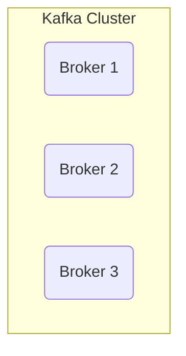
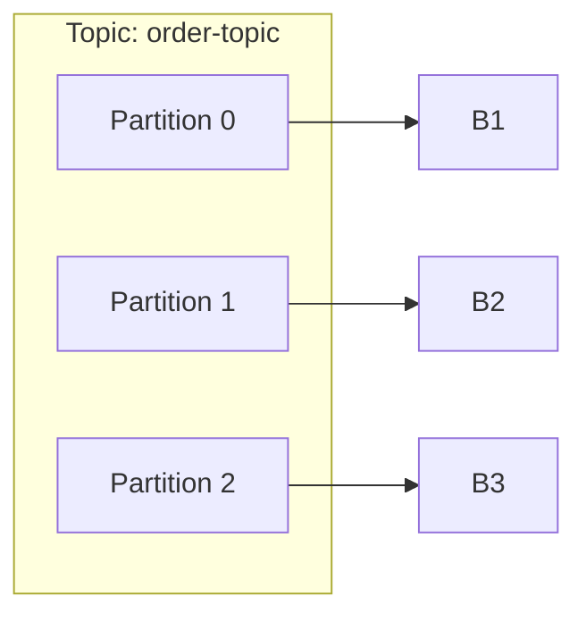
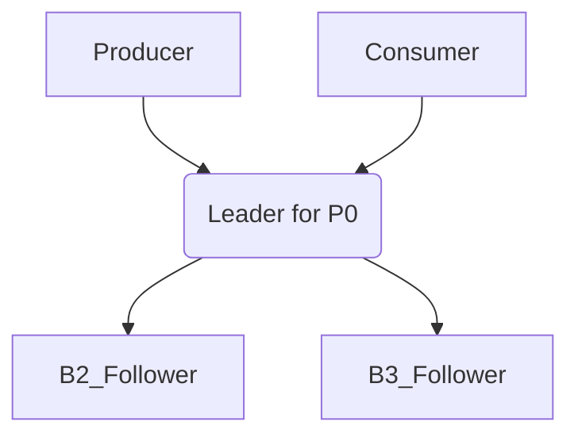
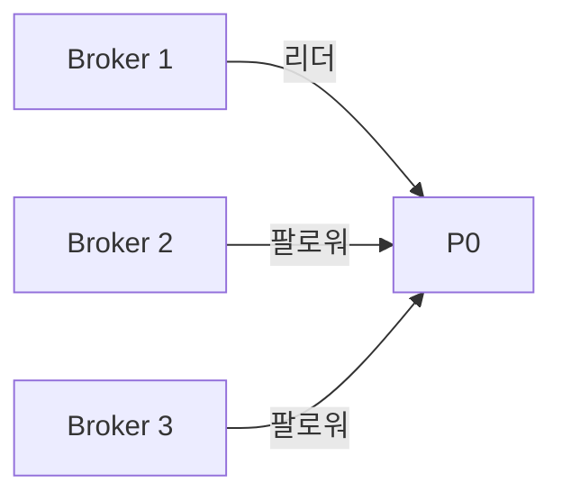
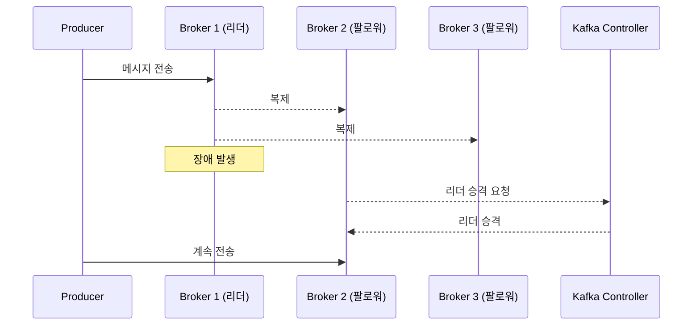

# 5장. Kafka 클러스터와 브로커

> Kafka는 단일 서버가 아니라, 여러 대의 서버가 함께 구성된 **클러스터 구조**로 운영됩니다.  
> 이 장에서는 Kafka 클러스터의 구조와, 핵심 구성요소인 **브로커(Broker)**, 그리고 **리더/팔로워 구조**에 대해 다룹니다.

---

## 5.1 Kafka 클러스터란?

Kafka는 대량의 데이터를 안정적으로 처리하기 위해  
**여러 대의 서버를 하나로 묶은 클러스터** 구조로 동작해요.  
각 서버는 Kafka의 **브로커(Broker)** 역할을 합니다.



> 💡 Kafka는 1대만으로도 동작은 가능하지만, **장애 대응, 복제, 확장성**을 위해 최소 3대 이상이 권장돼요.

---

## 5.2 브로커란?

Kafka의 **브로커(Broker)** 는 Kafka 클러스터 안에서  
메시지를 **받고, 저장하고, 보내주는 역할**을 하는 서버입니다.

| 역할 | 설명 |
|------|------|
| 메시지 수신 | Producer가 보낸 메시지를 받음 |
| 메시지 저장 | 디스크에 Topic/Partition별로 기록 |
| 메시지 전달 | Consumer가 요청하면 메시지를 전달 |
| 클러스터 참여 | 리더 선출, 복제 등 내부 클러스터 조율 |

---

## 5.3 Partition은 브로커에 어떻게 저장될까?

Kafka는 **하나의 Topic을 여러 Partition으로 쪼개고**,  
이 Partition을 **브로커에 분산해서 저장**해요.



---

## 5.4 Kafka의 고가용성을 위한 복제 구조

Kafka는 단순히 데이터를 저장하는 게 아니라,  
**서버 장애가 발생해도 메시지가 손실되지 않도록 고가용성을 보장**해야 해요.

그래서 Kafka는 **각 Partition을 여러 브로커에 복제(Replication)** 해서 저장해요.

```plaintext
order-topic
├── Partition 0
│   ├── Broker 1 (복제본 1)
│   ├── Broker 2 (복제본 2)
│   └── Broker 3 (복제본 3)
```

> ✅ 이렇게 복제하면 **Broker 1이 죽어도** 나머지 브로커에 데이터가 살아 있어서  
> 시스템이 계속 동작할 수 있어요!

### 💬 복제를 하는 이유는?

| 이유 | 설명 |
|------|------|
| 장애 대응 | 한 브로커가 죽어도 데이터를 잃지 않도록 함 |
| 고가용성 | 계속해서 메시지를 보내고 읽을 수 있도록 |
| 무중단 운영 | 리더 장애 시 자동 전환이 가능함 |

---

## 5.5 리더와 팔로워는 **파티션 단위**로 정해져요

Kafka는 **각 Partition마다 리더와 팔로워를 지정**합니다.

- **Partition 단위로 리더가 존재**하고,  
- 리더는 **쓰기/읽기 담당**,  
- 팔로워는 **리더의 데이터를 복제만 수행**해요.

```plaintext
order-topic
├── Partition 0 → 리더: Broker 1, 팔로워: Broker 2, 3
├── Partition 1 → 리더: Broker 2, 팔로워: Broker 1, 3
├── Partition 2 → 리더: Broker 3, 팔로워: Broker 1, 2
```

> 💡 초보자 주의! Kafka의 리더/팔로워는 **브로커 기준이 아니라 Partition 기준**이에요.

---

### 🔄 Producer와 Consumer는 누구와 통신할까?

Kafka에서 **외부와 통신하는 주체는 항상 리더 브로커**입니다.

| 역할 | 리더와 통신 여부 |
|------|------------------|
| Producer | ✅ 리더에게만 메시지를 전송 |
| Consumer | ✅ 리더에게만 메시지를 요청 |
| Follower | ❌ 직접 통신 불가 (복제만 수행) |



---

## ⚖️ Kafka는 Partition 리더를 브로커에 자동으로 분산시켜요

Kafka는 모든 Partition의 리더가 특정 브로커에 몰리지 않도록  
**리더를 자동으로 여러 브로커에 분산 배치**해요.

| Partition | Leader | Follower 1 | Follower 2 |
|-----------|--------|------------|------------|
| P0        | B1     | B2         | B3         |
| P1        | B2     | B3         | B1         |
| P2        | B3     | B1         | B2         |
| P3        | B1     | B2         | B3         |
| P4        | B2     | B3         | B1         |
| P5        | B3     | B1         | B2         |

> ✅ Kafka는 이처럼 리더 브로커를 자동으로 **균형 있게 배치**해서  
> 클러스터 전체에 부하를 분산시켜요.

---

## 💬 그러면 Consumer 요청도 브로커에 분산되겠네요?

맞아! Kafka의 Consumer는 메시지를 읽을 때 **각 Partition의 리더 브로커에 요청(pull)** 해요.

```plaintext
Consumer Group A
├── Partition 0 → 리더: B1에게 요청
├── Partition 1 → 리더: B2에게 요청
├── Partition 2 → 리더: B3에게 요청
```

> 💡 이 구조 덕분에 **Consumer의 메시지 요청도 자동으로 브로커에 고르게 분산**됩니다!

---

## 5.6 왜 Kafka는 3대 이상 브로커 구성이 필요할까?

Kafka는 복제본이 있을 때,  
**과반수 이상이 살아 있어야 정상 작동**할 수 있어요.



| 브로커 수 | 살아 있어야 하는 수 | 결과 |
|-----------|----------------------|------|
| 1명 죽음 (2/3) | 과반수 생존 → ✅ 정상 |
| 2명 죽음 (1/3) | 과반수 붕괴 → ❌ 쓰기 불가 |

> ✅ Kafka는 **과반수 합의 기반**으로 쓰기를 수행하기 때문에  
> 보통 최소 3대 이상으로 구성해요

---

## 5.7 장애 발생 시 Kafka는 어떻게 동작할까?



> ✅ Kafka는 장애 발생 시 **팔로워를 리더로 자동 승격**해서  
> 서비스 중단 없이 계속 동작할 수 있어요

---

## 5.8 브로커 수 설계 팁

| 항목 | 설명 |
|------|------|
| 최소 구성 | 3대 이상 (복제 기준 포함) |
| 리더 분산 고려 | Partition 리더가 몰리지 않도록 Kafka가 자동 배치 |
| 수평 확장 | 필요할 때 브로커를 추가하면 자동으로 리밸런싱 가능 |

---

## ✅ 정리

- Kafka는 **브로커 여러 대를 클러스터로 구성**해 고가용성과 확장성을 갖춰요  
- 리더/팔로워는 **브로커 기준이 아니라 파티션 기준**으로 존재해요  
- Kafka는 **각 Partition의 리더를 브로커에 자동 분산 배치**해서 부하를 나눠요  
- Producer/Consumer는 항상 리더 브로커와만 통신해요  
- 최소 3대 이상 구성하면 **1대 장애 시에도 과반수 유지로 무중단 운영**이 가능해요