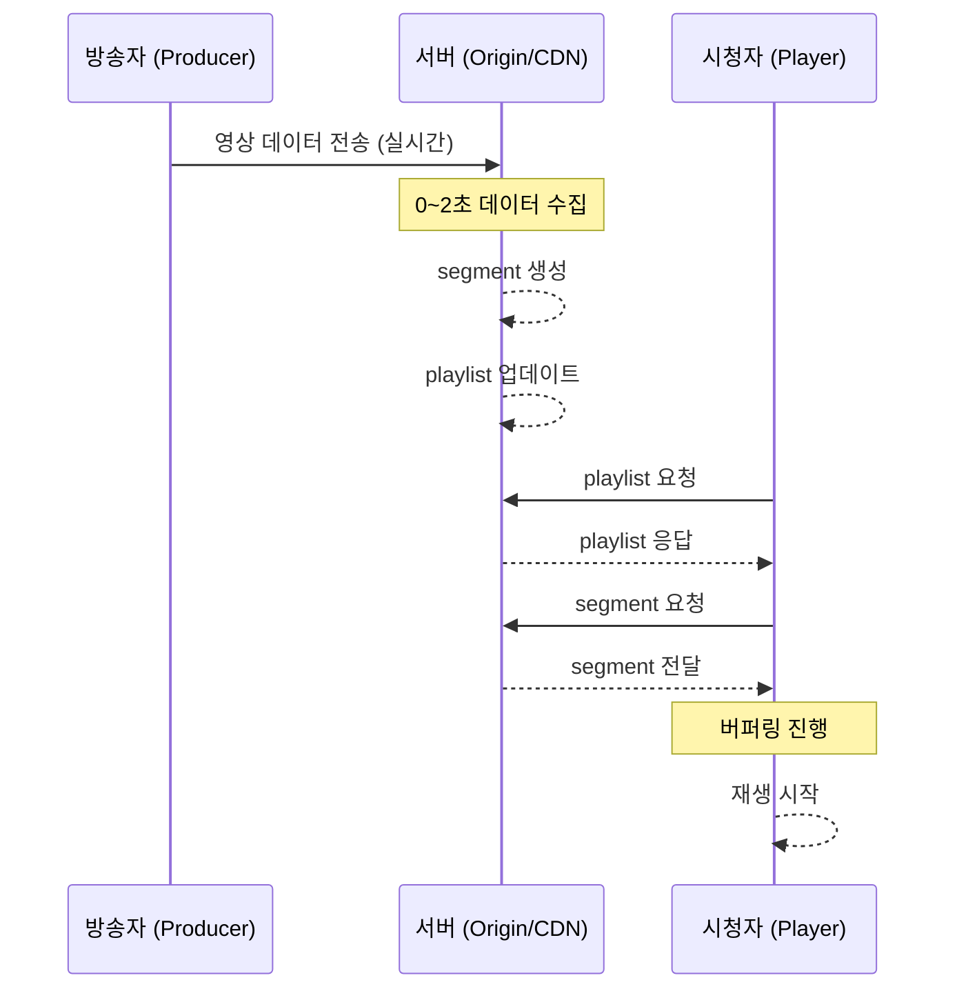

# 4장. 왜 HLS는 느릴 수밖에 없는가 (Latency를 구조로 이해하기)

## 4.1 라이브인데 왜 늦게 보일까

라이브 스트리밍을 보다 보면 이런 상황을 자주 겪는다.  
방송자는 이미 어떤 말을 했는데, 시청자는 몇 초 뒤에야 그 장면을 보게 된다.

이걸 단순히 네트워크 문제나 서버 성능 문제로 생각하기 쉽지만,  
실제로는 그보다 더 근본적인 이유가 있다.

> HLS는 구조적으로 지연이 발생하도록 설계되어 있다.

이 장에서는 그 이유를 “방송자 → 서버 → 시청자” 흐름으로 따라가며 이해한다.

---

## 4.2 전체 흐름을 먼저 그려보기

아래 흐름을 한 번 눈으로 보면 전체 구조가 잡힌다.

이 흐름에서 중요한 건
“누가 언제 기다리는가”다.

---

## 4.3 서버는 먼저 기다린다 (Segment 생성)

HLS의 첫 번째 지연은 서버에서 시작된다.

영상은 일정 시간 단위로 잘려서 segment가 된다.  
예를 들어 2초 단위라면:

0~2초 → seg1
2~4초 → seg2

여기서 중요한 점은 segment는 실시간으로 쪼개지는 게 아니라,  
**해당 구간의 영상이 모두 모인 뒤에 생성된다**는 것이다.

즉 시간 흐름은 다음과 같다.

0초: 촬영 시작
1초: 아직 seg1 없음
2초: seg1 생성

이 순간 이미 최소 2초의 지연이 발생한다.

---

## 4.4 시청자는 바로 알 수 없다 (Playlist 구조)

segment가 만들어졌다고 해서 바로 시청자가 받을 수 있는 것은 아니다.

HLS에서 플레이어는 segment를 직접 알지 못한다.  
항상 playlist(m3u8)를 통해서만 정보를 얻는다.

즉 흐름은 이렇게 된다.

segment 생성 → playlist 업데이트 → 플레이어가 다시 요청 → 인지

여기서 중요한 구조적 특징이 나온다.

> HLS는 push가 아니라 pull 방식이다.

---

## 4.5 시청자는 계속 물어본다 (Polling)

플레이어는 서버에게 계속 이렇게 묻는다.

“새로운 segment 있어?”

이 요청은 일정 주기로 반복된다.  
예를 들어 2초마다 요청한다고 가정해보자.

이 경우 timing에 따라 이런 상황이 발생한다.

segment 생성 직후 → 아직 요청 안함 → 모름  
2초 후 요청 → 그제야 알게 됨

즉, segment가 준비됐어도 바로 전달되지 않는다.

> 요청 타이밍에 따라 추가 지연이 발생한다.

---

## 4.6 플레이어는 일부러 기다린다 (Buffer)

여기서 가장 큰 지연이 발생한다.

플레이어는 안정적인 재생을 위해 일부 데이터를 미리 쌓는다.  
바로 재생하면 끊길 위험이 있기 때문이다.

일반적으로는 다음과 같이 동작한다.

segment 2~3개 확보 → 재생 시작

예를 들어 segment가 2초라면:

2초 × 3개 = 6초

즉 플레이어는 스스로 약 6초 정도를 지연시키고 재생을 시작한다.

이건 문제가 아니라 의도된 동작이다.

> 끊김을 막기 위해 일부러 늦게 시작한다.

---

## 4.7 전체 흐름을 시간으로 다시 보면

이제 전체를 하나로 묶어보자.

촬영 시작  
→ 2초 후 segment 생성  
→ 1~2초 후 playlist 반영 및 인지  
→ 4~6초 버퍼링  
→ 재생 시작

결과적으로 약 6~10초의 지연이 발생한다.

이게 우리가 일반적으로 보는 HLS 라이브 지연이다.

---

## 4.8 이 구조의 본질

지금까지 내용을 한 문장으로 정리하면 이렇다.

> HLS는 “즉시 보여주는 구조”가 아니라  
> “안정적으로 보여주기 위해 기다리는 구조”다.

이 구조에서는

* 서버도 기다리고
* 시청자도 기다리고
* 플레이어도 기다린다

결국 모든 단계에 “대기”가 들어간다.

---

## 4.9 왜 이런 설계를 선택했을까

이건 HLS의 설계 목표와 연결된다.

HLS는 처음부터 초저지연을 목표로 만든 기술이 아니다.  
대신 다음을 목표로 했다.

* 끊김 없는 재생
* 글로벌 확장성
* CDN 활용

그래서 선택한 방향은 명확하다.

> 조금 늦더라도 안정적으로 보여주자

---

## 4.10 그래서 생긴 한계

이 구조는 자연스럽게 다음과 같은 결과를 만든다.

장점:

* 끊김이 적다
* 네트워크 변화에 강하다
* 대규모 서비스에 유리하다

단점:

* 실시간성이 떨어진다
* 구조적으로 지연이 발생한다

---

## 4.11 핵심 정리

HLS의 지연은 다음 네 가지에서 발생한다.

* segment 생성 대기
* playlist 기반 간접 구조
* polling 방식
* player buffer

이걸 직관적으로 표현하면:

Latency ≈ segment + polling + buffer

그리고 가장 중요한 문장은 이것이다.

> HLS는 Low Latency 기술이 아니라  
> Stable Streaming 기술이다.