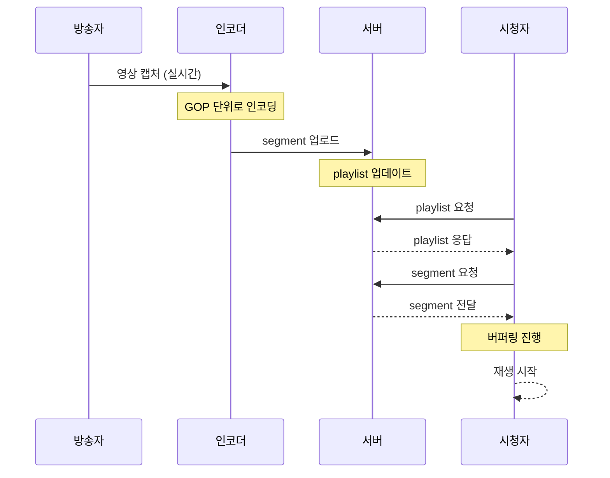

# 5장. 왜 HLS는 느릴 수밖에 없는가

## 5.1 라이브인데 왜 늦게 보일까

라이브 스트리밍을 보다 보면
이런 상황을 자주 겪는다.

> 방송자는 이미 어떤 말을 했는데,
> 시청자는 몇 초 뒤에야 그 장면을 보게 된다.

단순히 네트워크 문제나 서버 성능 문제로 생각하기 쉽지만
실제로는 더 근본적인 이유가 있다.

> **HLS는 구조적으로
> 지연이 발생하도록 설계되어 있다.**

이 장에서는 그 이유를
**"방송자 → 인코더 → 서버 → 시청자"** 흐름으로 따라간다.

---

## 5.2 전체 흐름 한눈에 보기

먼저 흐름을 한 번 눈으로 보자.



이 흐름에서 중요한 건
"**누가 언제 기다리는가**"다.

각 구간마다 발생하는 지연을 하나씩 분석한다.

---

## 5.3 인코더 측 지연

가장 앞단부터 보자.

카메라가 영상을 캡처하면
**먼저 인코더가 처리**해야 한다.

이 과정에서 두 종류의 지연이 발생한다.

---

### ① GOP 단위 처리

4장에서 다룬 GOP를 떠올려보자.

```
[I, P, P, B, P, B, P, P, I, P, P, ...]
 ←──────── GOP ────────→
```

B-Frame은 **양쪽 프레임을 참조**한다.

즉 어떤 프레임을 인코딩하려면
**미래 프레임이 들어올 때까지 기다려야 한다**.

```
시간 0   : 프레임 캡처
시간 0.05: 다음 프레임 캡처
시간 0.10: B-Frame 인코딩 가능
```

대략 **GOP 길이의 절반 정도** 지연이 발생한다.
(보통 0.5~1초)

---

### ② 버퍼 + 비트레이트 제어

인코더는 **품질 안정성**을 위해
짧은 버퍼를 둔다.

* VBV (Video Buffering Verifier)
* lookahead (몇 프레임 미리 봄)

이로 인해 추가로 **수백 ms**가 더해진다.

---

### 인코더 측 총 지연

| 항목 | 대략적 시간 |
|---|---|
| GOP/B-Frame 대기 | 0.5~1초 |
| VBV/lookahead | 0.2~0.5초 |
| **합계** | **약 1초 안팎** |

---

## 5.4 서버 측 지연: Segment 완성 대기

HLS의 두 번째 지연은
**서버에서 segment를 완성하는 시간**이다.

영상은 일정 시간 단위로 잘려서
segment가 된다.

예를 들어 2초 단위라면:

```
0~2초 → seg1
2~4초 → seg2
```

여기서 중요한 점.

> **segment는 실시간으로 쪼개지는 게 아니라
> 해당 구간의 영상이 모두 모인 뒤에 생성된다**

즉 시간 흐름은 이렇다.

```
0초  : 촬영 시작
1초  : 아직 seg1 없음
2초  : seg1 생성 완료
```

이 순간 이미
**최소 2초의 지연**이 발생한다.

---

### Segment 길이를 줄이면?

* 2초 → 1초로 줄이면 → 1초 지연으로 감소
* 0.5초로 줄이면 → 0.5초 지연

하지만 segment를 무한정 작게 만들 수는 없다.

* 파일 수 폭증 → HTTP 요청 부담
* CDN 캐싱 효율 저하
* keyframe 강제로 인한 화질 손실

그래서 **2초가 전통적인 sweet spot**이었다.
(LL-HLS는 이걸 200~500ms까지 내린다 — 6장)

---

## 5.5 Playlist 구조에서 오는 간접 지연

segment가 만들어졌다고 해서
바로 시청자가 받을 수 있는 것은 아니다.

HLS에서 플레이어는
segment를 **직접 알지 못한다**.

항상 playlist(m3u8)를 통해서만 정보를 얻는다.

```
segment 생성
  → playlist 업데이트
    → 플레이어가 playlist 다시 요청
      → 플레이어가 새 segment 인지
        → segment 다운로드 시작
```

이 흐름에서 중요한 구조적 특징이 나온다.

> **HLS는 push가 아니라 pull 방식이다.**

서버가 "새 데이터 있어!"라고 알려주지 않는다.
플레이어가 **직접 물어봐야** 한다.

---

## 5.6 Polling 방식의 추가 지연

플레이어는 서버에게 계속 묻는다.

> "새로운 segment 있어?"

이 요청은 일정 주기로 반복된다.

HLS 명세는 다음을 권장한다.

> playlist는 **TARGETDURATION / 2** 주기로 갱신하라
> (보통 1초)

이 경우 timing에 따라 이런 상황이 발생한다.

```
T=2.0초: segment 생성 완료
T=2.1초: 아직 다음 polling 안 옴 → 모름
T=3.0초: polling → 그제야 알게 됨
```

즉 segment가 준비됐어도
**바로 전달되지 않는다**.

> **요청 타이밍에 따라
> 추가로 0~TARGETDURATION 만큼의 지연이 발생한다.**

평균적으로 **TARGETDURATION의 절반** 정도가 추가된다.

---

## 5.7 Player Buffer 지연

여기서 **가장 큰 지연**이 발생한다.

플레이어는 안정적인 재생을 위해
일부 데이터를 미리 쌓는다.

바로 재생하면
**작은 네트워크 변동에도 끊긴다**.

일반적인 동작:

```
segment 2~3개 확보 → 재생 시작
```

segment가 2초라면:

```
2초 × 3개 = 6초
```

즉 플레이어는 스스로
**약 6초의 지연을 의도적으로** 만든다.

이건 문제가 아니라 **의도된 동작**이다.

> **끊김을 막기 위해
> 일부러 늦게 시작한다.**

---

### 왜 그렇게 많이 쌓을까

플레이어는 다음을 가정한다.

* 네트워크는 출렁인다
* 한 segment가 늦게 오더라도
  다른 segment로 메워야 한다
* 화질을 바꿀 여유도 있어야 한다

이 모든 안전 마진의 결과가
**큰 버퍼**다.

LL-HLS는 이 가정을 바꾼다.
(6장에서 다룸)

---

## 5.8 지연을 시간으로 다시 보기

이제 전체를 하나로 묶어보자.

```
T=0초     : 촬영
T=1초     : 인코딩 완료
T=2초     : segment 생성 완료
T=2.5초   : playlist 업데이트
T=3초     : 시청자가 polling → 인지
T=3.2초   : segment 다운로드 완료
T=9초     : 버퍼 6초 쌓음 → 재생 시작
```

결과적으로 약 **6~10초의 지연**이 발생한다.

이게 우리가 일반적으로 보는
HLS 라이브 지연이다.

---

### 지연 구성 분해

| 구간 | 대략적 시간 |
|---|---|
| 인코더 | 약 1초 |
| Segment 완성 | 1~2초 |
| Playlist 갱신 + Polling | 0~2초 |
| Player Buffer | 4~6초 |
| **총합** | **6~10초** |

대부분의 지연은
**버퍼와 segment 완성**에서 온다.

---

## 5.9 이 구조의 본질

지금까지 내용을 한 문장으로 정리하면 이렇다.

> **HLS는 "즉시 보여주는 구조"가 아니라
> "안정적으로 보여주기 위해 기다리는 구조"다.**

이 구조에서는

* 인코더도 기다리고
* 서버도 기다리고
* 시청자도 기다리고
* 플레이어도 기다린다

결국 모든 단계에 "대기"가 들어간다.

---

### 왜 이런 설계를 선택했을까

이건 HLS의 설계 목표와 연결된다.

HLS는 처음부터
**초저지연을 목표로 만든 기술이 아니다**.

대신 다음을 목표로 했다.

* 끊김 없는 재생
* 글로벌 확장성
* CDN 활용
* 네트워크 호환성

그래서 선택한 방향은 명확하다.

> **조금 늦더라도 안정적으로 보여주자**

---

### 그래서 생긴 장단점

**장점**

* 끊김이 적다
* 네트워크 변화에 강하다
* 대규모 서비스에 유리하다
* 인프라 비용이 낮다

**단점**

* 실시간성이 떨어진다
* 구조적으로 지연이 발생한다
* 인터랙티브 콘텐츠(쌍방향)에 부적합하다

---

## 5.10 핵심 정리

HLS의 지연은
다음 네 가지에서 발생한다.

1. **인코더 측 지연** (GOP, lookahead)
2. **Segment 생성 대기**
3. **Playlist polling 간격**
4. **Player buffer**

이걸 한 공식으로 표현하면:

```
Latency ≈ encoder + segment + polling + buffer
```

그리고 가장 중요한 문장은 이것이다.

> **HLS는 Low Latency 기술이 아니라
> Stable Streaming 기술이다.**

다음 장에서는
이 네 가지 지연 요소를 **어떻게 줄였는가**를 다룬다.
LL-HLS의 등장이다.

---

## 5장 한 줄 정리

> HLS의 지연은 **버그가 아니라 설계**다.
> 안정성을 얻기 위해 각 단계가
> 의도적으로 기다리도록 만들어졌다.
