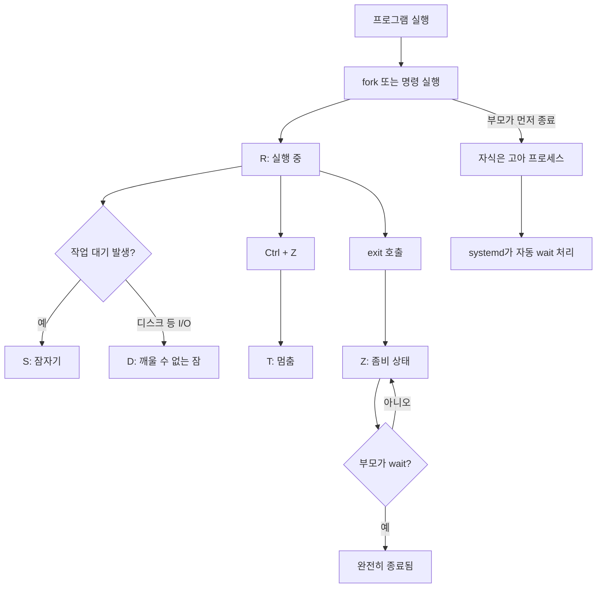

# 🐧 리눅스 프로세스 상태

## 1️⃣ 프로세스란?

* 리눅스에서 실행 중인 프로그램을 '프로세스'라고 부릅니다.
* 우리가 `sleep`, `php`, `bash` 같은 명령어를 실행할 때마다 새로운 프로세스가 만들어집니다.

### ✅ 실습 예제: 간단한 프로세스 만들기

```bash
sleep 60
```

* 이 명령어는 60초 동안 아무것도 하지 않고 대기하는 프로그램입니다.
* 새 터미널을 열고 아래 명령어로 확인해볼 수 있어요:

```bash
ps -eo pid,ppid,stat,cmd | grep sleep
```

---

## 2️⃣ ps 명령어로 프로세스 상태 확인하기

```bash
ps -eo pid,ppid,user,stat,cmd
```

| 항목   | 설명           |
| ---- | ------------ |
| PID  | 프로세스 ID (번호) |
| PPID | 부모 프로세스 ID   |
| USER | 실행한 사용자 이름   |
| STAT | 현재 상태 코드     |
| CMD  | 실행한 명령어      |

---

## 3️⃣ 리눅스 프로세스 상태 전체 보기

### 주요 상태 코드 (1글자)

| 코드 | 의미        | 설명                      |
| -- | --------- | ----------------------- |
| R  | 실행 중      | CPU를 사용하거나 실행 대기 중      |
| S  | 잠자기 상태    | 대기 중이며 시그널이 오면 깨어날 수 있음 |
| D  | 깨울 수 없는 잠 | I/O 작업 중이라 절대 깨울 수 없음   |
| T  | 멈춤        | 일시 중지 상태 (Ctrl+Z 등)     |
| Z  | 좀비        | 종료됐지만 부모가 아직 처리하지 않음    |

> 💡 R, S, D, T, Z는 대부분 시스템에서 쉽게 확인 가능해요

---

## 4️⃣ 보조 상태 플래그 (추가로 붙을 수 있음)

| 플래그 | 설명                   |
| --- | -------------------- |
| <   | 우선순위가 높음             |
| N   | 우선순위가 낮음             |
| s   | 세션 리더 (보통 터미널의 bash) |
| +   | 포그라운드 그룹에 속함         |

예: `Ss` → 잠자기 상태이면서 세션 리더임 (보통 bash가 이 상태)

---

## 5️⃣ S와 D 상태 차이 쉽게 이해하기

### 🔹 S (Sleeping, 잠자기 상태)

* 프로그램이 할 일이 없어서 대기 중
* 예: `sleep 60`처럼 시간만 기다리는 상태
* 시그널을 보내면 즉시 깨어남 → `kill` 명령으로 종료 가능

### 🔸 D (Uninterruptible Sleep, 깨울 수 없는 잠)

* 디스크, 네트워크 등 I/O 작업 중인데 완료되지 않아서 무조건 기다려야 하는 상태
* 시그널을 보내도 반응 없음
* `kill`도 무시됨 → 시스템이 멈춘 것처럼 보일 수 있음
* 이 상태는 직접 만들기 어렵지만 문제 발생 시 `ps`로 종종 보임

---

## 6️⃣ 실습: 직접 상태 확인해보기

### ✅ R 상태 확인하기

```bash
yes > /dev/null &
top
```

→ CPU를 계속 사용해서 R 상태로 보임

🔸 top에서 빠져나오는 방법: 키보드에서 `q` 입력

🔸 `yes` 명령어는 계속 실행되므로 종료해줘야 합니다:

```bash
ps aux | grep yes
kill PID번호  # 위 명령어에서 확인한 PID로 대체
```

### ✅ S 상태 확인하기

```bash
sleep 100 &
ps -o pid,stat,cmd -p $!
```

> `$!` 는 방금 백그라운드로 실행한 `sleep` 명령어의 PID를 가져옵니다.

### ✅ T 상태 (멈춤) 만들기

```bash
sleep 100
```

그리고 Ctrl + Z 누르기 → T 상태가 됨

### ✅ Z 상태 (좀비) 만들기

```bash
bash -c 'sleep 1 &'  # 자식이 먼저 죽고 부모는 그대로
```

→ 1초 안에 아래 명령어로 확인

```bash
ps -eo pid,ppid,stat,cmd | grep Z
```

---

## 7️⃣ 상태별 요약 정리표

| 상태 | 설명     | 시그널 반응 | kill 가능 여부 |
| -- | ------ | ------ | ---------- |
| R  | 실행 중   | 반응함    | 가능         |
| S  | 잠자기    | 반응함    | 가능         |
| D  | 블로킹 대기 | 반응 안 함 | 불가능        |
| T  | 일시정지   | 반응함    | 가능         |
| Z  | 좀비     | 반응 없음  | 부모가 처리해야 함 |

---

## 8️⃣ 좀비 프로세스와 고아 프로세스

### 👻 좀비 프로세스 (Zombie)

* 자식 프로세스가 `exit()`으로 종료되었지만, 부모가 `wait()` 또는 `waitpid()`를 호출하지 않으면 생깁니다.
* 시스템은 종료된 자식의 종료 코드를 부모가 받아갈 때까지 잠깐 보관합니다.
* 이 때 자식 프로세스는 "Z (Zombie)" 상태로 남습니다.
* 오래 방치되면 시스템에 자원 누수 위험이 있으므로 피해야 합니다.

### 👶 고아 프로세스 (Orphan)

* 부모 프로세스가 먼저 종료되고 자식이 계속 실행 중인 경우
* 이런 경우 자식 프로세스는 자동으로 `PID 1 (systemd)`가 부모 역할을 대신합니다.
* systemd는 자동으로 `wait()`를 호출해주기 때문에 좀비 상태로 남지 않습니다.

---

## 9️⃣ 프로세스의 기본적인 상태 변화 흐름 (Mermaid 다이어그램)



> 💡 systemd가 부모가 된 고아 프로세스는 wait을 자동으로 수행하므로 좀비가 되지 않음

---

## 🔚 마무리 정리

* 리눅스에서 실행 중인 모든 명령어는 "프로세스"입니다.
* 프로세스에는 여러 상태가 있고, 이 상태는 `ps` 명령으로 확인할 수 있습니다.
* 대부분의 상태는 `sleep`, `yes`, `bash` 같은 기본 명령으로 테스트할 수 있습니다.
* `top` 명령은 실시간으로 상태를 보기에 좋으며, `q` 키로 종료할 수 있습니다.
* `yes`나 `sleep` 같은 백그라운드 프로세스는 꼭 `kill`로 종료하는 습관을 들이세요.
* 좀비 프로세스는 반드시 부모가 wait 해줘야 없어지고, 고아 프로세스는 systemd가 자동 처리합니다.

> 궁금한 점이 있다면 `man ps` 명령어로 더 많은 정보도 볼 수 있어요!
