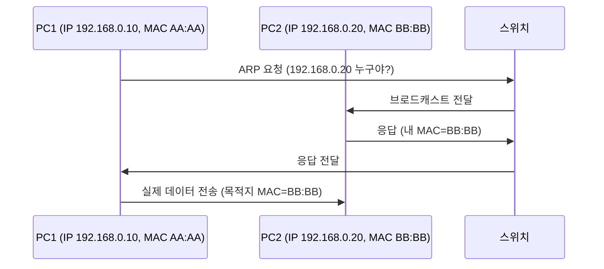

# 🌐 IP 주소와 MAC 주소

## 1️⃣ 왜 주소가 필요한가?

* 네트워크에서 장치들이 서로 대화하려면 **“누구에게 보내야 하는지”** 를 알아야 함
* 현실 비유

  * **IP 주소** = 집 주소 (어느 동네, 어느 집)
  * **MAC 주소** = 주민등록번호 (그 집 안의 특정 사람)

---

## 2️⃣ IP 주소 (논리적 주소)

* 네트워크에서 장치를 구분하는 **위치 정보**
* IPv4 : 32비트, `192.168.0.10` 같은 형태 (현재 대부분 사용)
* IPv6 : 128비트, 주소 부족 문제 해결용 (아직 IPv4 중심)

---

## 3️⃣ MAC 주소 (물리적 주소)

* 네트워크 카드(NIC)에 새겨진 고유 식별 번호
* 48비트, 16진수 6쌍 (예: `00:1A:2B:3C:4D:5E`)
* 전 세계적으로 유일, 바뀌지 않음

---

## 4️⃣ IP와 MAC의 관계

* **IP 주소**는 네트워크에서 **“누구에게 보낼지”** 를 정함
* 하지만 실제 데이터 전송은 **MAC 주소**로 이루어짐
* 즉, **IP = 논리적 목적지 / MAC = 실제 수신자**

---

## 5️⃣ ARP(Address Resolution Protocol)

IP와 MAC을 이어주는 다리 역할

* 상황: PC1이 `192.168.0.20`에 데이터 보내고 싶음

1. PC1: “192.168.0.20의 MAC 주소 누구야?” (ARP 요청, 브로드캐스트)
2. PC2: “그건 나야, MAC은 BB\:BB\:BB” (ARP 응답)
3. PC1 → PC2: 실제 데이터 전송 (목적지 MAC = BB\:BB\:BB)

---

## 6️⃣ 시각적 흐름 (ARP 예시)

---

## ✅ 요약

* IP 주소 = 집 주소 (논리적 위치)
* MAC 주소 = 주민등록번호 (고유 식별자)
* 데이터 통신은 IP로 목적지를 찾고, MAC으로 최종 전달
* **ARP** = IP 주소를 MAC 주소로 변환해주는 중간 과정