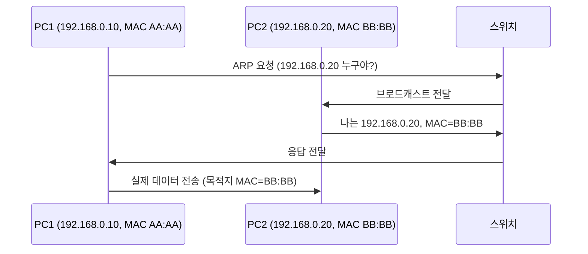

# 🌐 IP 주소와 MAC 주소

## 1️⃣ IP 주소 (논리 주소)

* 네트워크 상에서 장치를 구분하기 위한 **논리적인 주소**
* 사람이 읽고 관리하기 쉽도록 숫자로 표현 (예: `192.168.0.10`)
* 네트워크 관리자나 DHCP 서버가 변경 가능
* 같은 네트워크 대역 안에서만 직접 통신 가능

👉 **집 주소와 비슷** (동네와 번지가 있어서 위치를 알 수 있음)

---

## 2️⃣ MAC 주소 (물리 주소)

* **네트워크 카드(NIC)** 에 새겨진 **고유 식별자** (제조 시 하드웨어에 할당)
* 48비트(6바이트)로 구성, 16진수로 표현

    * 예: `00:1A:2B:3C:4D:5E`
* 전 세계에서 중복되지 않음 (제조사 코드 + 일련번호)
* 하드웨어 수준에서 실제 통신 시 사용

👉 **사람의 주민등록번호**와 비슷 (바뀌지 않는 유일한 값)

---

## 3️⃣ IP ↔ MAC 관계 (ARP 프로토콜)

* 같은 네트워크 안에서 **IP만 알면 바로 통신할 수 없음**
* 실제 데이터는 **MAC 주소**로 전송됨
* 그래서 장치는 \*\*ARP(Address Resolution Protocol)\*\*으로
  "이 IP를 가진 장치의 MAC 주소가 뭐지?" 하고 물어봄

예:

1. PC1이 `192.168.0.20`에 데이터를 보내려 함
2. PC1이 네트워크에 ARP 요청: “192.168.0.20 가진 MAC 주소 알려줘”
3. 해당 PC가 MAC 주소 응답: `00:1A:2B:3C:4D:5E`
4. 실제 데이터는 **MAC 주소를 목적지로 해서 전송**

---

## 4️⃣ 그림으로 표현

