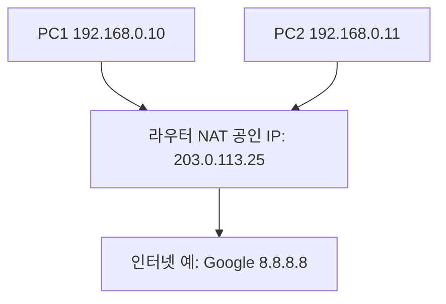

# 🌐 공인 IP와 사설 IP, 그리고 NAT

## 1️⃣ 공인 IP (Public IP)

* **인터넷에서 직접 사용되는 주소**
* 전 세계에서 **유일**해야 함 (중복 불가)
* ISP(통신사)가 고객에게 할당
* 예: `203.0.113.25`, `8.8.8.8` (구글 DNS)
* 특징:

    * 인터넷 어디서나 접근 가능
    * 주소 개수가 한정되어 있음 (IPv4 부족 문제 발생)

---

## 2️⃣ 사설 IP (Private IP)

* 회사나 가정 **내부 네트워크에서만 사용**
* 외부 인터넷에서는 직접 사용 불가
* 누구나 자유롭게 쓸 수 있음 (중복 가능)

사설 IP 대역 (RFC1918 규정):

* `10.0.0.0 ~ 10.255.255.255` (/8)
* `172.16.0.0 ~ 172.31.255.255` (/12)
* `192.168.0.0 ~ 192.168.255.255` (/16)

예: `192.168.0.10`, `10.1.1.5`

👉 그래서 집에서 쓰는 공유기 IP는 보통 `192.168.x.x`

---

## 3️⃣ 왜 공인/사설로 나눴을까?

* 인터넷에 연결된 모든 장치에 공인 IP를 주기에는 **IPv4 주소가 부족**
* 그래서 내부망은 사설 IP를 쓰고,
* 외부와 연결할 때만 공인 IP 하나(or 소수)를 사용

---

## 4️⃣ NAT (Network Address Translation)

**NAT = 사설 IP ↔ 공인 IP 변환 기술**

* 라우터(공유기, pfSense)가 수행
* 내부 장치가 인터넷에 나갈 때:

    * 사설 IP(192.168.0.10) → 라우터가 가진 공인 IP(203.0.113.25)로 변환
* 외부 서버가 응답할 때:

    * 공인 IP로 들어온 데이터 → 내부의 올바른 사설 IP로 전달

---

## 5️⃣ NAT의 종류

* **SNAT (Source NAT)**

    * 내부 → 외부로 나갈 때 출발지 주소를 공인 IP로 바꿔줌 (일반적인 인터넷 사용)
* **DNAT (Destination NAT)**

    * 외부 → 내부로 들어올 때 목적지 주소를 사설 IP로 변환 (포트포워딩)
    * 예: 회사 내부 웹서버를 외부에서 접속 가능하게 만들 때 사용

---

## 6️⃣ 예시 (가정/회사 네트워크)

* 내부 PC1, PC2는 **사설 IP**만 가짐
* 라우터는 인터넷과 연결된 **공인 IP** 하나만 가짐
* NAT 덕분에 PC1, PC2 모두 인터넷에 접속 가능

---

## ✅ 요약

* **공인 IP**: 인터넷에서 직접 통신 가능한 유일한 주소
* **사설 IP**: 내부 전용 주소 (외부에서는 직접 통신 불가)
* **NAT**: 사설 IP ↔ 공인 IP 변환 기술

    * 내부 장치 여러 대가 공인 IP 하나를 공유해 인터넷 사용 가능
    * 포트포워딩(DNAT)으로 외부에서 내부 서버 접속 가능