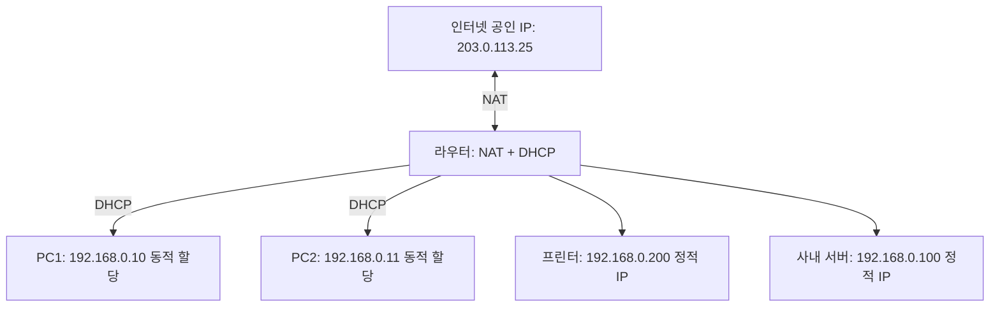

# 📘 정적 IP, 동적 IP, DHCP, 그리고 NAT

## 1️⃣ 정적 IP (Static IP)

* 관리자가 직접 지정한 **고정된 주소**
* 항상 변하지 않음
* 사용 예시:

    * 회사 서버 (웹서버, DB 서버)
    * 네트워크 프린터 (모든 직원이 같은 주소로 접근해야 함)
    * 라우터/스위치 같은 장비 관리

👉 **장점**: 변하지 않아서 접속하기 쉬움  
👉 **단점**: 사람이 직접 설정해야 하고, 많아지면 관리 힘듦

---

## 2️⃣ 동적 IP (Dynamic IP)

* 네트워크에 연결할 때 **자동으로 주소를 받는 방식**
* 보통 **DHCP 서버**가 알아서 배분해줌

👉 **장점**: 편리, 자동 관리, 충돌 없음  
👉 **단점**: 시간이 지나면 주소가 바뀔 수 있음 → 서버용으로는 부적합

---

## 3️⃣ DHCP (Dynamic Host Configuration Protocol)

* **IP 주소를 자동으로 배분하는 기능**
* 네트워크에 연결된 PC, 노트북, 스마트폰이 “주소 주세요!” 하면 → DHCP 서버가 IP, 게이트웨이, DNS까지 세트로 줌

### DHCP 서버는 누구?

* **작은 네트워크(집, 소규모 회사)** → 보통 라우터(공유기)가 DHCP 서버 역할을 함
* **큰 회사** → 별도의 DHCP 서버(Windows Server, Linux DHCP)에서 관리

---

## 4️⃣ NAT (Network Address Translation)

* **사설 IP ↔ 공인 IP 변환 기술**
* 내부 PC는 보통 사설 IP(`192.168.x.x`)를 쓰고, 인터넷은 공인 IP가 필요함
* 라우터(NAT)가 **중간에서 변환**해줌

👉 예시:

* 내부 PC1: `192.168.0.10`
* 내부 PC2: `192.168.0.11`
* 라우터의 공인 IP: `203.0.113.25`

PC1, PC2가 인터넷에 접속할 때 → NAT을 거쳐 **모두 `203.0.113.25`로 나감**

---

## 5️⃣ 전체 흐름 예시

📌 PC가 처음 네트워크에 연결해서 인터넷에 접속하는 과정

1. PC → “IP 주소 주세요!” (DHCP Discover)
2. 라우터(DHCP 서버) → “너 192.168.0.10 써” (DHCP Offer/ACK)
3. PC는 IP 주소를 받고 내부 네트워크에 합류
4. PC가 구글(8.8.8.8)에 접속하려고 함
5. 라우터(NAT)가 `192.168.0.10`을 `203.0.113.25`로 변환해서 인터넷으로 보냄
6. 구글이 응답할 때도 NAT이 다시 변환해서 PC에게 돌려줌

---

## 6️⃣ 그림으로 이해하기

* DHCP: 내부 장치에 주소를 자동으로 배분
* NAT: 공인 IP 하나로 내부 장치 여러 대를 인터넷에 연결