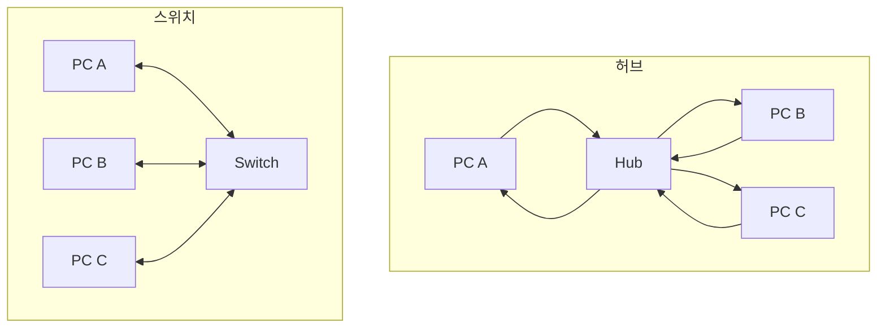

# 📘 허브(Hub)

## 1️⃣ 허브란?

* 네트워크 장비의 가장 기본 형태
* 여러 PC를 단순히 전기적으로 연결 → 모든 포트에 신호를 똑같이 전달
* 네트워크의 **멀티탭** 같은 역할

👉 예: 내가 보낸 데이터가 모든 포트로 퍼짐  
→ 내 PC가 보낸 데이터가 프린터, 다른 PC 등 모든 장치에게 다 전달됨  
→ 목적지가 아닌 장치는 그냥 무시

---

## 2️⃣ 허브의 문제점

1. **네트워크 효율 저하**

    * 모든 장치가 동시에 데이터를 보내면 충돌(Collision) 발생
    * 충돌이 많아질수록 속도가 급격히 느려짐

2. **반이중(Half-Duplex)만 지원**

    * 동시에 **송신과 수신**이 불가능
    * 예: 내가 말할 때는 듣지 못하고, 듣고 있을 때는 말할 수 없음

3. **보안 문제**

    * 데이터가 모든 포트로 전달되므로 스니핑(도청) 가능

---

## 3️⃣ CSMA/CD (Carrier Sense Multiple Access with Collision Detection)

허브 시절 충돌 문제를 해결하기 위해 나온 방식

* **Carrier Sense**: 전송하기 전에 네트워크가 사용 중인지 확인
* **Multiple Access**: 여러 장치가 네트워크를 공유
* **Collision Detection**: 동시에 전송하면 충돌 발생 → 충돌 감지 후 일정 시간 랜덤 대기 → 재전송

👉 마치 여러 사람이 동시에 말하려다 부딪히면 “아, 겹쳤네” 하고 서로 잠깐 기다린 뒤 다시 말하는 것과 같음

---

## 4️⃣ 스위치의 등장

* 스위치는 허브의 단점을 보완한 장비
* **데이터를 목적지 포트에만 전달** (MAC 주소 기반)
* **전이중(Full-Duplex) 통신** 지원 → 동시에 송신과 수신 가능
* 충돌이 사라지고 속도가 빨라짐
* 현재는 허브 대신 대부분 스위치를 사용

---

## 5️⃣ 그림으로 비교

* **허브**: 모든 데이터가 모든 장치로 퍼짐
* **스위치**: 목적지 장치에만 전달