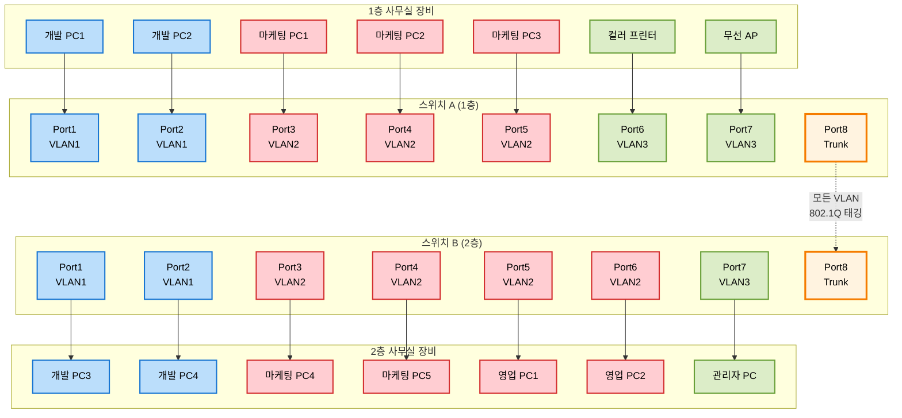

# 📘 스위치(Switch)와 VLAN

## 1️⃣ 스위치란?

* 흔히 말하는 “스위치”는 보통 **L2 스위치**(데이터링크 계층)
* 허브와 달리, **목적지 장치에게만 데이터 전달**
* **전이중(Full-Duplex)** 통신 지원 → 동시에 송수신 가능
* 이 때문에 **CSMA/CD 프로토콜**이 필요 없음 (충돌 없음)

👉 허브와의 차이:

* 허브 = 멀티탭, 무조건 전체 방송
* 스위치 = 똑똑한 우체국, 목적지만 골라서 배달

---

## 2️⃣ MAC 주소 테이블

스위치는 **MAC 주소 테이블**을 만들어서 장치와 포트를 매핑합니다.

* 내 PC(MAC: AA\:BB\:CC…) → 스위치 Port 1
* 프린터(MAC: DD\:EE\:FF…) → 스위치 Port 5

👉 이렇게 “누가 어디 있는지” 주소록을 자동으로 작성

---

## 3️⃣ MAC 주소 학습 과정

1. **플러딩(Flooding)**

    * 처음에는 목적지를 모르니까, 프레임을 모든 포트에 뿌림

2. **포워딩(Forwarding) & 필터링(Filtering)**

    * 목적지 MAC이 테이블에 있으면 해당 포트로만 전송 (포워딩)
    * 다른 포트로는 보내지 않음 (필터링)

3. **에이징(Aging)**

    * 일정 시간 동안 통신이 없으면 테이블에서 삭제
    * (장치가 이동하거나 꺼졌을 때 반영하기 위함)

---

## 4️⃣ VLAN (가상 LAN)

스위치는 기본적으로 모든 포트가 같은 네트워크에 속함.  
하지만 **VLAN**을 사용하면 하나의 스위치를 여러 개의 네트워크처럼 나눌 수 있음.

👉 예:

* 개발팀 PC는 VLAN 10
* 마케팅팀 PC는 VLAN 20
* 물리적으로 같은 스위치에 꽂혀 있어도 서로 통신 불가

---

## 5️⃣ VLAN의 종류

1. **포트 기반 VLAN (Port-based VLAN)**

    * 특정 포트를 특정 VLAN에 할당
    * 가장 많이 쓰이는 방식
    * 예: Port 1\~10 → VLAN 10, Port 11\~20 → VLAN 20

2. **MAC 기반 VLAN**

    * 장치의 MAC 주소를 기준으로 VLAN 할당
    * 포트가 바뀌어도 같은 VLAN에 속하게 가능

---

## 6️⃣ VLAN 트렁킹 (VLAN Trunking)

* VLAN은 스위치 내부에서는 나눠지지만, 스위치 간 연결 시에도 구분이 필요
* 이때 사용하는 것이 **트렁크 포트(Trunk Port)**

👉 특징:

* 트렁크 포트는 여러 VLAN의 데이터를 동시에 전달
* VLAN을 구분하기 위해 **VLAN 태그**를 붙여 전송
* 이때 사용하는 표준: **802.1Q VLAN Tagging**

---

## 7️⃣ 그림으로 이해하기

* SW1과 SW2 사이 연결은 **트렁크 포트**로 → VLAN 태그 붙여 전달