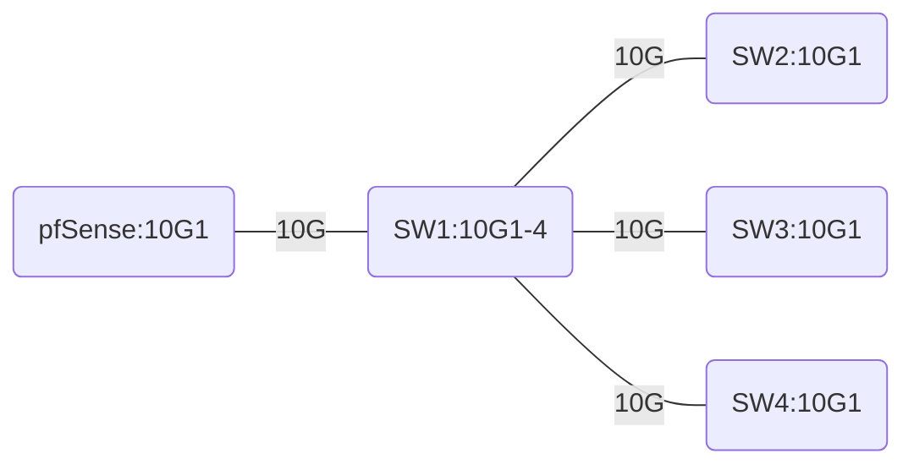
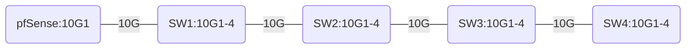
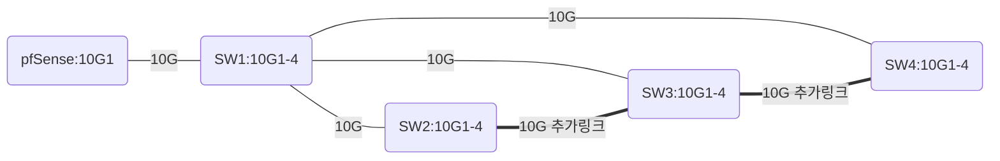
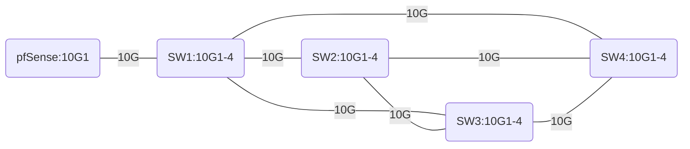
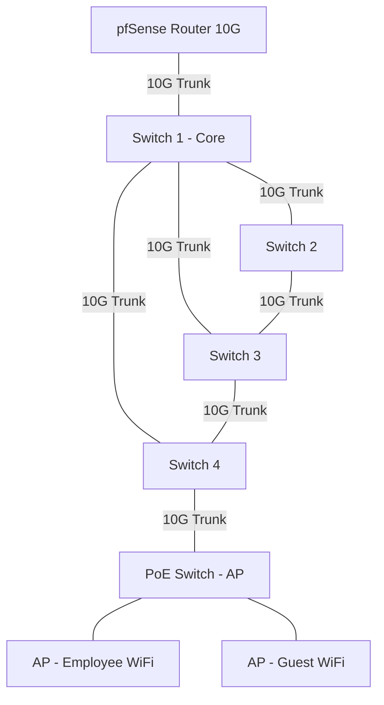

# 스위치 Trunk 연결 방법

## 1) 스타(Star)형 — 관리 가장 쉬움

* **SW1이 코어**, 나머지는 액세스.
* 포트 예산(각 스위치 10G 4개) 안에서 딱 맞음.

**포트 배정(10G)**

* SW1: pfSense=10G1, SW2=10G2, SW3=10G3, SW4=10G4 (총 4/4)
* SW2: SW1=10G1 (1/4)
* SW3: SW1=10G1 (1/4)
* SW4: SW1=10G1 (1/4)

**장점** 단순/안정, 트렁크·VLAN관리 쉬움
**단점** 모든 트래픽이 SW1로 집중(병목 가능) → 필요 시 **LACP로 SW1↔각 SWx를 2링크(20G)** 로 업!

---

## 2) 체인(Chain)형 — 케이블 최소지만 위험

* 직렬 연결이라 **끝쪽 스위치가 불리**하고, 중간 장애 시 뒤가 전부 끊김.

**포트 배정(10G)**

* SW1: pfSense=10G1, SW2=10G2 (2/4)
* SW2: SW1=10G1, SW3=10G2 (2/4)
* SW3: SW2=10G1, SW4=10G2 (2/4)
* SW4: SW3=10G1 (1/4)

**장점** 케이블/포트 절약
**단점** 지연·병목·장애전파 큼 → **권장 안 함**

---

## 3) 하이브리드(Star + 일부 직접링크) — 현실적인 타협안(추천)

* 기본은 **스타**, 추가로 **액세스 간 10G 링크** 몇 개를 넣어 **SW1 병목 완화**.
* 루프 생기므로 **STP 활성화**, 또는 **LACP로 포트채널** 구성 권장.

**포트 배정(예시, 10G)**

* SW1: pfSense=10G1, SW2=10G2, SW3=10G3, SW4=10G4 (4/4)
* SW2: SW1=10G1, **SW3=10G2** (2/4)
* SW3: SW1=10G1, **SW2=10G2**, **SW4=10G3** (3/4)
* SW4: SW1=10G1, **SW3=10G2** (2/4)

**장점** SW2↔SW3↔SW4 사이 트래픽은 SW1 우회 가능 → 병목 감소
**팁** 트래픽 많은 구간에만 직접링크 추가 / 필요시 SW1↔SWx를 **LACP(2x10G)** 로 업

---

## 4) 풀 메쉬(Full Mesh) — 성능 최강, 관리 난이도 최고

* 각 스위치가 **모든 스위치와 10G 직결**.
* SW1은 pfSense까지 물려서 **정확히 4포트 모두 소진**.
* **STP 필수**, 대개 과한 설계라 잘 안 씀.

**포트 배정(10G)**

* SW1: pfSense=10G1, SW2=10G2, SW3=10G3, SW4=10G4 (4/4)
* SW2: SW1=10G1, SW3=10G2, SW4=10G3 (3/4)
* SW3: SW1=10G1, SW2=10G2, SW4=10G3 (3/4)
* SW4: SW1=10G1, SW2=10G2, SW3=10G3 (3/4)

**장점** 병목 최소/경로 다양 → 고가용성
**단점** 케이블·구성 복잡, STP 튜닝 필요, 포트 낭비

---

## 설계 팁 (10G 목표 충족을 위한 실전 포인트)

* **코어-액세스 구조**로 두고(스타 기본), **필요한 액세스 간**만 10G 직접링크(하이브리드) 추가가 현실적.
* **VLAN 트렁크**: pfSense↔SW1, SW1↔각 SWx는 802.1Q 트렁크로.
* **LACP(링크 집성)**: 병목 구간은 2×10G로 묶어 20G 확보.
* **STP/RSTP**: 루프 있는 토폴로지(하이브리드/풀메쉬)는 반드시 활성화.
* **광 모듈/케이블**: 양쪽 규격(SR/LR, OM3/OM4)·거리 맞추기.
* **트래픽 흐름**: 게스트 Wi-Fi/백업/빌드 서버 등 **많이 오가는 경로**에 우선 대역폭 투자.

## 하이브리드 + 무선 POE 스위치 추가
