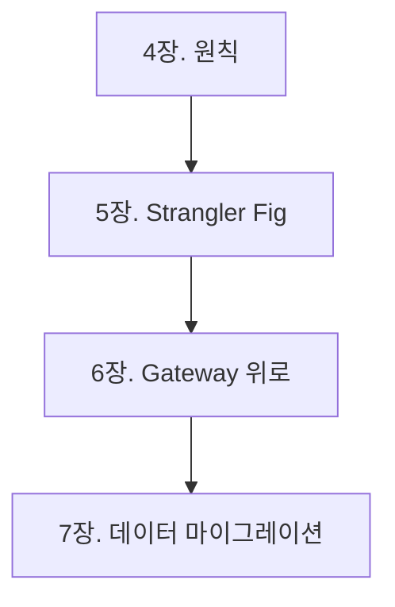

# 4장. 한 번에 옮길 수 없다 — 점진적 전환의 원칙

1부에서 우리는 마이크로서비스의 장점과 그림자를 보았다.
그리고 반드시 이해해야 할 핵심 개념들을 정리했다.

이제 다음 질문이 남는다.

> 그래서, 어떻게 옮길 것인가?

많은 팀이 이 단계에서 같은 결정을 내린다.

> "모놀리스를 다시 짜자.
> 깨끗하게 마이크로서비스로."

그리고 대부분 실패한다.

---

## 빅뱅 마이그레이션이 실패하는 이유

빅뱅 방식은 단순해 보인다.

* 새 아키텍처로 처음부터 다시 짠다
* 완성되면 한 번에 전환한다
* 기존 시스템은 폐기한다

이 방식은 거의 항상 막힌다.
이유는 다섯 가지다.

### 1️⃣ 기존 시스템은 멈추지 않는다

새 시스템을 만드는 동안에도
모놀리스는 계속 변한다.

* 버그 수정
* 신규 기능 추가
* 정책 변경

새 시스템이 따라잡지 못한다.

### 2️⃣ 모놀리스의 진짜 동작을 아무도 모른다

오래된 모놀리스에는
**문서화되지 않은 비즈니스 규칙**이 숨어 있다.

* 코드 깊은 곳의 if문
* 우연히 의존하게 된 동작
* 옛 고객을 위한 특수 처리

새로 짜면 이 모든 게 사라진다.
그리고 운영 중에 발견된다.

### 3️⃣ 전환 시점에 모든 위험이 몰린다

빅뱅 방식은 단 한 번의 큰 결정이다.

* 데이터 마이그레이션
* 트래픽 전환
* 검증
* 롤백

모두 같은 날 동시에 일어난다.

이 중 하나만 어긋나도 전체가 무너진다.

### 4️⃣ 검증할 방법이 없다

새 시스템이 모놀리스와 똑같이 동작하는지
프로덕션 트래픽 없이는 알 수 없다.

그런데 프로덕션 트래픽은
"전환의 날"에야 처음 흐른다.

### 5️⃣ 비즈니스가 기다려주지 않는다

빅뱅은 보통 1~2년이 걸린다.
그동안 새 기능은 어디에 넣어야 하는가?

* 모놀리스에만 넣으면 새 시스템과 격차가 더 벌어진다
* 양쪽에 넣으면 두 번 일한다
* 새 시스템에만 넣으면 사용자는 못 쓴다

어느 쪽도 답이 아니다.

---

## 점진적 전환의 원칙

그래서 현실적인 답은 하나다.

> **모놀리스와 새 시스템이 공존하면서, 한 조각씩 옮긴다.**

이 방식의 핵심은 세 가지다.

### 1️⃣ 작게, 자주, 검증하며 옮긴다

한 번에 떼어내는 것은 하나의 도메인이다.
그 하나가 완전히 안정화된 후 다음으로 넘어간다.

### 2️⃣ 신·구 시스템은 오래 공존한다

공존 기간은 짧으면 6개월, 길면 수년이다.
이 기간 자체가 정상이라는 것을 받아들여야 한다.

### 3️⃣ 언제든 되돌릴 수 있게 만든다

각 단계마다 롤백 시나리오가 준비되어야 한다.
한 도메인 추출이 실패하면
즉시 모놀리스로 트래픽을 되돌릴 수 있어야 한다.

---

## 무엇부터 떼어낼 것인가

점진적이라 해도 순서는 중요하다.
잘못된 순서로 시작하면 막힌다.

좋은 후보의 특징:

* 도메인 경계가 비교적 명확하다
* 다른 영역과의 결합이 약하다
* 변경 빈도가 높거나 확장 요구가 크다
* 실패해도 핵심 비즈니스에 치명적이지 않다

흔한 첫 후보:

* 로그 수집
* 알림·푸시 발송
* 통계·분석
* 검색 인덱싱

이런 영역은
실패해도 주문이 멈추지 않는다.

추출 우선순위를 결정하는 방법은
9장에서 자세히 다룬다.

---

## 점진적 전환의 비용

이 방식이 무료는 아니다.
다음을 받아들여야 한다.

### ⚠️ 두 시스템을 동시에 운영한다

운영 부담은 잠시 동안 **늘어난다**.

* 모니터링 대상 증가
* 인프라 비용 증가
* 디버깅 복잡도 증가

### ⚠️ 일관성 검증이 필요하다

같은 데이터를 두 시스템이 다루는 동안
정합성을 검증할 도구가 필요하다.

이 주제는 23장에서 자세히 다룬다.

### ⚠️ 전환 자체에 인력이 든다

"전환 팀"이 따로 필요할 정도로
사람이 든다.

기존 기능 개발 속도가 일시적으로 떨어진다.

이 비용을 인정하지 않으면
중간에 멈추거나 빅뱅으로 회귀한다.

---

## 책 전체의 흐름

이 책 2부 전체는
점진적 전환을 위한 방법들이다.

각 장은 전환의 다른 면을 다룬다.

* **5장** — 큰 그림: 어떻게 감싸 잘라낼 것인가
* **6장** — 입구 재배치: Gateway를 어디에 둘 것인가
* **7장** — 데이터: 분리된 DB로 어떻게 옮길 것인가

---

## 이 장의 핵심

* 빅뱅 마이그레이션은 거의 항상 실패한다
* 모놀리스는 멈추지 않고, 빅뱅은 모든 위험을 한 시점에 몰아넣는다
* 점진적 전환은 신·구 시스템의 공존을 전제로 한다
* 작게 옮기고, 자주 검증하고, 언제든 되돌릴 수 있게 만든다
* 추출 순서는 결합도와 위험도를 기준으로 정한다
* 공존기의 운영 비용은 정상이라는 것을 받아들여야 한다
