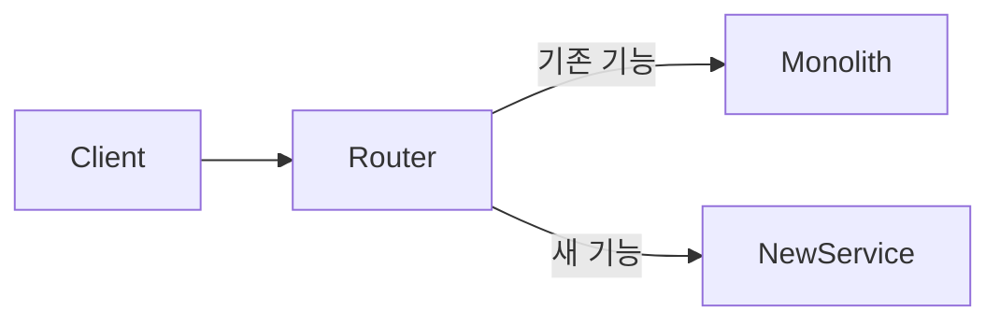
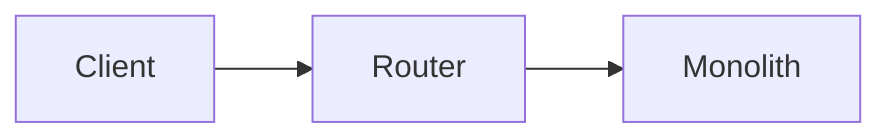
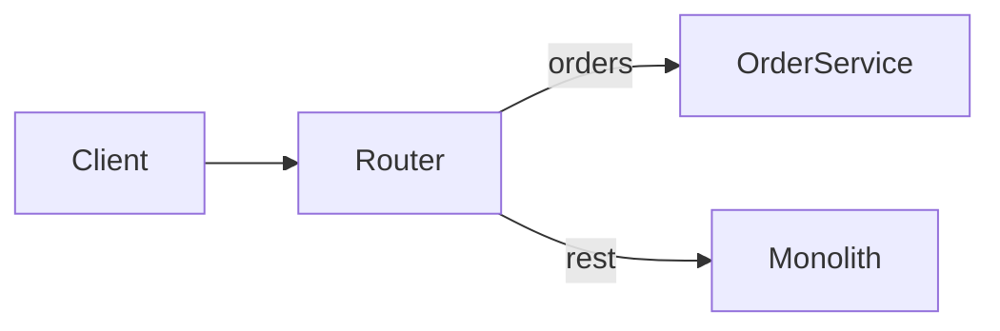
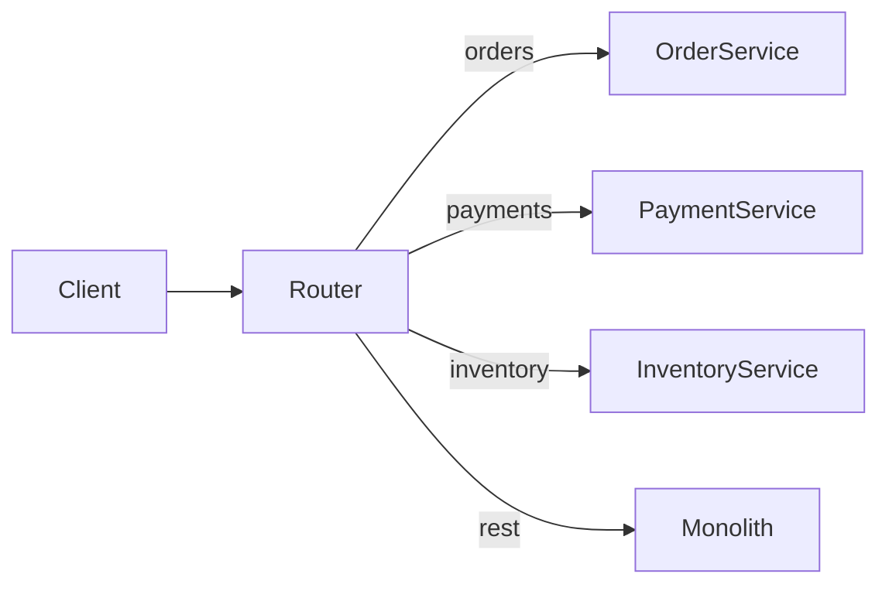
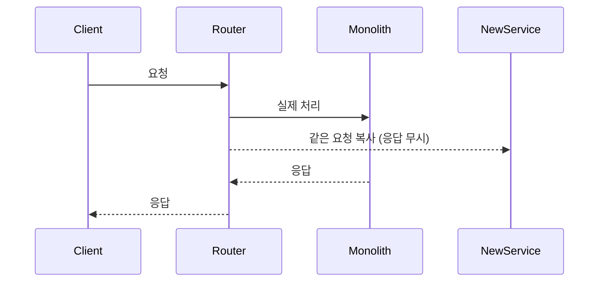
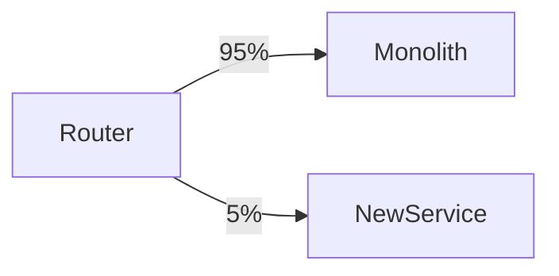

# 5장. Strangler Fig — 모놀리스를 감싸 잘라내기

4장에서 우리는 점진적 전환의 원칙을 보았다.

* 작게, 자주, 검증하며 옮긴다
* 신·구 시스템은 오래 공존한다
* 언제든 되돌릴 수 있게 만든다

그렇다면 구체적으로 어떻게 하는가?

대표적인 방법이 **Strangler Fig 패턴**이다.

---

## 이름의 유래

Strangler Fig는 열대우림에서 자라는 나무다.

* 다른 나무를 감싸며 자란다
* 점점 자기 몸을 키운다
* 결국 안의 원래 나무는 죽고
* 바깥의 새 나무만 남는다

소프트웨어 비유로 가져온 사람은 마틴 파울러다.

> 모놀리스를 새 시스템이 천천히 감싸 들어간다.
> 시간이 지나면 안의 모놀리스는 사라지고, 바깥만 남는다.

---

## 핵심 아이디어

기존 시스템을 멈추지 않는다.
대신 옆에 새 시스템을 만들고,
**라우팅 계층**이 어느 쪽으로 보낼지 결정한다.

처음에는 거의 모든 트래픽이 모놀리스로 간다.
한 기능씩 새 서비스로 옮기며
라우터가 점점 더 많은 트래픽을 새 쪽으로 보낸다.

마지막에 모놀리스로 가는 트래픽이 0이 되면
모놀리스를 폐기할 수 있다.

---

## 단계별 흐름

전환은 보통 다음 단계를 거친다.

### 1️⃣ 라우팅 계층 도입

* 라우터는 처음에 모든 요청을 모놀리스로 보낸다
* 기능적으로는 아무것도 안 바뀐다
* 이 단계의 목적은 **구조 변경**

이 라우팅 계층이 흔히
6장에서 다룰 **API Gateway**가 된다.

### 2️⃣ 한 기능 추출, 라우팅 분기

* 첫 도메인을 새 서비스로 떼어낸다
* 라우터가 경로별로 분기한다
* 한 기능만 새 시스템으로

### 3️⃣ 점진적 추출 반복

* 도메인 하나씩 옮긴다
* 매번 라우팅 규칙이 추가된다
* 모놀리스가 담당하는 영역은 줄어든다

### 4️⃣ 모놀리스 폐기

라우터가 모놀리스로 보내는 트래픽이 0이 되면
모놀리스를 제거한다.

---

## Strangler Fig의 핵심 — 라우팅

이 패턴의 진짜 힘은 **라우팅 분리**에 있다.

라우팅이 외부에 있기 때문에

* 클라이언트는 내부 변화를 모른다
* 한 기능만 새 서비스로 보내고, 나머지는 그대로 둘 수 있다
* 문제 발생 시 라우팅만 되돌리면 즉시 롤백

만약 라우팅이 모놀리스 안에 있다면
새 기능을 호출하기 위해 모놀리스를 거쳐야 하고
경로 변경마다 모놀리스를 배포해야 한다.

> 라우팅이 모놀리스 안에 있으면
> Strangler Fig는 작동하지 않는다.

이 문제를 해결하는 것이 6장의 주제다.

---

## 어떻게 정말 "감싸는가"

추출 과정에서 흔히 마주치는 케이스를 보자.

### 케이스 A — 새 기능을 새 서비스에 만든다

가장 쉽다.

* 새 기능은 처음부터 새 서비스에서 시작
* 라우터는 새 경로로만 새 서비스로 보낸다

### 케이스 B — 기존 기능을 그대로 옮긴다

흔한 케이스.

* 기존 기능을 새 서비스에 똑같이 구현
* 검증 후 라우팅 전환

이때 중요한 원칙:

> **새 서비스는 모놀리스의 모든 동작을 그대로 따라야 한다.**

세 가지 이유:

* 사용자가 차이를 느끼면 안 된다
* 검증이 가능해야 한다
* 롤백이 의미가 있어야 한다

리팩토링이나 개선은 추출이 끝난 후에 한다.
**추출과 리팩토링을 동시에 하지 않는다.**

### 케이스 C — 두 시스템에서 같은 데이터를 다룬다

가장 어렵다.

* 사용자 정보처럼 양쪽에서 다 필요한 데이터
* 양쪽이 같이 쓰면서 다른 곳이 진짜인지 결정 필요

이 문제는 7장에서 자세히 다룬다.

---

## 검증을 어떻게 하나

Strangler Fig의 가장 큰 이점 중 하나는
**실 트래픽으로 검증할 수 있다**는 것이다.

대표적인 두 가지 방법:

### 1️⃣ Shadow Traffic — 그림자 호출

* 사용자에게는 모놀리스 응답이 간다
* 새 서비스에도 같은 요청을 복제해서 보낸다
* 새 서비스의 응답은 무시
* 두 응답을 비교해서 차이를 분석한다

→ 사용자 영향 0으로 검증 가능.

### 2️⃣ Canary — 일부 트래픽만 새 서비스로

* 5% → 25% → 50% → 100% 단계적 증가
* 문제 발생 시 즉시 비율 감소
* 메트릭으로 차이 추적

→ 문제 발생 범위를 제한 가능.

---

## 이 패턴의 한계

Strangler Fig는 만능이 아니다.

### ⚠️ 데이터 경계가 모호하면 막힌다

모놀리스 안에서
여러 도메인이 같은 테이블을 쓰고 있다면
한 도메인만 분리하기 어렵다.

데이터 분리는 7장의 주제다.

### ⚠️ 라우팅이 너무 복잡해질 수 있다

추출이 진행될수록
라우팅 규칙이 많아진다.

규칙이 100개를 넘으면
라우터 자체가 또 다른 모놀리스가 된다.

### ⚠️ 공존기가 길어지면 두 배의 부담

신·구 시스템을 동시에 운영하는 비용은 실재한다.
이 점은 4장에서 짚었다.

---

## 이 장의 핵심

* Strangler Fig는 모놀리스 옆에 새 시스템을 두고 한 기능씩 옮기는 패턴이다
* 핵심은 라우팅 계층 분리다 — 라우팅이 모놀리스 안에 있으면 작동하지 않는다
* 추출 시 새 서비스는 모놀리스의 동작을 그대로 따라야 한다
* 추출과 리팩토링을 동시에 하지 않는다
* Shadow Traffic과 Canary로 실 트래픽 검증이 가능하다
* 데이터 경계가 모호하면 이 패턴만으로는 부족하다
