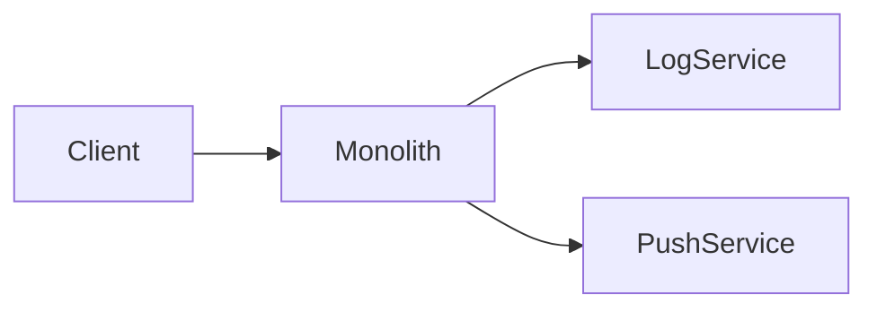
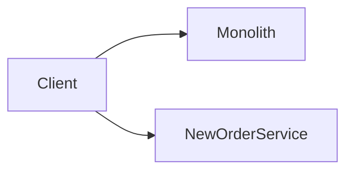
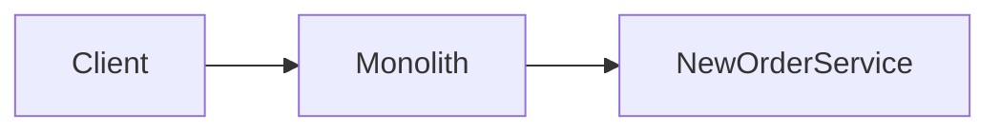
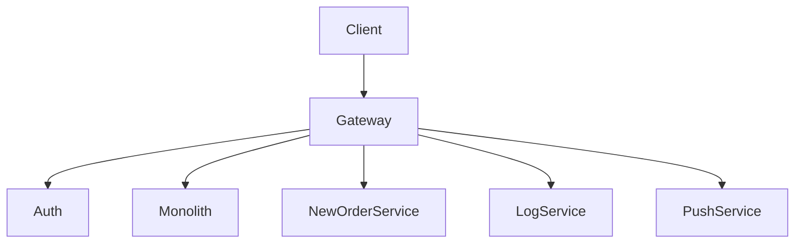
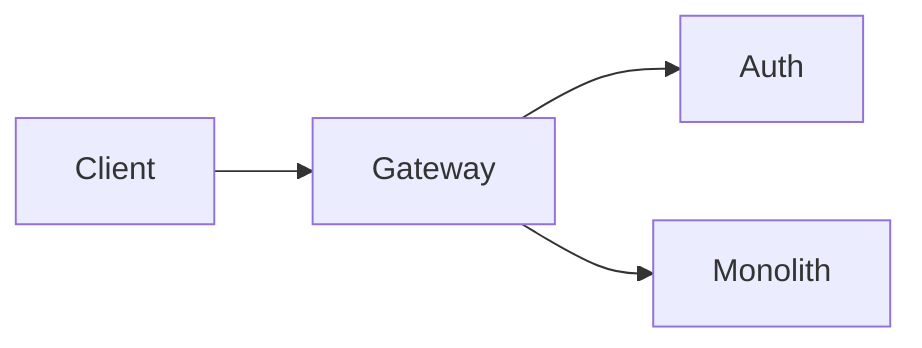
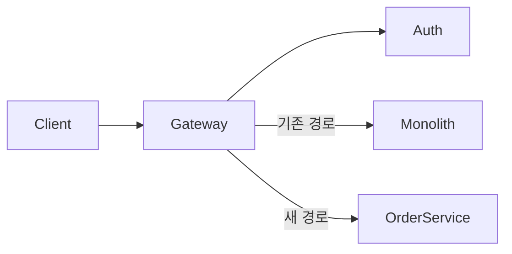

# 6장. Gateway를 위로 끌어올리기 — 모놀리스 앞에 새 관문 두기

5장에서 우리는 Strangler Fig 패턴을 보았다.
모놀리스를 감싸 하나씩 잘라낸다는 아이디어다.

하지만 실제로 시도해보면
이상한 벽에 부딪힌다.

> 잘라낸 조각은 누가 호출할 것인가?

많은 회사에서 답은 같다.

> **모놀리스가 호출한다.**

문제는 여기서 시작된다.

---

## 모놀리스가 Gateway일 때 — 흔한 출발점

전형적인 시작은 이런 구조다.

분리되기 쉬운 것부터 떼어냈다.

* 로그 수집
* 푸시 발송
* 검색 인덱싱

이런 기능은 도메인과 멀어 떼어내기 쉽다.

그리고 모놀리스는

* 인증을 처리하고
* 라우팅을 결정하고
* 공통 로직을 수행한 뒤
* 일부 작업을 분리된 서비스에 위임한다

겉보기에는 잘 돌아간다.

> 모놀리스가 사실상 **Gateway 역할**을 한다.

---

## 핵심 도메인을 떼어내려 할 때 막힌다

이제 다음 단계로 가야 한다.

주문, 결제, 회원 같은 **핵심 도메인**을 떼어내려 한다.

하지만 그러려면 두 선택지뿐이다.

### 1️⃣ 클라이언트가 새 서비스를 직접 호출한다

문제:

* 클라이언트가 내부 구조를 알아야 한다
* 인증을 누가 어떻게 책임지는가?
* 모놀리스 변경 시 클라이언트도 함께 영향
* 모바일·웹·앱마다 별도 처리 필요

### 2️⃣ 모놀리스가 새 서비스를 호출한다

문제:

* 모놀리스의 의존성이 더 깊어진다
* 모놀리스를 거치지 않는 흐름은 만들 수 없다
* 결국 모놀리스가 더 비대해진다

두 선택지 모두

> 분리는 했지만, 결합은 그대로다.

---

## 근본 원인 — Gateway가 잘못된 자리에 있다

이 막힘의 본질은 단순하다.

> 모놀리스가 Gateway 역할을 하고 있기 때문이다.

Gateway가 모놀리스 안에 있으면

* 인증 로직이 모놀리스 안에 묶인다
* 라우팅 결정도 모놀리스 안에서 일어난다
* 새 서비스를 추가하려면 모놀리스를 거쳐야 한다
* 모놀리스가 빠지면 모든 흐름이 끊긴다

그래서 다음 단계는 분명하다.

> **Gateway를 모놀리스 위로 끌어올린다.**

---

## 새로운 구조

이제 Gateway가 진짜 입구다.

* 클라이언트는 항상 Gateway로 들어온다
* 인증은 Auth 서비스가 담당한다
* 모놀리스도, 신규 서비스도 모두 Gateway 밑에 있다

이 구조의 의미는 크다.

> 모놀리스는 더 이상 시스템의 입구가 아니다.
> **여러 백엔드 중 하나**가 된다.

---

## 왜 Auth부터 분리하는가

Gateway 도입 시 가장 먼저 분리해야 하는 것은 인증이다.

이유는 단순하다.

### 1️⃣ 모든 요청이 거치는 첫 관문이다

인증이 모놀리스 안에 묶여 있으면
Gateway가 인증을 위해 매번 모놀리스를 호출해야 한다.

→ 사실상 모놀리스를 못 떼어낸다.

### 2️⃣ 다른 서비스가 독립적으로 인증할 수 있어야 한다

신규 서비스가 토큰을 검증할 때
모놀리스에 묻는다면, 그 서비스는 독립적이지 않다.

### 3️⃣ 토큰 형식을 통일할 수 있다

세션 기반 모놀리스에서
토큰 기반(JWT 등)으로 옮겨가는 자연스러운 전환점이 된다.

---

## 단계별 전환 흐름

전환은 한 번에 끝나지 않는다.
보통 다음 단계를 거친다.

### 단계 1️⃣ — Gateway·Auth 도입, 모든 트래픽 우회

* Gateway가 클라이언트 입구가 된다
* 모든 요청을 일단 모놀리스로 그대로 전달
* Auth만 분리해서 토큰 검증 책임을 가진다

이 단계의 목표는 **구조 변경**이지 기능 추출이 아니다.

### 단계 2️⃣ — 한 도메인 추출, 라우팅 분기

* 주문 같은 한 도메인을 떼어낸다
* Gateway에서 경로별로 분기
* `/orders` → OrderService
* 나머지 → Monolith

### 단계 3️⃣ — 점진적 트래픽 이전

도메인을 떼어냈다고 즉시 100% 이전하지 않는다.

* Feature Flag로 일부 트래픽만 새 서비스로
* 검증 후 비율 증가
* 문제 발생 시 즉시 모놀리스로 롤백

### 단계 N — 모놀리스가 충분히 작아질 때까지 반복

핵심 도메인 하나하나를
같은 방식으로 떼어낸다.

모놀리스는 점점 작아지고
어느 순간 **마지막 도메인 서비스**가 된다.

---

## 흔히 발생하는 문제들

이 패턴은 단순해 보이지만 함정이 있다.

### ⚠️ 모놀리스에 인증 우회 통로가 남는다

모놀리스는 자체 세션·쿠키를 가진다.
이걸 그대로 두면

* Gateway를 우회하는 호출이 가능해진다
* 인증 정책이 두 곳에 분산된다

대응:

> 모놀리스 내부 인증은 **Gateway가 발급한 토큰만 신뢰**하게 바꾼다.

### ⚠️ 라우팅 변경이 한 번에 일어난다

라우팅을 한 번에 바꾸면
문제 발생 시 전체가 영향을 받는다.

대응:

* Feature Flag 또는 비율 기반 라우팅
* 두 시스템 동시 호출 후 결과 비교 (Shadow traffic)

### ⚠️ Gateway가 비대해진다

비즈니스 로직이 Gateway로 올라오기 시작하면
또 다른 모놀리스가 된다.

대응:

> Gateway는 정책·라우팅·인증까지만.
> 도메인 로직은 절대 넣지 않는다.

이 원칙은 12장에서 다시 자세히 다룬다.

### ⚠️ 공존 기간이 길다

이 전환은 짧으면 6개월, 길면 수년이 걸린다.
그 기간 내내 **모놀리스와 새 서비스가 동시에** 살아 있다.

이 공존기 자체의 운영 비용을 인정해야 한다.

---

## 이 패턴이 잘 맞는 상황

* 모놀리스가 인증·라우팅·공통 로직까지 다 들고 있다
* 분리된 서비스조차 모놀리스를 거쳐야 동작한다
* 핵심 도메인을 떼어내려는데 입구를 어떻게 바꿀지 막힌다

이 셋 중 둘 이상이라면
이 패턴이 합리적인 선택이다.

---

## 이 장의 핵심

* 분리되기 쉬운 기능부터 떼어내다 보면 모놀리스가 Gateway 역할을 하게 된다
* 이 상태에서는 핵심 도메인 추출이 막힌다
* 해결책은 Gateway를 모놀리스 위로 끌어올리는 것이다
* 가장 먼저 분리해야 하는 것은 인증(Auth)이다
* 라우팅 변경은 점진적이어야 한다 (Feature Flag, Shadow traffic)
* Gateway는 얇게 유지하고 도메인 로직을 흡수시키지 않는다
* 모놀리스와 신규 서비스의 공존기 자체가 운영 비용임을 인정한다
