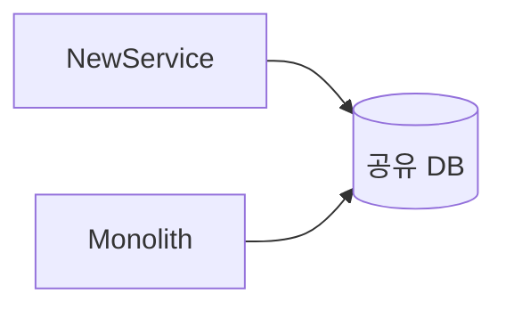
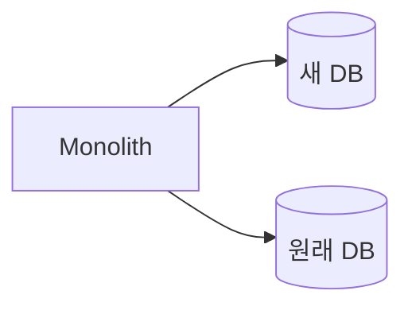
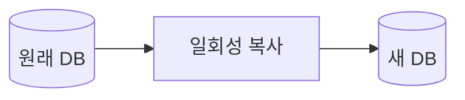
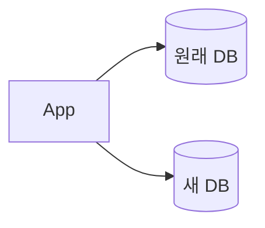
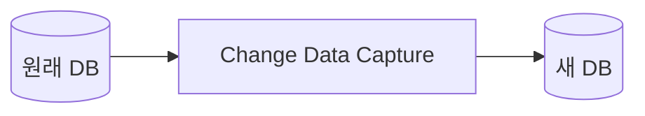
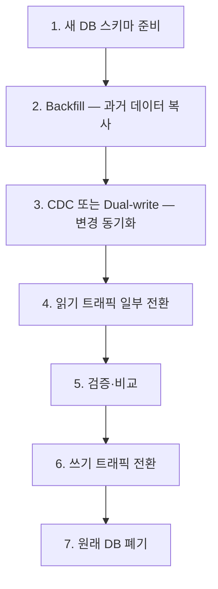

# 7장. 데이터 마이그레이션 — 공유 DB에서 분리된 DB까지

6장에서 우리는 Gateway를 위로 끌어올렸다.
이제 트래픽 입구는 깔끔하다.

하지만 진짜 어려운 문제가 남는다.

> **데이터는 어떻게 옮길 것인가?**

서비스 분리보다 데이터 분리가 어렵다.
대부분의 전환이 막히는 지점이 여기다.

---

## 왜 데이터 분리가 어려운가

모놀리스의 DB는 보통 다음 특징을 가진다.

* 한 트랜잭션이 여러 테이블을 묶는다
* JOIN이 도처에 있다
* Foreign key가 도메인을 가로지른다
* 여러 도메인이 같은 테이블을 공유한다

이 상태에서 한 도메인만 빼내려고 하면

* 한 테이블만 떼어내도 JOIN이 깨진다
* 트랜잭션을 두 DB로 나눌 수 없다
* 외래 키 제약이 무너진다

데이터는 코드보다 훨씬 깊이 얽혀 있다.

---

## 두 가지 큰 선택

데이터 분리에는 두 가지 큰 접근이 있다.

### 1️⃣ 코드 먼저 분리, DB는 나중에

* 서비스 코드는 떼어내지만
* DB는 일단 그대로 공유한다
* 나중에 DB를 분리한다

장점:

* 추출 위험이 낮다
* 서비스 검증부터 할 수 있다

단점:

* 분산 모놀리스의 위험이 커진다
* DB 변경 시 양쪽이 영향
* "나중에"가 영원히 안 올 수 있다

### 2️⃣ DB 먼저 분리, 코드는 그대로

* DB를 먼저 두 개로 나눈다
* 모놀리스가 두 DB를 모두 쓴다
* 그 다음 코드를 분리한다

장점:

* 진짜 경계가 일찍 드러난다
* JOIN 의존성을 일찍 발견한다

단점:

* 모놀리스가 더 복잡해진다
* 단기 운영 부담이 크다

---

## 어떤 것을 선택할 것인가

정답은 없다.
하지만 실무에서 자주 통하는 방향은 있다.

> **추출 첫 단계에서는 DB를 함께 분리한다.
> 단, 한 도메인의 데이터에 한해서.**

여러 도메인을 동시에 분리하지 말고
한 도메인의 코드와 데이터를 한 번에 묶어 옮긴다.

이렇게 하면

* 분산 모놀리스 위험이 작다
* 한 번에 한 도메인만 위험에 둔다
* 검증 범위가 명확하다

---

## 데이터를 옮기는 세 가지 기술

본격적인 데이터 분리에는 세 가지 기법이 있다.
대부분의 전환은 이 셋의 조합이다.

### 1️⃣ Backfill — 과거 데이터를 새 DB로 복사

* 특정 시점까지의 데이터를 새 DB로 복사
* 보통 큰 배치 작업
* 시간이 오래 걸린다

이것만으로는 부족하다.
복사하는 동안에도 데이터가 계속 변하기 때문이다.

### 2️⃣ Dual-write — 두 DB에 동시에 쓴다

* 애플리케이션이 양쪽 DB에 동시에 쓴다
* 한쪽 실패 시 처리가 까다롭다
* 정합성 검증이 반드시 필요하다

Dual-write의 운영 문제는
23장에서 자세히 다룬다.

### 3️⃣ CDC — DB의 변경 로그를 따라간다

* DB의 트랜잭션 로그(binlog 등)를 실시간으로 읽는다
* 변경을 새 DB에 자동 적용한다
* 애플리케이션 코드 변경이 거의 없다

도구:

* Debezium
* AWS DMS
* 클라우드 사업자 제공 CDC

CDC의 장점은
**애플리케이션이 한 DB만 알아도 된다**는 점이다.

---

## 일반적인 마이그레이션 흐름

대부분의 데이터 마이그레이션은 다음 단계를 거친다.

각 단계의 핵심:

### Step 1 — 새 DB 스키마 준비

* 원래 스키마를 그대로 옮기지 않는다
* 새 도메인 경계에 맞게 재설계한다
* 다른 도메인 컬럼은 빼고 스냅샷만 남긴다

### Step 2 — Backfill

* 과거 데이터를 일회성으로 복사
* 큰 테이블은 배치를 잘게 쪼개야 한다
* 진행 중 데이터 변경을 어떻게 처리할지 미리 정한다

### Step 3 — 변경 동기화

* CDC 또는 Dual-write
* 이 시점부터 두 DB는 "거의 같은" 상태
* 거의 같지 정확히 같지는 않다

### Step 4 — 읽기 전환

* 일부 읽기 요청을 새 DB로 보낸다
* Shadow Read로 두 DB 응답을 비교
* 차이가 임계치 이하가 될 때까지 반복

### Step 5 — 검증·비교

* 두 DB의 정합성을 정기적으로 검증
* 자동화된 검증 스크립트
* 차이가 발견되면 원인 분석

### Step 6 — 쓰기 전환

* 새 DB가 쓰기의 주인이 된다
* 원래 DB는 일정 기간 동기화 유지 (롤백용)

### Step 7 — 원래 DB 폐기

* 충분한 안정화 기간 후
* 원래 테이블에서 컬럼 제거 또는 테이블 삭제

---

## 흔히 빠지는 함정

### ⚠️ JOIN을 없애지 않는다

서비스를 나눠도
원래 DB에 다른 도메인 테이블을 JOIN해서 읽으면
경계는 무너진 상태다.

→ 새 서비스는 자기 DB만 쓴다.

### ⚠️ 스키마를 그대로 옮긴다

원래 스키마는
모놀리스에 최적화되어 있다.

* 다른 도메인 컬럼들이 섞여 있다
* 정규화가 도메인을 가로지른다

새 도메인 경계에 맞춰
스키마를 다시 설계해야 한다.

### ⚠️ Backfill 중에 시간이 멈춘 줄 안다

Backfill은 보통 몇 시간~며칠이 걸린다.
그 사이에도 데이터는 계속 변한다.

* 시작 시점 기준으로 복사할지
* 종료 시점까지 변경을 따라잡을지

전략을 미리 정해야 한다.

### ⚠️ 정합성 검증을 안 한다

"옮겼으니 끝"이 아니다.

* 양쪽 DB의 행 수를 비교
* 샘플링해서 값을 비교
* 차이 발견 시 자동 알림

이 검증 없이는 운영 중에 사고로 발견한다.

---

## 롤백 시나리오

각 단계마다 되돌릴 수 있어야 한다.

| 단계 | 롤백 방법 |
|---|---|
| Backfill | 새 DB 삭제 후 다시 |
| 동기화 | CDC/Dual-write 중단 |
| 읽기 전환 | 라우팅 비율 0으로 |
| 쓰기 전환 | 쓰기 대상을 원래 DB로 |

쓰기 전환 후에도
**원래 DB의 동기화를 일정 기간 유지**해야 한다.

그래야 진짜 위급 상황에서 되돌릴 수 있다.

---

## 이 장의 핵심

* 서비스 분리보다 데이터 분리가 어렵다
* 코드 먼저 vs DB 먼저 — 보통 한 도메인 단위로 함께 분리
* Backfill·Dual-write·CDC 세 기법의 조합으로 옮긴다
* 마이그레이션은 다단계이며 각 단계마다 검증이 필요하다
* 스키마는 그대로 옮기지 말고 새 도메인 경계에 맞춰 재설계
* 정합성 검증이 없으면 운영 중에 사고로 발견한다
* 쓰기 전환 후에도 일정 기간 동기화를 유지해 롤백 여지를 남긴다
