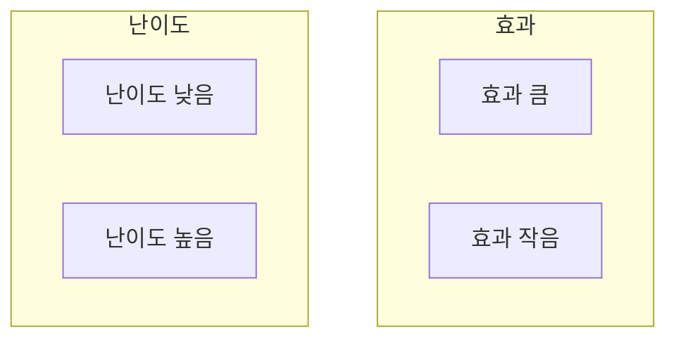
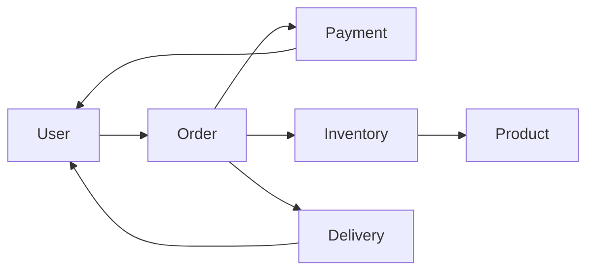
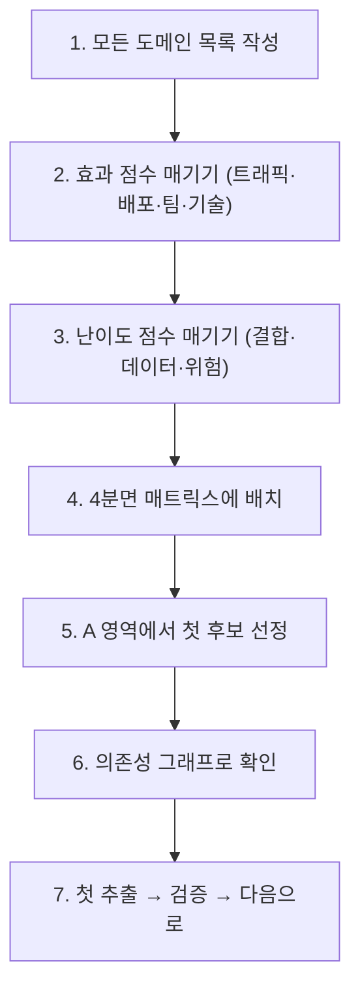

# 9장. 무엇부터 떼어낼 것인가 — 추출 우선순위 결정법

8장에서 우리는 경계를 어떻게 설계하는지 보았다.
DDD와 Bounded Context로 책임 단위를 나눈다.

하지만 책임을 다 나누었다 해도
여전히 남는 질문이 있다.

> 그 중 무엇부터 떼어낼 것인가?

한 번에 다 떼어낼 수는 없다.
4장에서 본 점진적 전환은
**순서**가 필요하다.

이 장에서는 그 순서를 정하는 방법을 다룬다.

---

## 잘못된 첫 후보

많은 팀이 처음에 같은 실수를 한다.

> "가장 중요한 도메인을 먼저 떼어내자."

예: 주문, 결제, 회원

이유는 "그 영역이 가장 자주 바뀌고 가장 중요하니까"다.

하지만 결과는 보통 이렇다.

* 도메인이 가장 깊이 얽혀 있어 떼어내기 어렵다
* 실패하면 핵심 비즈니스가 영향을 받는다
* 운영팀이 새 시스템에 익숙해질 시간이 없다

> **첫 추출은 학습 단계다.**
> 가장 중요한 도메인을 첫 후보로 두지 않는다.

---

## 첫 후보를 고르는 기준

좋은 첫 후보는 다음 특징을 가진다.

### 1️⃣ 결합도가 낮다

다른 도메인과의 의존성이 적다.

* 다른 테이블을 거의 JOIN하지 않는다
* 다른 도메인의 이벤트를 받기만 하거나, 보내기만 한다
* 외부 시스템 연동이 잘 격리되어 있다

### 2️⃣ 실패해도 핵심 비즈니스가 안 죽는다

이 영역에 문제가 생겨도
주문·결제·로그인은 계속 동작해야 한다.

### 3️⃣ 확장 또는 변경 요구가 있다

순수하게 떼어내고 싶다는 욕구만으로는 부족하다.

* 트래픽이 특정 영역에 집중된다
* 그 영역의 배포 주기가 다른 곳보다 빠르다
* 그 영역만 다른 기술 스택을 쓰고 싶다

이유가 있어야 동력이 생긴다.

### 4️⃣ 도메인 경계가 비교적 명확하다

비즈니스 사람이 들었을 때
"이건 이 영역의 일이지"라고 즉시 답할 수 있다.

---

## 흔한 첫 후보들

대부분의 회사에서 다음 영역이 첫 후보가 된다.

| 영역 | 왜 좋은가 |
|---|---|
| 알림·푸시 | 비즈니스 핵심이 아니고, 실패해도 큰 문제 없음 |
| 로그·통계 수집 | 단방향 데이터 흐름, 외부 호출 거의 없음 |
| 검색·인덱싱 | 읽기 전용, 비동기 갱신 가능 |
| 이메일 발송 | 외부 SMTP 연동만, 도메인 경계 명확 |
| 파일 업로드·처리 | 트래픽 패턴 다르고, 자원 요구 다름 |

이런 영역은 **분리되기 쉬운 변두리**다.

핵심을 떼어내기 전에
변두리에서 운영 경험을 쌓는다.

---

## 핵심 도메인을 떼어낼 때

변두리를 충분히 떼어냈다면
이제 핵심 도메인 차례다.

여기서는 우선순위 결정이 더 까다롭다.

### 결정에 쓰이는 두 축

| 축 | 의미 |
|---|---|
| **효과** | 떼어내면 얻는 가치 (성능·확장·조직 정렬·변경 속도) |
| **난이도** | 추출의 어려움 (결합도·데이터 얽힘·트래픽 위험) |

이 두 축으로 4분면 매트릭스를 만든다.

|  | 효과 큼 | 효과 작음 |
|---|---|---|
| **난이도 낮음** | **A: 우선 추출** | C: 시간 날 때 |
| **난이도 높음** | B: 준비 후 추출 | D: 보류 |

* A — 최우선
* B — 준비 단계가 길지만 결국 해야 함
* C — 여유 있을 때
* D — 그냥 두는 게 낫다

---

## 효과를 어떻게 측정하는가

"효과 큼"은 추상적이다.
구체적인 신호로 바꾼다.

### 1️⃣ 트래픽 집중

특정 영역이 전체 트래픽의 큰 부분을 차지한다.
독립 확장이 필요하다.

### 2️⃣ 배포 주기 차이

그 영역만 자주 바뀐다.
다른 영역과 함께 배포하는 게 비효율적이다.

### 3️⃣ 팀 구조 불일치

특정 팀이 그 영역만 책임진다.
지금은 다른 팀과 코드를 공유한다.

### 4️⃣ 기술 요구의 차이

특정 영역은 다른 언어나 기반이 더 적합하다.
지금은 전체가 같은 스택이라 어쩔 수 없다.

이 중 둘 이상이라면 효과는 크다.

---

## 난이도를 어떻게 측정하는가

### 1️⃣ 결합도 분석

이 영역이 다른 도메인과 얼마나 얽혀 있는가?

* 호출 관계 (in/out)
* 공유 테이블 수
* 공유 트랜잭션 범위
* 외래 키 의존

### 2️⃣ 데이터 의존 분석

이 영역의 데이터를 떼어내기 얼마나 어려운가?

* JOIN으로 묶인 테이블 수
* 다른 도메인이 이 데이터를 직접 읽는가
* 트랜잭션 단위가 도메인을 가로지르는가

### 3️⃣ 트래픽 위험

실패 시 사용자에게 미치는 영향.

* 핵심 비즈니스 경로인가
* 사용자가 즉시 인지하는가
* 매출에 직결되는가

---

## 의존성 그래프를 그려본다

추출 전에 한 번은 의존성 그래프를 그려야 한다.

이 그래프를 보면

* 어떤 도메인이 허브인지
* 어떤 도메인이 외곽인지
* 어떤 의존이 단방향이고 어떤 게 양방향인지

알 수 있다.

추출하기 좋은 후보는 **외곽**이다.
허브를 처음 건드리면 모든 게 흔들린다.

---

## 이벤트 스토밍 — 경계 발견을 돕는 워크숍

추출 후보를 정하기 어려울 때
**이벤트 스토밍**이 도움이 된다.

방법은 단순하다.

1. 비즈니스에서 일어나는 모든 "사건(이벤트)"을 포스트잇에 적는다
   * 예: `주문 생성됨`, `결제 승인됨`, `재고 차감됨`, `배송 시작됨`
2. 시간 순서대로 벽에 붙인다
3. 비슷한 영역끼리 묶는다
4. 묶음의 경계가 곧 후보 도메인이 된다

이 워크숍의 가치는

* 코드가 아니라 비즈니스 관점으로 본다
* 숨어 있던 도메인이 드러난다
* 비기술자도 참여할 수 있다

---

## 우선순위 결정 — 정리된 절차

종합하면 다음 절차다.

이 절차의 가장 큰 적은 **욕심**이다.

* 한 번에 여러 도메인을 동시에
* 가장 어려운 도메인부터
* 가장 중요한 도메인부터

이 세 가지 유혹을 모두 거절해야 한다.

---

## 이 장의 핵심

* 점진적 전환은 추출 순서를 정하는 일에서 시작된다
* 첫 추출은 학습 단계다. 핵심 도메인을 첫 후보로 두지 않는다
* 흔한 첫 후보는 알림·로그·검색·이메일 같은 변두리다
* 핵심 도메인은 효과×난이도 매트릭스로 우선순위를 정한다
* 의존성 그래프와 이벤트 스토밍이 결정을 돕는다
* 욕심을 거절한다 — 한 번에 하나씩, 외곽부터 안으로
