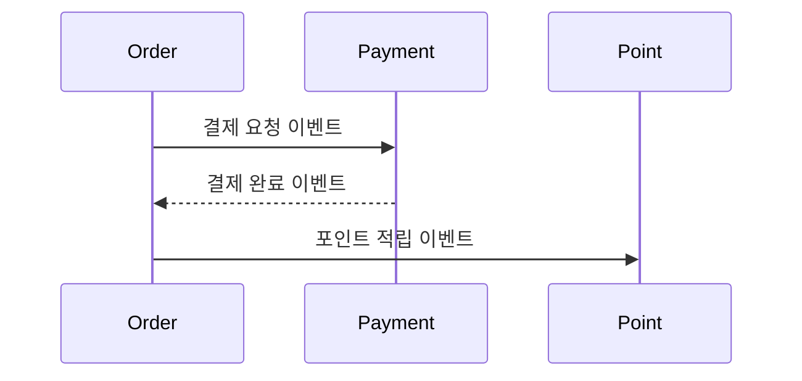
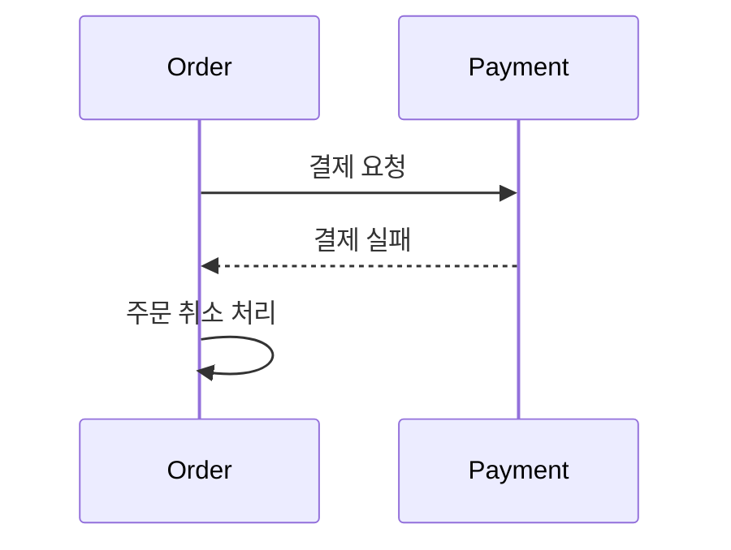

# 10장. 분산 환경에서의 정합성

9장에서 우리는 한 가지를 이해했다.

* 메시지는 중복될 수 있고
* 순서가 바뀔 수 있으며
* 정확히 한 번 전달은 비싸다

이제 질문은 이것이다.

> 이렇게 불완전한 환경에서  
> 여러 서비스의 상태를 어떻게 맞출 것인가?

모놀리스에서는 이 질문이 단순했다.

---

## 모놀리스에서의 정합성

모놀리스에서는 하나의 데이터베이스 트랜잭션이 있었다.

```
BEGIN
주문 생성
결제 승인
포인트 적립
COMMIT
```

중간에 실패하면  
전부 되돌아간다.

사용자는 항상  
완성된 결과만 보게 된다.

이것이 강한 일관성이다.

---

## 마이크로서비스에서 달라지는 점

서비스가 나뉘면 상황이 달라진다.

* 주문은 Order 서비스가 처리하고
* 결제는 Payment 서비스가 처리하고
* 포인트는 Point 서비스가 처리한다

각 서비스는 자기 데이터베이스를 가진다.

이들을 하나의 트랜잭션으로 묶을 수 없다.

따라서 “한 번에 맞추는 방식” 대신  
“단계적으로 맞추는 방식”을 선택해야 한다.

---

## 최종 일관성이라는 개념

마이크로서비스는 보통  
최종 일관성을 전제로 설계된다.

의미는 단순하다.

> 잠시 어긋날 수는 있지만  
> 결국에는 맞춰진다.

예를 들어:

1. 주문 생성 완료
2. 결제 승인 완료
3. 포인트 적립은 몇 초 뒤 반영

사용자는 잠시 동안  
포인트가 반영되지 않은 상태를 볼 수 있다.

하지만 시간이 지나면  
모든 데이터는 일관된 상태로 수렴한다.

이것이 최종 일관성이다.

---

## 설계 방식의 변화

모놀리스에서는 이렇게 생각했다.

> 어떻게 한 번에 끝낼 것인가?

마이크로서비스에서는 이렇게 생각해야 한다.

> 어떻게 단계적으로 완성시킬 것인가?

이 차이가 핵심이다.

---

## Saga 패턴 — 단계별 처리 방식

Saga는 여러 서비스에 걸친 작업을  
단계적으로 처리하는 방식이다.

각 단계는  
각 서비스 내부에서만 트랜잭션을 보장한다.

예를 들어 주문 처리 흐름은 다음과 같다.



각 서비스는  
자기 일만 확실히 처리한다.

전체는 이벤트 흐름으로 연결된다.

---

## 실패는 어떻게 되돌리는가

결제가 실패하면 어떻게 될까?



이미 수행된 작업을  
데이터베이스 롤백으로 되돌릴 수는 없다.

대신 비즈니스 로직으로 되돌린다.

예:

* 결제 성공 후 배송 시작 → 배송 취소
* 포인트 적립 후 주문 취소 → 포인트 차감

이것을 보상 처리라고 한다.

---

## 중간 상태를 인정해야 한다

마이크로서비스에서는  
중간 단계를 숨길 수 없다.

예를 들어 주문은  
다음과 같은 단계를 가질 수 있다.

* CREATED
* PAYMENT_PENDING
* PAYMENT_COMPLETED
* CANCELED
* FAILED

중요한 것은 이것이다.

> 어떤 단계에서  
> 어떤 단계로 바뀔 수 있는지  
> 명확한 규칙이 있어야 한다.

예를 들어:

* 이미 취소된 주문이 다시 결제 완료가 되면 안 된다.
* 결제가 완료되기 전에 배송이 시작되면 안 된다.

이런 규칙이 정해져 있어야  
시스템이 꼬이지 않는다.

---

## 멱등성은 필수다

9장에서 봤듯이  
이벤트는 중복될 수 있다.

따라서 같은 이벤트가 여러 번 와도  
결과는 한 번 처리된 것과 같아야 한다.

예:

* 결제 완료 이벤트가 두 번 와도  
  주문 상태는 한 번만 결제 완료가 되어야 한다.

* 포인트 적립 이벤트가 두 번 와도  
  포인트는 한 번만 증가해야 한다.

멱등성은 선택이 아니라  
전제 조건이다.

---

## 일시적 불일치를 허용하는 설계

마이크로서비스에서는  
모든 것을 동시에 맞출 수 없다.

그래서 다음을 스스로에게 물어야 한다.

* 포인트 적립이 2초 늦어도 되는가?
* 알림이 조금 늦어도 되는가?
* 통계 수치는 몇 분 늦어도 되는가?

모든 것을 강하게 묶으면  
시스템은 복잡해지고 확장성이 떨어진다.

최종 일관성을 받아들이는 것은  
느슨해지는 것이 아니라  
확장성을 선택하는 것이다.

---

## 반드시 고민해야 할 질문

정합성을 설계할 때  
다음 질문에 답해야 한다.

1. 반드시 동시에 완료되어야 하는 작업인가?
2. 잠시 어긋난 상태를 허용할 수 있는가?
3. 실패 시 되돌리는 방법은 명확한가?
4. 상태가 바뀌는 규칙은 정의되어 있는가?
5. 같은 이벤트가 여러 번 와도 안전한가?

이 질문을 건너뛰면  
분산 시스템은 언젠가 예기치 않게 무너진다.

---

## 이 장의 핵심

마이크로서비스에서는

* 하나의 거대한 트랜잭션은 존재하지 않는다.
* 대신 여러 개의 작은 확실함이 있다.
* 전체 정합성은 단계적으로 완성된다.
* 실패는 롤백이 아니라 보상으로 처리된다.
* 상태가 어떻게 바뀌는지 규칙을 설계해야 한다.
* 멱등성은 반드시 필요하다.

정합성은 더 이상  
데이터베이스가 책임지지 않는다.

아키텍처와 비즈니스 설계가  
그 책임을 가진다.