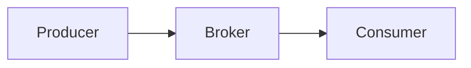

# 11장. 이벤트는 항상 순서대로 오지 않는다

10장에서 우리는  
정합성을 단계적으로 맞추는 설계를 배웠다.

하지만 그 설계에는 중요한 전제가 있다.

> 이벤트가 우리가 기대하는 순서로 도착한다.

현실은 다르다.

* 네트워크 지연
* 재시도
* Consumer 재시작
* 브로커 리밸런싱
* 병렬 처리

이 모든 요인이  
이벤트 순서를 뒤섞을 수 있다.

---

## 왜 순서가 깨지는가

이벤트 흐름은 단순해 보인다.

하지만 실제 환경에서는 다음과 같은 일이 발생한다.

### 1️⃣ 네트워크 지연

먼저 발생한 이벤트가  
나중에 도착할 수 있다.

### 2️⃣ 재시도

ACK 손실이나 타임아웃으로 인해  
이전 이벤트가 뒤늦게 재전송될 수 있다.

### 3️⃣ 병렬 소비

여러 Consumer가 동시에 처리하면  
완료 순서가 달라질 수 있다.

즉,  
**발생 순서와 처리 완료 순서는 다를 수 있다.**

---

## 브로커 레벨에서의 순서 보장 (대부분의 경우 해결)

다행히 대부분의 메시지 브로커는  
제한적인 범위 안에서 순서를 보장한다.

하지만 중요한 점은 이것이다.

> 순서 보장은 항상 “범위 제한적”이다.

### 1️⃣ Kafka — 파티션 단위 순서

Kafka는 **파티션 내부에서만 순서를 보장**한다.

같은 Key를 같은 파티션으로 보내면  
그 Key에 대해서는 순서가 유지된다.

핵심 전략:

> 같은 비즈니스 키는 같은 파티션으로 보낸다.

예:

* 주문 ID를 파티션 키로 사용
* 사용자 ID를 파티션 키로 사용

주의:

* 다른 파티션 간 순서는 보장되지 않는다.
* 파티션 수를 변경하면 분배 전략이 달라질 수 있다.

### 2️⃣ AWS SQS FIFO — Message Group ID

SQS FIFO는  
같은 Message Group ID 내에서 순서를 보장한다.

* 같은 Group ID → 순서 유지
* 다른 Group ID → 순서 보장 없음

하지만 Group 단위로 직렬 처리되기 때문에  
병렬성이 일부 제한된다.

### 3️⃣ RabbitMQ

RabbitMQ는 큐 내부에서는  
전달 순서를 유지한다.

그러나:

* 여러 Consumer가 병렬로 처리하면
* ACK 시점에 따라 체감 순서가 달라질 수 있다.

엄격한 순서를 원한다면:

* 단일 Consumer 사용
* Prefetch 조정
* 병렬 처리 제한

이 필요하다.

### 4️⃣ Google Cloud Pub/Sub

Pub/Sub은 Ordering Key를 제공한다.

같은 Ordering Key를 사용하면  
그 키 단위로 순서를 유지한다.

단, 장애나 재시도 상황에서는  
중복 및 재정렬 가능성을 고려해야 한다.

---

## ⚠️ 브로커 순서 보장이 성립하려면

브로커 설정만으로 순서가 보장되는 것은 아니다.  
다음 조건이 충족되어야 한다.

### 1️⃣ 같은 키는 반드시 같은 스트림으로 묶여야 한다

* Kafka → 같은 Key는 같은 파티션
* SQS FIFO → 같은 Message Group ID
* Pub/Sub → 같은 Ordering Key

키가 흔들리면  
순서 보장은 즉시 깨진다.

### 2️⃣ 해당 스트림은 동시에 하나만 처리해야 한다

“소비자가 하나여야 한다”는 뜻은 아니다.

정확히는:

> 같은 파티션(또는 Group/Ordering Key)은  
> 동시에 하나의 소비자만 처리해야 한다.

Kafka는 consumer group 내에서  
파티션을 하나의 consumer에게만 할당한다.

하지만:

* Consumer 내부에서 병렬 처리하면
* 처리 완료 순서가 바뀔 수 있다.

즉,

> 전달 순서 ≠ 처리 완료 순서

라는 점을 반드시 이해해야 한다.

### 3️⃣ 재시도와 리밸런싱을 고려해야 한다

* Consumer 재시작
* 파티션 리밸런싱
* ACK 실패
* Visibility timeout 만료

이 상황에서는  
이미 처리한 메시지가 다시 오거나  
체감 순서가 뒤바뀔 수 있다.

브로커는 90%를 해결해주지만  
100%는 아니다.

---

## 그래도 깨지는 경우 — 외부 이벤트 시스템

지금까지는 우리가 직접 제어할 수 있는  
메시지 브로커를 기준으로 설명했다.

하지만 현실에서는  
**외부 시스템이 보내는 이벤트**도 처리해야 한다.

예를 들면:

* 결제 대행사(PG) 웹훅
* 물류사 배송 상태 콜백
* 외부 인증 서비스 이벤트
* SaaS 서비스 상태 변경 알림

이러한 이벤트는  
Kafka나 SQS처럼 세밀하게 통제할 수 없다.

대부분 HTTP Webhook 형태로 전달되며  
순서를 보장하지 않는다.

### 사례 — AWS IVS

AWS IVS는  
Amazon Interactive Video Service의 약자로  
라이브 스트리밍을 제공하는 AWS 서비스다.

스트리밍 상태가 바뀌면  
다음과 같은 이벤트를 보낸다.

* Stream Start
* Stream End
* Recording Ready

이 이벤트들은  
순서를 보장하지 않는다.

즉:

* Stream End가 먼저 오고  
* Stream Start가 나중에 올 수 있다.

네트워크 지연, 재시도, 내부 처리 순서 등  
여러 요인이 작용하기 때문이다.

이 경우 브로커 설정으로 해결할 수 없다.

---

## 애플리케이션 레벨 대응 전략

브로커는 1차 방어선이다.  
최종 방어선은 애플리케이션이다.

### 1️⃣ 버전 기반 처리

각 이벤트에 version을 둔다.

* 현재 version보다 낮으면 무시
* 더 높은 version만 반영

상태가 뒤로 가지 않도록 한다.

### 2️⃣ 현재 상태 기준 검증

이미 CANCELED 상태라면  
PAYMENT_COMPLETED 이벤트를 무시한다.

현재 상태가  
이벤트를 수용할 수 있는지 판단한다.

### 3️⃣ 타임스탬프 비교

이벤트 발생 시간을 비교해  
더 오래된 이벤트는 폐기한다.

단, 시간 동기화 문제는 고려해야 한다.

### 4️⃣ 단방향 상태 설계

상태가 뒤로 돌아가지 않도록 설계한다.

예:

CREATED → PAYMENT_PENDING → COMPLETED

이미 COMPLETED라면  
이전 단계 이벤트는 무시한다.

---

## 순서를 완벽히 보장하려 하지 말라

브로커 설정으로  
대부분의 순서 문제는 해결할 수 있다.

하지만 설계 원칙은 이것이다.

> 순서가 깨져도 시스템이 무너지지 않도록 설계하라.

브로커는 편의를 제공한다.  
안전성은 설계가 만든다.

---

## 이 장의 핵심

이벤트 기반 시스템에서는

* 순서는 범위 제한적으로만 보장된다.
* 키 단위 스트림 설계가 중요하다.
* 해당 스트림은 동시에 하나만 처리해야 한다.
* 전달 순서와 처리 완료 순서는 다를 수 있다.
* 외부 이벤트는 순서를 보장하지 않는다.
* 애플리케이션이 최종 방어를 해야 한다.

이제 우리는

* 중복 문제
* 정합성 문제
* 순서 문제

를 모두 이해했다.