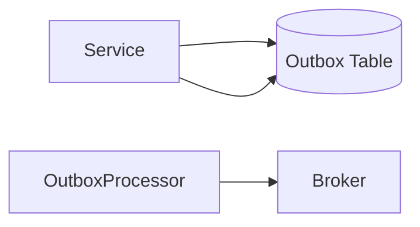

# 12장. 트랜잭션과 이벤트의 원자성

10장에서 우리는 정합성을 단계적으로 맞추는 방식을 배웠다.  
11장에서 이벤트 순서 문제를 다루었다.

하지만 아직 해결하지 않은 치명적인 틈이 하나 있다.

> DB는 커밋됐는데 이벤트는 발행되지 않았다면?

이 문제는 이벤트 기반 아키텍처에서  
가장 흔하고, 가장 위험한 실패 지점이다.

---

## 문제 상황

A 서비스가 다음과 같이 동작한다고 가정하자.

```
BEGIN TRANSACTION
주문 저장
COMMIT

이벤트 발행 (OrderCreated)
```

겉보기에는 자연스러운 흐름이다.

하지만 이런 일이 발생할 수 있다.

* DB Commit 성공
* 이벤트 발행 직전 서버 다운
* 브로커 네트워크 장애
* 이벤트 전송 중 예외 발생

결과:

* DB에는 주문이 존재한다.
* 다른 서비스는 주문이 생성된 사실을 모른다.
* Saga 흐름이 멈춘다.
* 시스템 정합성이 붕괴된다.

이건 예외 처리가 부족한 문제가 아니다.  
구조적으로 발생 가능한 문제다.

---

## 왜 단순 재시도는 충분하지 않은가

많은 개발자가 이렇게 생각한다.

> “이벤트 발행 실패하면 다시 보내면 되지 않나?”

하지만 다음을 생각해보자.

* 재시도 로직이 메모리에만 있다면?
* 프로세스가 죽으면?
* 배포 중 재시작되면?

이벤트는 영원히 사라질 수 있다.

Try-Catch + Retry는  
일시적 오류에는 대응할 수 있지만  
구조적 유실을 막지는 못한다.

---

## 문제의 본질

핵심은 이것이다.

> DB 트랜잭션과 메시지 발행은 하나의 원자적 연산이 아니다.

DB는 로컬 트랜잭션을 보장한다.  
메시지 브로커는 완전히 다른 시스템이다.

이 둘을 하나의 트랜잭션으로 묶지 않는 한  
그 사이에는 항상 틈이 존재한다.

---

## 해결책 — Outbox 패턴

Outbox 패턴은  
이 틈을 메우기 위한 설계다.

핵심 아이디어는 단순하다.

> 이벤트를 즉시 브로커로 보내지 말고,  
> DB 안에 함께 저장하라.

### 기본 구조



### 동작 흐름

1. DB 트랜잭션 시작
2. 비즈니스 데이터 저장
3. Outbox 테이블에 이벤트 레코드 저장
4. 트랜잭션 커밋
5. 별도 프로세스가 Outbox를 읽어 브로커로 전송
6. 성공 시 상태 변경

코드 흐름은 다음과 같다.

```
BEGIN
주문 저장
Outbox에 OrderCreated 이벤트 저장
COMMIT
```

여기까지는 하나의 트랜잭션이다.

이제 DB에 이벤트가 안전하게 남는다.  
설령 서버가 즉시 죽어도  
Outbox 레코드는 사라지지 않는다.

---

## Outbox 처리 방식

Outbox를 브로커로 내보내는 방식은 여러 가지가 있다.

### 1️⃣ 주기적 Polling 방식

* 일정 주기로 Outbox 테이블 조회
* 상태가 PENDING인 이벤트 전송
* 성공 시 SENT로 업데이트

장점:

* 구현이 단순하다
* 이해하기 쉽다

단점:

* 폴링 주기만큼 지연 발생 가능

### 2️⃣ 즉시 발행 + 실패분 Polling (하이브리드)

실무에서 자주 사용하는 절충안이다.

* 트랜잭션 안에서 Outbox에 이벤트 저장
* 커밋 직후 애플리케이션이 즉시 한 번 발행 시도
* 성공 시 SENT로 업데이트
* 실패한 레코드만 Polling 프로세스가 재시도

이 방식은:

* 정상 케이스는 지연 없이 빠르게 전파하고
* 장애 케이스는 폴링으로 안전하게 복구한다

단, 중요한 점이 있다.

> 즉시 발행은 Outbox에 기록된 데이터를 기반으로 해야 한다.  
> Outbox를 우회해서 직접 발행하면 안 된다.

### 3️⃣ CDC(Change Data Capture)

CDC는 접근 방식이 다르다.

애플리케이션이 Outbox를 읽는 대신  
DB의 트랜잭션 로그를 감시한다.

DB는 내부적으로  
“어떤 데이터가 언제 어떻게 변경되었는지” 기록을 남긴다.

CDC 도구(예: Debezium)는:

* 이 트랜잭션 로그를 실시간으로 읽고
* Outbox 테이블의 변경을 감지하고
* Kafka 같은 브로커로 자동 전송한다

즉, 애플리케이션은:

* Outbox에 저장까지만 책임지고
* 브로커 전송은 CDC 파이프라인이 담당한다

장점:

* 거의 실시간 처리
* 애플리케이션 코드 단순화

단점:

* 운영 복잡성 증가
* 커넥터/오프셋 관리 필요

---

## Outbox도 중복에서 자유롭지 않다

Outbox는 이벤트 유실을 막는다.  
하지만 중복을 완전히 제거하지는 못한다.

왜냐하면 다음과 같은 틈이 존재하기 때문이다.

### 케이스 A — 전송 성공, 상태 업데이트 실패

* 브로커 전송 성공
* SENT 업데이트 중 DB 오류 발생
* 다음 폴링에서 같은 이벤트 재전송

결과: 중복 이벤트 발생

### 케이스 B — 워커 간 경합

* 두 워커가 동시에 같은 PENDING 레코드를 읽음
* 둘 다 전송 시도

이 경우도 중복이 발생할 수 있다.

이를 줄이기 위해:

* 상태를 PENDING → PROCESSING으로 원자적 변경
* SELECT FOR UPDATE
* SKIP LOCKED
* lease 기반 처리

같은 기법을 사용한다.

하지만 0% 중복은 현실적으로 어렵다.

---

## CDC도 재시도와 중복이 존재한다

CDC 역시 내부적으로:

* 커넥터 재시작
* 브로커 전송 실패
* 오프셋 재조정

과정을 거치며  
재전송이나 리플레이가 발생할 수 있다.

즉, CDC도 중복 가능성을 전제로 설계해야 한다.

---

## 그래서 멱등성은 필수다

결론은 명확하다.

> Outbox는 유실을 막고,
> 멱등성은 중복을 안전하게 만든다.

어떤 방식이든:

* 이벤트에는 고유 ID를 부여하고
* 소비자는 해당 ID 기준으로 한 번만 처리하도록 설계하고
* 상태 기반 검증을 함께 수행해야 한다

Outbox는 안전한 출발점이고,  
멱등성은 안전한 도착점이다.

둘 중 하나라도 없으면  
분산 시스템은 언제든 흔들린다.

---

# 이 장의 핵심

* DB 커밋과 이벤트 발행은 기본적으로 분리되어 있다.
* 그 사이에는 일관성 붕괴 위험이 존재한다.
* 단순 재시도는 충분하지 않다.
* Outbox 패턴은 DB 트랜잭션 안에 이벤트를 함께 저장함으로써 유실을 막는다.
* 즉시 발행 + Polling 또는 CDC 방식으로 전송할 수 있다.
* Outbox와 CDC 모두 중복 가능성이 있다.
* 멱등성은 필수다.