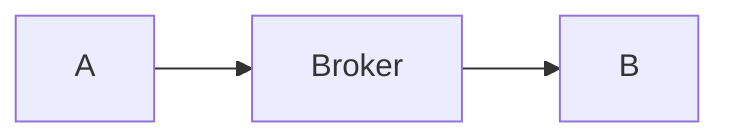

# 14장. 비동기 시스템의 장애와 복원 전략

동기 호출에서는 장애가 즉시 드러난다.  
느려지면 바로 대기하고, 바로 전파된다.

비동기 구조는 다르다.

A는 이벤트를 발행하고 응답을 끝낸다.  
B가 느려도 A는 모른다.

그래서 비동기는 안정적으로 보인다.

하지만 문제는 여기 있다.

> 비동기 시스템의 장애는 “조용히 쌓이다가 터진다.”

이 장에서는 그 구조와 대응 전략을 살펴본다.

---

## 비동기 시스템에서 발생하는 장애 유형

### 1️⃣ 메시지 적체 (Backlog)

Consumer가 느려지면:

* 메시지가 큐에 쌓이고
* 지연이 증가하고
* Eventually 처리 시간이 SLA를 초과한다

이건 즉시 장애가 아니라  
**지연 축적형 장애**다.

### 2️⃣ 소비자 폭주

적체가 발생하면  
운영자는 Consumer를 늘린다.

하지만:

* DB가 병목이면?
* 외부 API가 병목이면?
* Lock 경쟁이 심하면?

Consumer 수만 늘려도  
처리량이 늘지 않는다.

오히려 DB 과부하로 이어질 수 있다.

### 3️⃣ 재시도 폭발

메시지 처리 실패 → 재시도  
일시적 오류라면 괜찮다.

하지만 구조적 오류라면?

* 동일 메시지 반복 실패
* 재시도 루프
* 브로커 트래픽 증가
* DLQ 증가

이건 동기 구조의 Retry Storm과 유사하지만  
더 은밀하게 진행된다.

### 4️⃣ 브로커 장애

브로커 자체가:

* 과부하
* 디스크 부족
* 네트워크 문제
* 파티션 리밸런싱

을 겪으면:

* 발행 지연
* 소비 지연
* 순서 흔들림
* 재처리 증가

이건 시스템 전체의 비동기 흐름을 흔든다.

---

## 비동기 복원력 전략

### 1️⃣ Backpressure — 무한히 받아들이지 말라

Consumer가 처리 속도보다  
Producer가 더 빠르면 적체가 생긴다.

Backpressure 전략은:

* 처리 가능한 속도만큼만 수용
* 버퍼 크기 제한
* 소비자 처리량 기준으로 확장

Reactive 시스템에서 중요한 개념이다.

> 무한 큐는 복원력이 아니다.

### 2️⃣ DLQ (Dead Letter Queue)

처리 실패 메시지를  
메인 스트림에서 분리한다.

장점:

* 전체 흐름 보호
* 반복 실패 메시지 격리
* 운영 분석 가능

중요한 것은:

> DLQ는 “쓰레기통”이 아니라
> “진단 공간”이어야 한다.

### 3️⃣ 재시도 전략 설계

비동기에서도 재시도는 필요하다.

하지만:

* 무한 재시도 금지
* 지수 백오프 적용
* 실패 유형 분리
* 치명적 오류는 즉시 DLQ

재시도는 복구 수단이지  
지연 축적 도구가 되어선 안 된다.

### 4️⃣ 멱등성은 필수

비동기 시스템은:

* 중복
* 재처리
* 리플레이

가 기본 전제다.

따라서:

* 이벤트 ID 기반 처리
* 상태 기반 검증
* 중복 방지 테이블

등이 필요하다.

멱등성 없이는  
복원력도 없다.

### 5️⃣ 소비자 확장 전략

Consumer 수를 늘리는 것은  
무조건 정답이 아니다.

확장 전 확인해야 할 것:

* 병목은 어디인가?
* DB IOPS는 충분한가?
* 외부 API Rate Limit은?
* Lock 경합은 없는가?

비동기 확장은  
시스템 전체를 고려해야 한다.

### 6️⃣ 모니터링 지표

비동기 시스템은 눈에 잘 보이지 않는다.

따라서 반드시 모니터링해야 한다.

* Consumer Lag
* 큐 길이
* 처리 시간
* 실패율
* DLQ 증가율

비동기 복원력은  
관측 없이는 존재하지 않는다.

---

## 동기 vs 비동기 장애의 차이

| 구분    | 동기                       | 비동기               |
| ----- | ------------------------ | ----------------- |
| 장애 노출 | 즉시                       | 지연                |
| 전파 속도 | 빠름                       | 느림                |
| 위험 유형 | 스레드/커넥션 고갈               | 메시지 적체            |
| 대응 전략 | Timeout, Circuit Breaker | Backpressure, DLQ |

동기는 “즉시 붕괴” 위험이 있고  
비동기는 “조용한 축적 후 폭발” 위험이 있다.

---

## 설계 시 스스로에게 물어야 할 질문

1. Consumer Lag이 10배 증가하면 어떻게 되는가?
2. DLQ가 급증하면 누가 보고 있는가?
3. 재시도 정책은 설계되어 있는가?
4. 메시지 적체가 SLA를 넘으면 어떻게 대응하는가?
5. 브로커 장애 시 시스템은 어떻게 동작하는가?

---

## 이 장의 핵심

* 비동기 구조는 즉시 장애 전파를 줄인다.
* 하지만 메시지 적체와 재시도 폭발이라는 위험을 가진다.
* Backpressure는 필수 전략이다.
* DLQ는 격리 공간이다.
* 멱등성은 전제 조건이다.
* 모니터링 없이는 복원력도 없다.