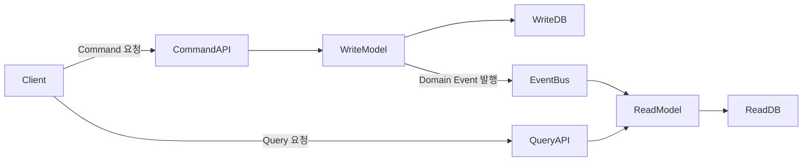
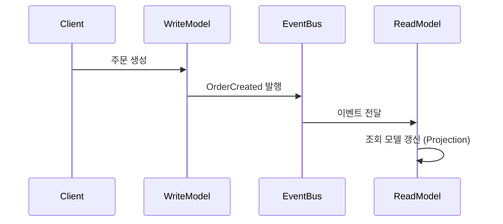
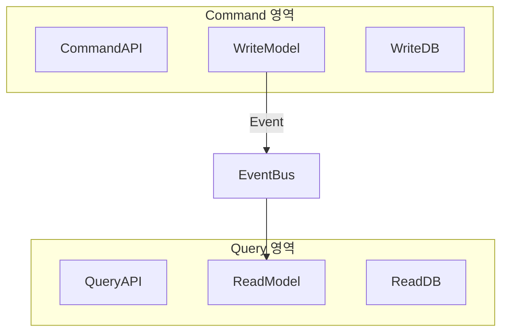

# 16장. 읽기와 쓰기의 모델을 분리하다 (CQRS)

---

## 우리는 왜 또 분리하려 하는가

우리는 계속해서 분리해왔다.

* 모놀리스에서 서비스로 분리했다.
* 서비스별로 데이터베이스를 분리했다.
* 동기 호출을 이벤트 기반 비동기로 전환했다.
* 강한 일관성을 포기하고 최종 일관성을 받아들였다.

그런데도 시스템은 여전히 복잡하다.

특히 다음과 같은 상황에서 문제가 드러난다.

* 조회 트래픽이 쓰기보다 압도적으로 많다.
* 복잡한 검색·정렬·집계 쿼리가 존재한다.
* 조회 로직이 애플리케이션 CPU를 점유한다.
* 조회 최적화를 위한 인덱스가 쓰기 성능을 떨어뜨린다.

읽기와 쓰기는 목적이 다르다.

그렇다면 하나의 모델로  
두 가지 상반된 요구를 동시에 만족시켜야 할 이유가 있을까?

이 질문에서 CQRS가 시작된다.

---

## Command와 Query는 무엇인가

먼저 용어를 간단히 정리하자.

* **Command**는 시스템의 상태를 변경하는 요청이다.  
  예: 주문 생성, 회원 가입, 결제 승인

* **Query**는 시스템의 상태를 조회하는 요청이다.  
  예: 주문 목록 조회, 회원 정보 조회, 통계 조회

구분 기준은 단 하나다.

> 시스템의 상태를 변경하는가, 그렇지 않은가.

CQRS는 이 구분을 구조 차원으로 끌어올린다.

---

## CQRS란 무엇인가

CQRS(Command Query Responsibility Segregation)는

> 상태를 변경하는 모델과  
> 상태를 조회하는 모델을 분리하는 패턴이다.

여기서 핵심은 코드 정리가 아니다.  
핵심은 **데이터 모델의 분리**다.

* Write 모델은 비즈니스 규칙과 트랜잭션 무결성에 집중한다.
* Read 모델은 조회 성능과 응답 형태에 집중한다.

두 모델은 목적이 다르기 때문에  
데이터 구조도 달라질 수 있다.

---

## CQRS의 최종 구조

이 문서에서 말하는 CQRS는 다음과 같은 형태를 의미한다.

이 구조의 본질은 다음과 같다.

* Write DB와 Read DB는 서로 다른 목적을 가진다.
* Read DB는 조회에 맞게 설계된 전용 스키마를 가질 수 있다.
* 두 모델은 이벤트를 통해 동기화된다.
* 즉시 일관성이 아니라 최종 일관성을 전제로 한다.

---

## Write 모델과 Read 모델의 역할 차이

### Write 모델

* 트랜잭션 중심
* 정규화된 도메인 모델 유지
* 비즈니스 규칙 강제
* 상태 변경이 목적

### Read 모델

* 조회 전용
* 비정규화 가능
* 집계 컬럼 사전 계산 가능
* 화면 요구사항 중심 설계

Write 모델을 조회에 맞게 왜곡할 필요가 없고,  
Read 모델을 무결성 때문에 복잡하게 만들 필요도 없다.

이 분리가 CQRS의 핵심이다.

---

## 이벤트 기반 동기화와 Projection

Write 모델에서 상태가 변경되면 도메인 이벤트가 발행된다.

예:

* OrderCreated
* OrderCancelled
* PaymentCompleted

Read 모델은 이 이벤트를 구독해 조회 모델을 갱신한다.

이때 **이벤트를 기반으로 조회 전용 데이터를 생성·갱신하는 과정을 Projection이라 한다.**

Projection은 단순한 복제가 아니다.  
조회 화면에 맞게 데이터를 가공하고,  
필요한 집계를 미리 계산해 저장하는 과정이다.

이 구조는 즉시 일관성을 보장하지 않는다.  
Write 직후 Query가 최신 상태를 보장하지 않을 수 있다.

CQRS는 이를 받아들이는 구조다.

---

## CQRS를 이해할 때 혼동하기 쉬운 지점

CQRS를 처음 접하면 다음과 같은 오해가 생길 수 있다.

* Command와 Query 클래스를 나누면 CQRS인가?
* Primary/Replica 구조면 CQRS인가?

이 구조들은 일부 유사해 보이지만  
이 문서에서 정의하는 CQRS의 핵심은 아니다.

* 단순한 코드 분리는 모델 분리가 아니다.
* Primary/Replica는 읽기 트래픽 분산 전략이다.
* 같은 스키마를 공유하면 읽기 모델을 자유롭게 설계하기 어렵다.

이 문서에서 말하는 CQRS는

> Read 모델이 Write 모델과 다른 데이터 구조를 가지는 상태

를 의미한다.

---

## 독립 확장은 선택의 문제다

CQRS 구조에서는 필요하다면  
Command 영역과 Query 영역을 물리적으로 분리할 수 있다.

이 경우 다음과 같은 효과가 생긴다.

* 애플리케이션 CPU 분리
* Query 서비스만 수평 확장 가능
* 조회 트래픽 증가 시 Write 영역 보호

그러나 이것은 CQRS의 필수 조건이 아니다.

서비스 분리는 다음과 같은 비용을 동반한다.

* 네트워크 호출 증가
* 배포 단위 분리
* 장애 처리 복잡성 증가
* 운영 및 모니터링 분리

따라서 물리적 분리는  
조회 트래픽이 압도적으로 크거나,  
Write 영역을 강하게 보호해야 할 때 선택하는 전략이다.

모델 분리와 서비스 분리는 동일하지 않다.

---

## CQRS의 비용

CQRS는 성능을 얻는 대신 복잡성을 수용하는 구조다.

### 최종 일관성

Write 직후 Query 결과가 최신이 아닐 수 있다.
사용자 경험 설계가 필요하다.

---

### 이벤트 처리 복잡성

* 이벤트 중복
* 순서 보장
* 멱등성 설계
* 재처리 전략

이전 장에서 다룬 이벤트 기반 구조의 복잡성이 그대로 이어진다.

---

### Projection 재구성

Read DB가 손상되면  
이벤트 로그를 기반으로 다시 구성해야 한다.

이 지점에서 다음 장의 주제와 연결된다.

---

## 정리

우리는 계속해서 분리해왔다.

* 서비스 분리
* 데이터 분리
* 동기/비동기 분리

그리고 이제

> 읽기 모델과 쓰기 모델을 분리했다.

CQRS는 단순한 성능 최적화 기법이 아니다.  
복잡성을 통제하기 위한 구조적 선택이다.

다음 장에서는  
상태 대신 이벤트를 저장하는 방식,  
Event Sourcing을 다룬다.

CQRS와 Event Sourcing이 만나면  
데이터를 바라보는 방식 자체가 달라진다.
