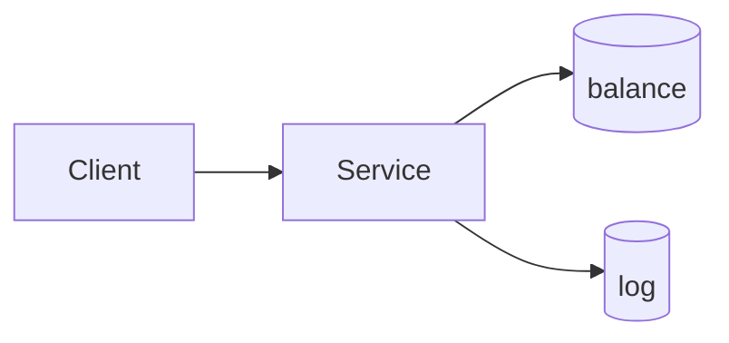
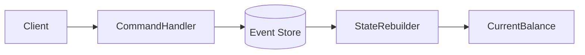
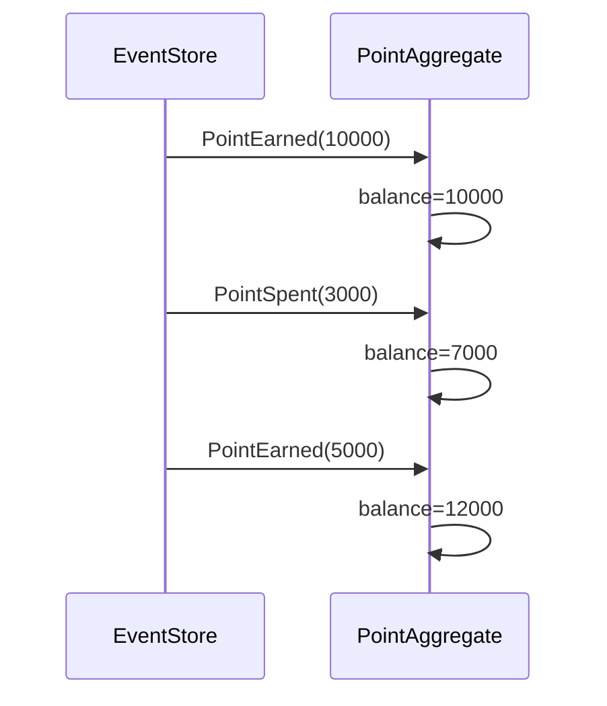
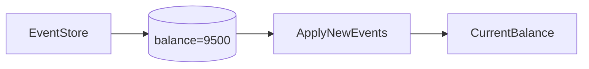

# 17장. 상태 대신 이벤트를 저장하다 (Event Sourcing)

---

## 우리는 무엇을 저장해왔는가

포인트 시스템을 생각해보자.

일반적인 시스템에서는 이렇게 저장한다.

```text
user_id = 10
point_balance = 12,000
```

포인트가 적립되거나 차감되면  
잔액을 업데이트하고,  
별도의 로그 테이블에 기록을 남긴다.

즉,

* 현재 잔액이 기준이다.
* 로그는 참고 자료다.

이 방식은 단순하고 이해하기 쉽다.  
하지만 질문이 하나 생긴다.

* 특정 시점의 잔액은 어떻게 알 수 있을까?
* 잔액이 잘못 계산되었다면 무엇을 기준으로 복구할까?
* 모든 변경 과정을 완전히 신뢰할 수 있을까?

우리는 “결과”만 저장하고 있다.

Event Sourcing은 여기서 출발한다.

---

## Event Sourcing이란 무엇인가

Event Sourcing은

> 상태를 저장하는 대신  
> 상태를 만들어낸 이벤트를 저장하는 방식이다.

포인트 예시로 비교해보자.

### 상태 저장 방식

```text
balance = 12,000
```

### 이벤트 저장 방식

```text
PointEarned(10000)
PointSpent(3000)
PointEarned(5000)
```

현재 잔액은 저장된 값이 아니라  
이 이벤트들을 순서대로 적용한 계산 결과다.

---

## 로그 방식과 무엇이 다른가

여기서 이런 의문이 생긴다.

> 로그도 남기고 있으면  
> 결국 계산 가능하지 않나?

맞다. 계산은 가능하다.

하지만 차이는 “무엇이 진짜 데이터인가”에 있다.

---

### 로그 + 상태 방식



* 진짜 값은 `balance`
* 로그는 보조 자료
* 상태가 기준(Source of Truth)

로그는 상태의 부산물이다.

---

### Event Sourcing 방식



* 진짜 값은 이벤트
* 상태는 계산 결과
* 이벤트가 기준(Source of Truth)

여기서 철학이 완전히 바뀐다.

> 로그는 결과를 기록한다  
> 이벤트는 결과를 만들어낸 원인이다

---

## Replay: 과거를 다시 적용하다

Event Sourcing의 핵심 개념은 **Replay**다.

Replay는

> 저장된 이벤트를 처음부터 다시 적용해  
> 현재 상태를 재구성하는 과정이다.



Replay가 가능하다는 것은 다음을 의미한다.

* 언제든지 상태를 재계산할 수 있다.
* 특정 시점의 상태를 복원할 수 있다.
* 계산 로직이 바뀌어도 다시 적용할 수 있다.

---

## Snapshot이 필요한 이유

이벤트가 많아지면 문제가 생긴다.

예를 들어 한 사용자가 수년간 활동했다면  
이벤트가 수만 개가 될 수 있다.

매번 처음부터 Replay하는 것은 비효율적이다.

그래서 Snapshot을 사용한다.

Snapshot은

> 특정 시점의 계산 결과를 저장해 두는 것



Replay는 Snapshot 이후 이벤트만 적용하면 된다.

---

## Event Sourcing의 장점

### 완전한 변경 이력 보존

포인트 도메인에서는 매우 중요하다.

* 부정 사용 추적
* 감사 대응
* 분쟁 해결

---

### 시점 기반 계산 가능

“2024년 1월 1일 기준 잔액”을 계산할 수 있다.

---

### 읽기 모델 재생성 가능

이벤트는 변하지 않는다.  
계산 방식이나 조회 구조가 바뀌어도  
이벤트를 다시 적용하면 된다.

---

## Event Sourcing의 비용

### 설계 난이도 증가

* 이벤트는 불변이어야 한다.
* 이벤트 버전 관리가 필요하다.
* 도메인 모델 설계가 중요해진다.

---

### 저장 공간 증가

이벤트는 계속 누적된다.

---

### 사고방식의 전환

상태 중심 사고에서  
이벤트 중심 사고로 전환해야 한다.

---

## 그렇다면 CQRS와는 무슨 관계인가

Event Sourcing은 CQRS의 필수 요소는 아니다.  
서로 독립적인 개념이다.

그러나 이벤트만 저장하는 구조에서는  
이벤트를 그대로 조회하기 어렵다.

이벤트는 “쓰기 기록”이기 때문이다.

따라서 실제로는

* 이벤트를 저장하고
* 그 이벤트를 기반으로 조회 전용 모델을 만들게 된다.

이 순간 자연스럽게 읽기 모델과 쓰기 모델이 분리된다.

즉,

> Event Sourcing을 적용하면  
> 결과적으로 CQRS 구조와 잘 어울리게 된다.

하지만 둘은 동일한 개념이 아니다.

* CQRS는 모델 분리 전략
* Event Sourcing은 저장 전략

---

## 언제 Event Sourcing을 고려해야 하는가

* 금전/포인트/정산 도메인
* 변경 이력이 매우 중요한 시스템
* 특정 시점 복원이 필요한 경우
* 복잡한 비즈니스 규칙이 존재하는 경우

단순 CRUD 시스템에는 과하다.

---

## 정리

전통적인 시스템은 결과를 저장한다.

Event Sourcing은  
그 결과를 만들어낸 과정을 저장한다.

현재 상태는 저장된 값이 아니라  
이벤트의 누적 결과일 뿐이다.

이제 질문이 남는다.

> 이벤트는 수정할 수 없다면  
> 잘못된 차감은 어떻게 되돌릴 것인가?

다음 장에서는  
보상 이벤트와 이벤트 불변성에 대해 다룬다.