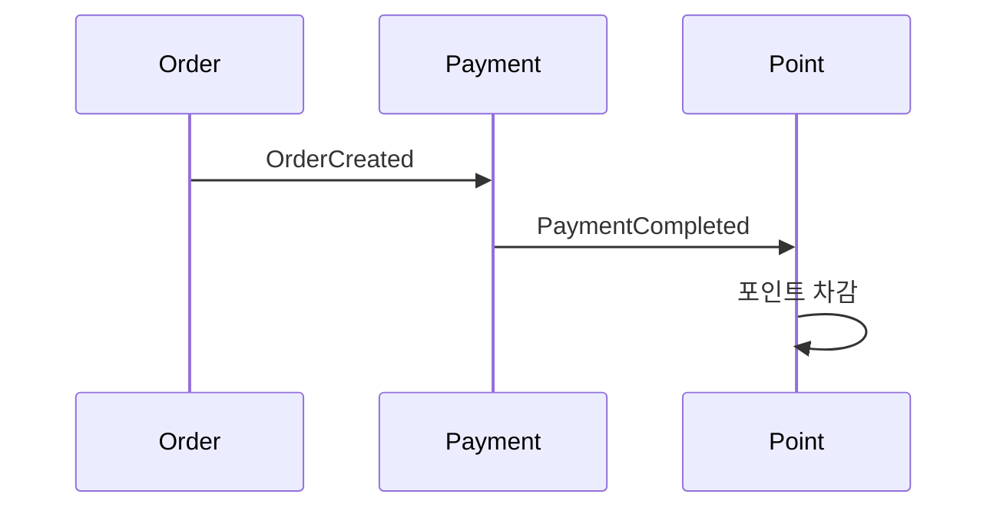
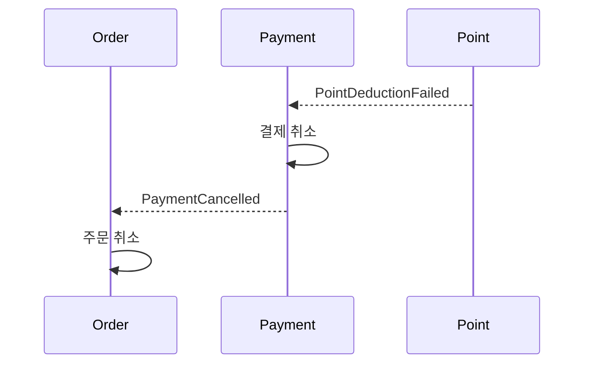
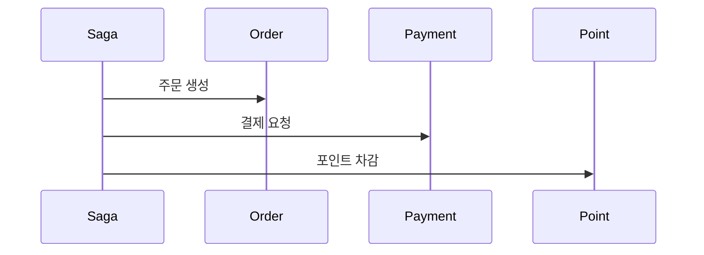
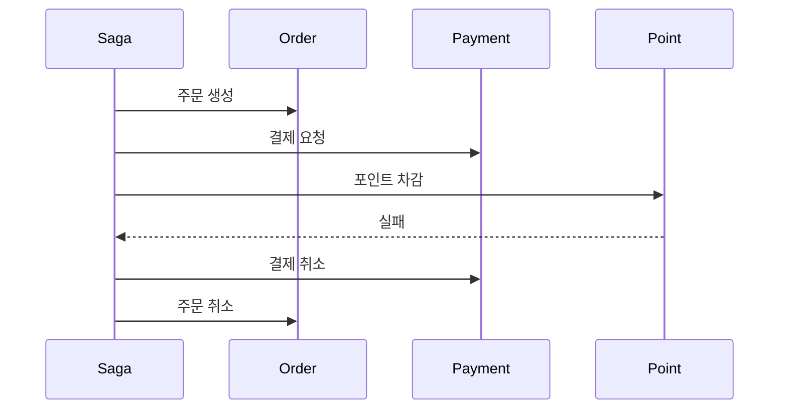

# 20장. Saga 패턴

---

## 먼저 이런 상황을 생각해보자

사용자가 상품을 구매한다.

겉보기에는 하나의 “구매” 작업이다.

하지만 시스템 내부에서는 다음과 같은 단계가 실행된다.

1. 주문 생성
2. 결제 승인
3. 포인트 차감

이 세 작업이 각각 다른 서비스에 있다면?

* Order Service
* Payment Service
* Point Service

이제 이런 상황을 생각해보자.

> 결제는 성공했는데  
> 포인트 차감이 실패했다면 어떻게 해야 할까?

---

## 하나의 서비스 안에서는 단순하다

모든 작업이 하나의 데이터베이스 안에 있다면 문제는 단순하다.

```sql
BEGIN;
INSERT ORDER;
UPDATE PAYMENT;
UPDATE POINT;
COMMIT;
```

중간에 실패하면 ROLLBACK 하면 된다.

데이터베이스가 자동으로 이전 상태로 되돌려 준다.

---

## 서비스가 나뉘면 롤백이 불가능하다

마이크로서비스 환경에서는  
각 서비스가 서로 다른 데이터베이스를 사용한다.

예를 들어:

* 결제는 이미 Payment DB에 커밋되었다.
* 주문은 이미 Order DB에 저장되었다.

이 상태에서 전체를 ROLLBACK 할 방법은 없다.

이미 커밋된 데이터는 되돌릴 수 없다.

그래서 접근 방식을 바꿔야 한다.

---

## Saga란 무엇인가

Saga는

> 여러 서비스에 걸친 하나의 작업을  
> 단계별로 실행하고  
> 실패하면 이미 완료된 단계를 취소하는 추가 작업을 실행하는 방식

이다.

여기서 중요한 점은 이것이다.

* 전통적인 트랜잭션은 “한 번에 롤백”한다.
* Saga는 “취소하는 작업을 새로 실행”한다.

---

## 롤백과 Saga의 차이

### 전통적인 트랜잭션

```text
A 실행
B 실행
C 실패
→ A, B 자동 롤백
```

DB가 이전 상태로 되돌린다.

---

### Saga

```text
A 실행 (완료)
B 실행 (완료)
C 실패
→ B 취소 실행
→ A 취소 실행
```

여기서

* B 취소
* A 취소

이 취소 작업이 바로 보상(Compensation)이다.

---

## 보상이란 무엇인가

보상은

> 이미 완료된 작업을 상쇄하기 위한 새로운 작업

이다.

중요한 점은 이것이다.

* 과거를 지우는 것이 아니다.
* 반대 의미의 작업을 추가로 실행하는 것이다.

예를 들어:

| 원래 작업  | 보상 작업  |
| ------ | ------ |
| 주문 생성  | 주문 취소  |
| 결제 승인  | 결제 취소  |
| 포인트 차감 | 포인트 복구 |

보상은 “상태를 되돌린다”기보다  
“반대 효과를 만들어낸다”에 가깝다.

---

## Saga의 두 가지 구현 방식

Saga는 구현 방식에 따라 두 가지로 나뉜다.

1. Choreography
2. Orchestration

---

### 1️⃣ Choreography 방식

중앙 조정자가 없다.  
각 서비스가 이벤트를 주고받으며 흐름을 이어간다.

#### 정상 흐름



#### 포인트 차감 실패 시



각 서비스가 실패 이벤트를 받아  
자신의 보상 작업을 실행한다.

#### 특징

* 중앙 관리자가 없다
* 각 서비스가 자신의 보상 책임을 가진다

#### 장점

* 구조가 단순하다
* 서비스 간 결합도가 낮다
* 이벤트 기반 구조와 잘 맞는다

#### 단점

* 전체 흐름을 한눈에 보기 어렵다
* 서비스가 많아지면 이벤트 흐름이 복잡해진다
* 디버깅이 어렵다

---

### 2️⃣ Orchestration 방식

중앙에 Saga 조정자가 존재한다.  
이 조정자가 전체 흐름을 관리한다.


#### 정상 흐름



#### 실패 시 보상



조정자가 실패를 감지하고  
보상 순서를 직접 실행한다.

#### 특징

* 중앙에서 전체 흐름을 제어한다
* 상태 관리가 명확하다

#### 장점

* 복잡한 흐름 관리에 유리하다
* 디버깅이 쉽다
* 보상 순서를 명확히 제어할 수 있다

#### 단점

* 중앙 컴포넌트가 복잡해질 수 있다
* 설계가 잘못되면 병목이 될 수 있다

---

## 어떤 방식을 선택해야 할까

### 단순한 비즈니스 흐름

* 단계가 적고
* 보상 로직이 단순하다면

→ Choreography가 적합하다.

### 복잡한 흐름

* 단계가 많고
* 실패 조건이 복잡하고
* 보상 순서 제어가 중요하다면

→ Orchestration이 더 적합하다.

---

# 정리

* 하나의 DB에서는 트랜잭션이 문제를 해결한다.
* 서비스가 분리되면 강한 롤백은 불가능하다.
* Saga는 단계별 실행 + 실패 시 취소 작업 실행 방식이다.
* 취소 작업을 보상(Compensation)이라고 한다.
* 구현 방식은 Choreography와 Orchestration 두 가지다.
* 선택은 비즈니스 복잡도에 따라 달라진다.