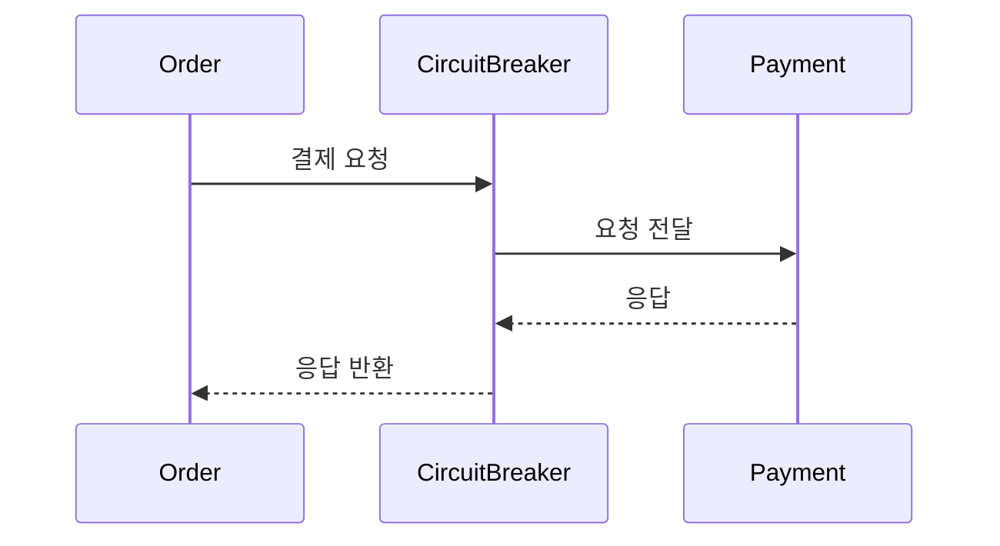
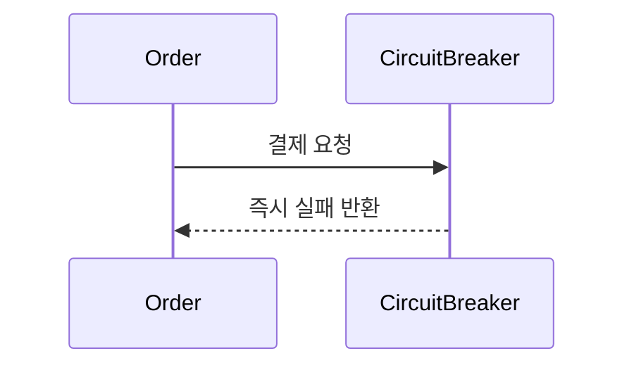
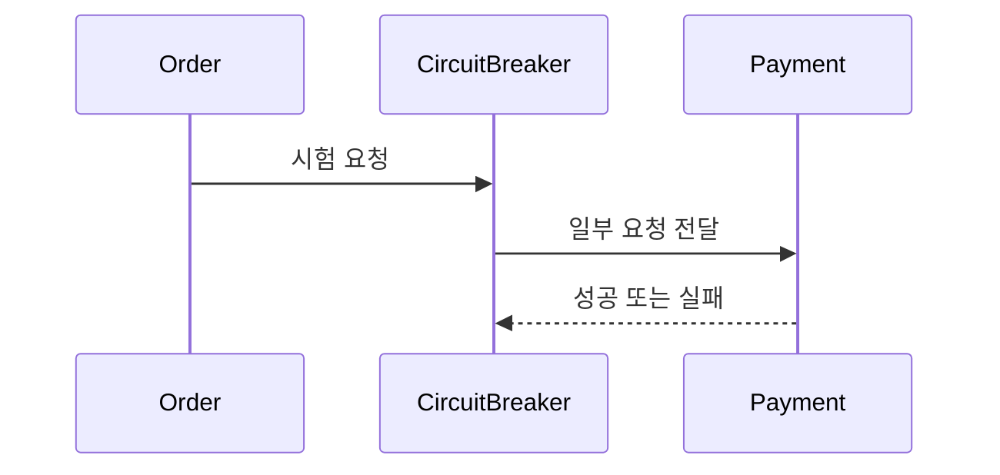
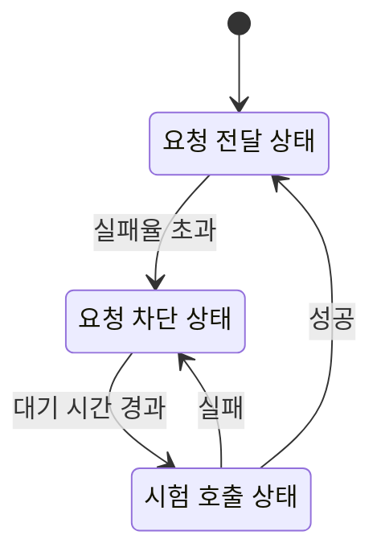

# 21장. Circuit Breaker

---

## 이런 상황을 생각해보자

Order Service가 Payment Service를 호출한다.

그런데 Payment Service에 장애가 발생했다.

* 응답이 매우 느리다
* 타임아웃이 발생한다
* 간헐적으로 실패한다

Order Service는 어떻게 될까?

* 계속 Payment를 호출한다
* 스레드가 대기한다
* 커넥션이 점점 쌓인다
* 결국 Order Service도 느려진다

이것을 **장애 전파**라고 한다.

하나의 서비스 장애가 다른 서비스로 퍼진다.

---

## 단순 재시도는 해결책이 아니다

장애가 발생하면 보통 재시도를 한다.

하지만 장애 상태에서 무작정 재시도하면:

* 네트워크 부하 증가
* 장애 서비스에 더 큰 압박
* 전체 시스템 지연 증가

오히려 상황이 더 나빠질 수 있다.

그래서 필요한 것이 Circuit Breaker다.

---

## Circuit Breaker란 무엇인가

Circuit Breaker는

> 장애가 발생한 서비스로의 호출을 일정 시간 차단하여  
> 장애가 시스템 전체로 확산되는 것을 막는 패턴

이다.

이 이름은 전기 차단기에서 왔다.

* 과부하가 발생하면 회로를 끊는다
* 일정 시간이 지나면 다시 연결을 시도한다

---

## 상태 이름이 헷갈리는 이유

Circuit Breaker는 “회로 상태” 기준으로 이름이 붙었다.

* **Closed** → 회로가 닫혀 있어서 전류가 흐른다 → 요청이 전달된다
* **Open** → 회로가 열려 있어서 전류가 끊긴다 → 요청이 차단된다

즉,

> Closed는 정상 연결 상태  
> Open은 차단 상태

이다.

이 점을 먼저 이해해야 다이어그램이 자연스럽다.

---

## Circuit Breaker의 세 가지 상태

1. Closed
2. Open
3. Half-Open

### 1️⃣ Closed (정상 상태)

* 요청이 실제 서비스로 전달된다.
* 실패율을 모니터링한다.
* 정상 동작 상태다.

### 2️⃣ Open (차단 상태)

* 일정 실패율을 넘으면 전환된다.
* 요청을 실제 서비스로 보내지 않는다.
* 즉시 실패를 반환한다.

Payment 서비스에는 요청이 가지 않는다.

### 3️⃣ Half-Open (시험 상태)

* 일정 시간이 지나면 전환된다.
* 일부 요청만 실제 서비스로 전달한다.
* 성공하면 Closed로 복귀
* 실패하면 다시 Open

---

## 상태 전이 다이어그램

이제 상태와 설명이 정확히 매칭된다.

---

## Circuit Breaker가 필요한 이유

1. 장애 확산 방지
2. 리소스 보호 (스레드, 커넥션)
3. 빠른 실패 반환
4. 시스템 안정성 확보

Circuit Breaker는 장애를 해결하지 않는다.

> 장애가 더 커지지 않도록 격리하는 장치다.

---

## 실무에서 고려해야 할 요소

### 1️⃣ 실패 기준

* 연속 실패 횟수?
* 일정 시간 내 실패율 %?
* 타임아웃도 실패로 볼 것인가?

### 2️⃣ Open 상태 유지 시간

* 너무 짧으면 계속 흔들린다.
* 너무 길면 복구가 늦어진다.

### 3️⃣ Fallback 전략

Open 상태에서 무엇을 반환할 것인가?

* 기본값
* 캐시 데이터
* 사용자에게 오류 메시지
* 비동기 처리 전환

Circuit Breaker는 차단만 하는 것이 아니라  
대체 전략과 함께 설계해야 한다.

---

# 정리

* 분산 시스템에서는 장애가 전파된다.
* 무작정 재시도는 위험하다.
* Circuit Breaker는 일정 조건에서 호출을 차단한다.
* Closed는 정상 연결 상태다.
* Open은 차단 상태다.
* Half-Open은 복구 시험 상태다.
* 목적은 장애 확산 방지다.