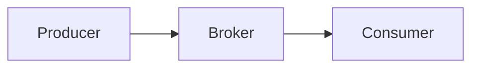
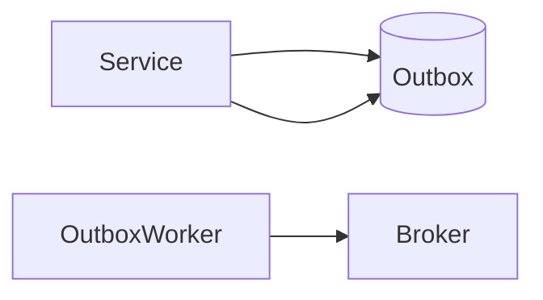
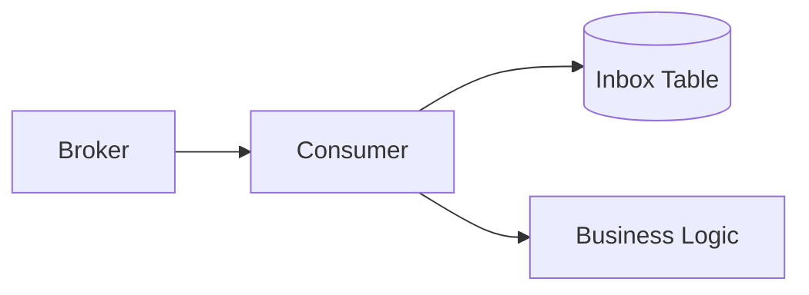
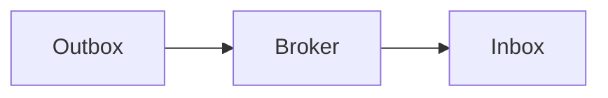

# 21장. 이벤트를 안전하게 전달하는 방법 — Outbox + Inbox

15장에서 우리는  
이벤트 기반 아키텍처를 살펴봤다.

* 서비스는 직접 호출하지 않고
* 이벤트로 연결되며
* 느슨하게 결합된다

하지만 이 구조에는 현실적인 문제가 있다.

> 이벤트는 유실될 수 있고, 중복될 수 있다

그렇다면 질문은 이것이다.

> 이벤트를 어떻게 안전하게 전달할 것인가?

---

## 문제는 양쪽에서 발생한다

이벤트 흐름은 단순해 보인다.



하지만 실제 문제는  
양쪽에서 동시에 발생한다.

---

### 1️⃣ 보내는 쪽 문제 (Producer)

> DB는 저장됐는데 이벤트는 발행되지 않았다

→ 20장에서 본 원자성 문제

---

### 2️⃣ 받는 쪽 문제 (Consumer)

> 같은 이벤트가 여러 번 처리된다

→ 18장에서 본 멱등성 문제

---

## 해결 전략 — Outbox + Inbox

이 두 문제를 함께 해결하는 방법이 있다.

> Outbox + Inbox 패턴

---

## Outbox — 보내는 쪽을 안전하게 만든다

Outbox 패턴의 핵심은 단순하다.

> 이벤트를 즉시 보내지 말고  
> DB 트랜잭션 안에 함께 저장하라

---

### 동작 흐름



1. 비즈니스 데이터 저장
2. Outbox 테이블에 이벤트 저장
3. 트랜잭션 커밋
4. 별도 프로세스가 이벤트 발행

---

### 효과

* 이벤트 유실 방지
* 장애 상황에서도 재시도 가능

---

## Inbox — 받는 쪽을 안전하게 만든다

Inbox는 소비자 측 패턴이다.

핵심은 이것이다.

> 이미 처리한 이벤트인지 기록한다

---

### 동작 흐름



1. 이벤트 수신
2. Inbox 테이블에 event_id 기록 시도
3. 이미 존재하면 무시
4. 없으면 처리 진행

---

### 핵심 구현

```sql
INSERT INTO inbox(event_id)
VALUES (?)
ON CONFLICT DO NOTHING;
```

→ insert 성공 시에만 처리

---

### 효과

* 중복 이벤트 차단
* 멱등성 보장

---

## Outbox와 Inbox는 함께 사용해야 한다

둘 중 하나만으로는 충분하지 않다.

---

### Outbox만 있는 경우

* 이벤트는 유실되지 않는다
* 하지만 중복은 그대로 발생한다

---

### Inbox만 있는 경우

* 중복은 제어된다
* 하지만 이벤트 자체가 사라질 수 있다

---

### 함께 사용하는 경우



* 유실 방지
* 중복 제어

👉 현실적인 최선의 구조

---

## 그래도 Exactly Once는 아니다

중요한 사실 하나

> Outbox + Inbox를 사용해도
> Exactly Once는 아니다

여전히

* 재시도
* 중복 전송
* 순서 문제

는 존재한다.

하지만

> 중복되더라도 안전한 시스템은 만들 수 있다

---

## 이벤트 시스템의 현실적인 목표

이벤트 기반 아키텍처의 목표는  
완벽함이 아니다.

> 유실 없이, 중복을 허용하되, 안전하게 처리하는 것

Outbox와 Inbox는  
이 목표를 가장 현실적으로 달성하는 방법이다.

---

## 이 장의 핵심

* 이벤트 전달 문제는 양쪽에서 발생한다
* Outbox는 이벤트 유실을 막는다
* Inbox는 중복 처리를 제어한다
* 둘을 함께 사용해야 안정성이 확보된다
* Exactly Once는 어렵지만 충분히 안전한 시스템은 만들 수 있다