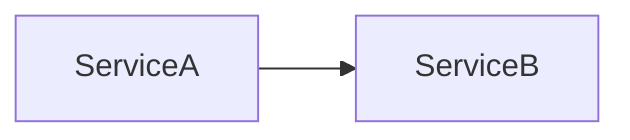
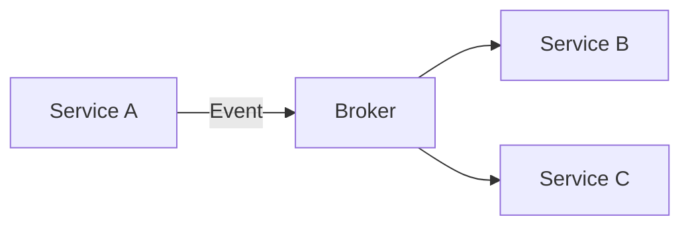

# 23장. 이벤트로 연결되는 시스템

지금까지 우리는  
이벤트 시스템의 현실을 봤다.

* 메시지는 중복될 수 있고
* 순서는 보장되지 않으며
* 정합성은 단계적으로 맞춰야 한다

그럼에도 불구하고  
많은 시스템이 이벤트 기반 아키텍처를 선택한다.

왜일까?

---

## 기존 방식 — 직접 호출

전통적인 방식은 단순하다.



Service A는 Service B에게 요청한다.

> “이 작업을 처리해줘”

이 구조는 이해하기 쉽다.
하지만 점점 문제가 생긴다.

* 서비스 간 의존성이 강해진다
* 장애가 전파된다
* 확장이 어려워진다

---

## 이벤트 기반 방식 — 상태를 알린다

이벤트 기반 아키텍처에서는  
방식이 완전히 바뀐다.



Service A는 더 이상 요청하지 않는다.

> “이런 일이 발생했다”

라고 알릴 뿐이다.

---

## 핵심 구성 요소

이 구조는 세 가지로 이루어진다.

---

### 1️⃣ 발행자 (Publisher)

이벤트를 생성하는 주체다.

예:

* 주문 생성
* 결제 완료
* 회원 가입

발행자는  
누가 이 이벤트를 사용할지 모른다.

> 단지 “일어났음을 알릴 뿐”이다.

---

### 2️⃣ 이벤트 (Event)

이미 발생한 사실을 표현한다.

중요한 점은 이것이다.

> 이벤트는 명령이 아니라 사실이다

예:

* ❌ `CreateOrder`
* ✅ `OrderCreated`

---

### 3️⃣ 구독자 (Subscriber)

이벤트를 받아 처리하는 주체다.

예:

* 포인트 적립 서비스
* 알림 서비스
* 통계 시스템

구독자는

* 누가 발행했는지 몰라도 되고
* 몇 개 서비스가 발행하는지도 몰라도 된다

> “이 이벤트를 받겠다”만 정의하면 된다

---

## 느슨한 결합 (Loose Coupling)

이벤트 기반 아키텍처의 핵심은 이것이다.

> 서로를 몰라도 동작한다

---

### 기존 방식

```
A → B → C
```

* A는 B를 알아야 하고
* B는 C를 알아야 한다

👉 하나가 바뀌면 전부 영향 받는다

---

### 이벤트 방식

```
A → Event → (B, C, D ...)
```

* A는 아무도 몰라도 된다
* B, C, D는 서로 몰라도 된다

👉 각자 자기 일만 한다

---

## 장점

이벤트 기반 구조는
다음과 같은 장점을 가진다.

---

### 1️⃣ 서비스 간 의존성 감소

발행자는  
구독자를 알 필요가 없다.

구독자도  
발행자를 알 필요가 없다.

---

### 2️⃣ 확장성

새로운 기능이 필요하면

> 구독자만 추가하면 된다

기존 서비스는 수정하지 않는다.

---

### 3️⃣ 장애 격리

하나의 서비스가 실패해도  
다른 서비스에는 직접적인 영향이 없다.

---

### 4️⃣ 비동기 처리

요청-응답을 기다리지 않기 때문에  
전체 시스템이 더 유연해진다.

---

## 단점

하지만 이 구조는  
대가 없이 얻어지지 않는다.

---

### 1️⃣ 정합성 문제

모든 처리가 동시에 완료되지 않는다.

> 최종 일관성을 받아들여야 한다

---

### 2️⃣ 추적의 어려움

하나의 요청이  
여러 서비스로 퍼진다.

* 어디까지 처리됐는지
* 어디서 실패했는지

추적이 어려워진다.

---

### 3️⃣ 멱등성 문제

이벤트는 중복될 수 있다.

> 같은 이벤트를 여러 번 처리해도 안전해야 한다

---

### 4️⃣ 순서 문제

이벤트는 순서대로 오지 않는다.

> 순서에 의존하면 시스템이 깨진다

---

## 이벤트 기반 설계의 본질

이 구조의 핵심은 이것이다.

> 요청이 아니라 결과를 공유한다

---

기존 방식:

> “이걸 해줘”

이벤트 방식:

> “이 일이 일어났어”

---

이 차이는 단순한 구현 방식의 차이가 아니다.

> 시스템을 바라보는 관점의 변화다

---

## 이 장의 핵심

이벤트 기반 아키텍처는

* 요청 대신 이벤트로 연결된다
* 발행자, 이벤트, 구독자로 구성된다
* 서로를 몰라도 동작하는 느슨한 결합 구조다
* 확장성과 유연성을 제공한다

하지만 동시에

* 정합성 문제를 감수해야 하고
* 추적이 어려워지며
* 멱등성과 순서 문제를 반드시 해결해야 한다