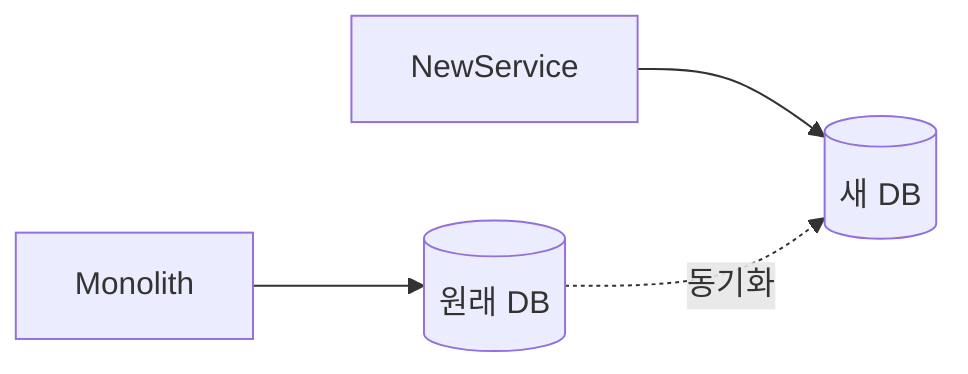
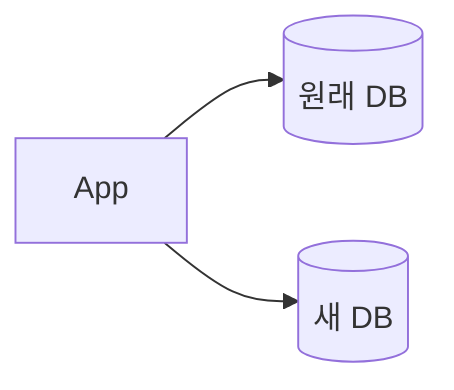
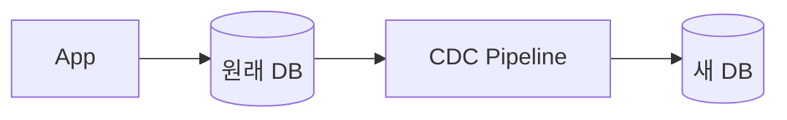
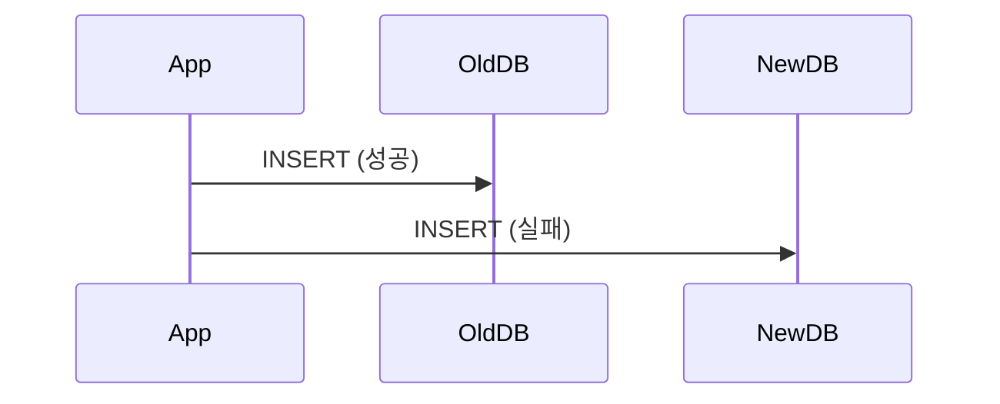
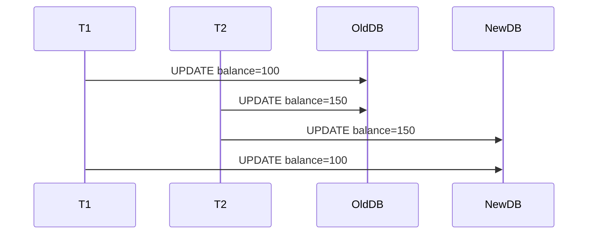
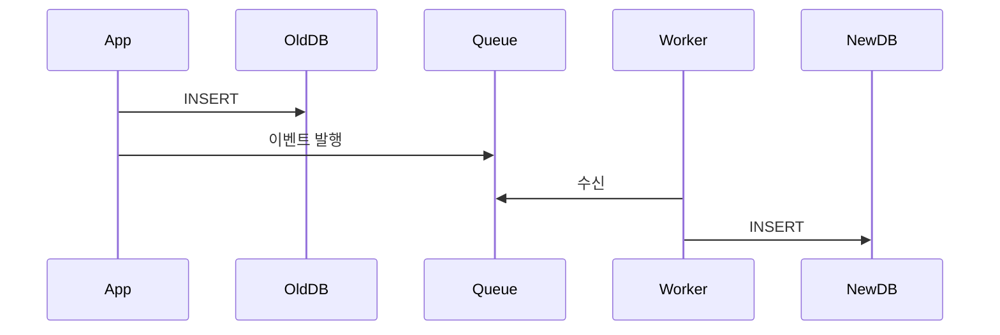
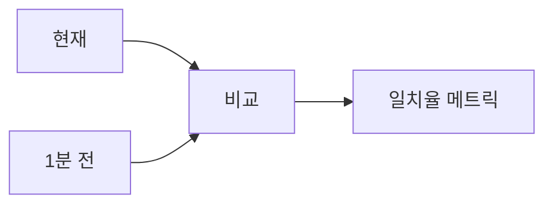
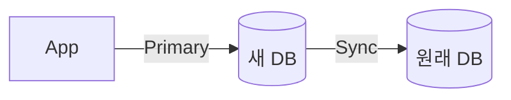

# 23장. 전환 중의 데이터 정합성 — Dual-write에서 살아남기

22장에서 우리는 Saga 패턴을 보았다.
이미 분산된 시스템에서 어떻게 정합성을 맞추는지 다뤘다.

하지만 마이크로서비스 전환 중에는
더 까다로운 문제가 있다.

> **모놀리스와 신규 서비스가 같은 데이터를 동시에 다룬다.**

이 공존기는 보통 수개월에서 수년에 걸친다.
그 기간 내내 데이터 정합성을 어떻게 유지할 것인가?

7장에서 데이터 마이그레이션의 큰 그림을 다뤘다.
이 장은 그 안의 가장 위험한 구간에 집중한다.

---

## 공존기에 데이터가 어디에 있는가

전환 중 데이터는 보통 다음 상태에 있다.



* 모놀리스는 원래 DB를 본다
* 신규 서비스는 새 DB를 본다
* 두 DB 사이에 동기화가 흐른다

이 상태에서 무엇이 위험한가?

> **두 DB가 어긋날 수 있다.**
> 그리고 한 번 어긋나면 발견하기 어렵다.

---

## 동기화의 두 가지 방식

7장에서 본 두 가지 동기화 방식을 다시 보자.

### 1️⃣ Dual-write



애플리케이션이 양쪽 DB에 동시에 쓴다.

장점:

* 즉시 반영된다
* 별도 인프라가 필요 없다

단점:

* 한쪽 실패 시 정합성이 깨진다
* 트랜잭션이 두 DB에 걸려 있다
* 코드가 복잡해진다

### 2️⃣ CDC (Change Data Capture)



DB의 변경 로그를 별도 파이프라인이 따라간다.

장점:

* 애플리케이션은 한 DB만 안다
* 비동기로 자연스럽다

단점:

* 지연이 있다 (수 ms ~ 수 초)
* 별도 파이프라인 운영 부담

---

## 어떤 것을 선택하는가

| 상황 | 권장 |
|---|---|
| 데이터의 즉시 일관성이 중요 | Dual-write |
| 약간의 지연 허용 가능 | CDC |
| 원래 DB 스키마를 못 바꾼다 | CDC |
| 한쪽 실패 시 자동 복구 원함 | CDC |
| 단순한 구조 우선 | Dual-write |

대부분의 케이스에서 **CDC**가 더 안전하다.

이유:

* 애플리케이션이 한 DB만 보면 되므로 코드가 단순하다
* 두 DB 트랜잭션을 묶을 필요가 없다
* 12장에서 본 Outbox 패턴과 잘 어울린다

그러나 즉시 일관성이 필요한 영역(예: 잔액, 재고)에서는
Dual-write가 더 적합할 수 있다.

---

## Dual-write의 위험

Dual-write를 선택했다면 다음을 받아들여야 한다.

### 위험 1 — 한쪽이 실패한다



결과: 원래 DB에는 있고, 새 DB에는 없다.

### 위험 2 — 순서가 어긋난다

두 트랜잭션이 동시에 양쪽에 쓰면
적용 순서가 달라질 수 있다.



원래 DB: 150 (최신)
새 DB: 100 (옛 값이 덮어씌움)

### 위험 3 — 부분 트랜잭션

원래 DB의 한 트랜잭션이
여러 테이블을 묶고 있다면
새 DB로 분리할 때 트랜잭션이 깨질 수 있다.

---

## Dual-write를 안전하게 만드는 방법

### 1️⃣ 한쪽을 진실의 원천으로 정한다

> **Source of Truth는 항상 한 곳이다.**

전환 초기:

* 원래 DB가 진실
* 새 DB는 복제본

전환 후반:

* 새 DB가 진실
* 원래 DB는 복제본 (롤백용)

진실의 원천이 어디인지를 매 시점 명확히 한다.

### 2️⃣ 실패는 진실의 원천에서 막는다

진실의 원천이 원래 DB라면

* 원래 DB 쓰기가 성공해야 응답한다
* 새 DB 쓰기는 실패해도 무시 (별도 모니터링)
* 어긋남은 정기 검증으로 잡는다

이렇게 하면 두 DB 트랜잭션을 묶지 않아도 된다.

### 3️⃣ 새 DB 쓰기는 비동기로



이 구조는 사실상 12장의 Outbox 패턴이다.

* 애플리케이션은 원래 DB만 신뢰
* 새 DB는 큐를 통해 따라간다
* 실패 시 큐에서 재시도

---

## 정합성 검증 — 가장 자주 빠지는 부분

Dual-write든 CDC든
**자동 정합성 검증** 없이는 운영할 수 없다.

### 검증의 세 단계

#### 1️⃣ 행 수 비교

```sql
-- 원래 DB
SELECT COUNT(*) FROM orders;

-- 새 DB
SELECT COUNT(*) FROM orders;
```

차이가 있으면 즉시 알람.

#### 2️⃣ 샘플링 비교

```text
무작위로 100개의 ID를 골라
두 DB의 해당 행을 비교한다.

* 컬럼 값이 다르면 차이 기록
* 임계치 이상이면 알람
```

#### 3️⃣ 시계열 드리프트 추적



매 분 일치율을 측정해서
시간에 따른 변화를 본다.

* 일치율이 99.9% 미만이면 알람
* 갑자기 떨어지면 더 큰 문제

---

## 드리프트가 발생했을 때

검증에서 차이가 발견되었다.
무엇을 할 것인가?

### 첫 단계 — 원인 파악

차이의 패턴을 본다.

* 한 특정 시점 이후에만 차이가 있다 → 그 시점에 무슨 일이?
* 특정 ID 범위에만 차이 → 특정 코드 경로 의심
* 무작위 분포 → 동기화 자체의 일시적 실패

### 둘째 단계 — 진실의 원천 기준으로 보정

진실의 원천이 정해져 있다면
보정은 단순하다.

* 원천에서 새 DB로 일방향 복원
* 보정 스크립트 자동화

### 셋째 단계 — 재발 방지

같은 종류의 드리프트가 다시 안 생기게 한다.

* 동기화 로직 점검
* 자동 검증의 빈도 증가
* 알람 임계치 조정

---

## 진짜 위험은 발견 못한 차이다

드리프트는 발견되면 고칠 수 있다.

진짜 위험은

> **차이가 있는 줄 모르고 신규 DB로 쓰기 전환이 일어나는 것**이다.

이걸 막는 단 하나의 방법은

> **자동 검증을 매 시점 돌리는 것**이다.

검증 없이 쓰기 전환은 도박이다.

---

## 롤백 시나리오

쓰기 전환 후에도
원래 DB의 동기화를 유지해야 한다.



이유:

* 새 DB에 문제가 생길 수 있다
* 진실의 원천을 다시 원래 DB로 되돌려야 할 수 있다
* 동기화가 끊겨 있으면 롤백 시점에 데이터를 잃는다

이 동기화는 보통

* 쓰기 전환 후 1~3개월 유지
* 충분한 안정화 기간 후 종료

---

## 이 장의 핵심

* 공존기의 가장 큰 위험은 두 DB 사이의 정합성 깨짐이다
* Dual-write는 즉시지만 위험하고, CDC는 지연이 있지만 안전하다
* Source of Truth는 항상 한 곳이어야 한다 — 매 시점 명확히
* Outbox + 큐 + Worker 구조로 Dual-write의 위험을 줄일 수 있다
* 자동 정합성 검증은 선택이 아니라 필수다
* 발견된 드리프트는 고칠 수 있지만 발견 못한 드리프트는 못 고친다
* 쓰기 전환 후에도 일정 기간 역방향 동기화를 유지한다
