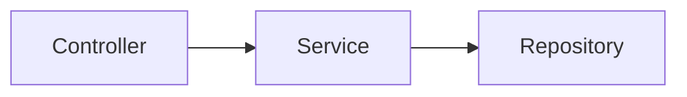

# 33장. 레이어 아키텍처

지금까지 우리는  
이벤트 기반 시스템의 구조를 살펴봤다.

* 이벤트로 연결되고
* 비동기로 동작하며
* Outbox와 Inbox로 안정성을 확보한다

그렇다면 이제 질문이 생긴다.

> 이 복잡한 시스템을 코드로는 어떻게 구성할 것인가?

---

## 대부분의 시스템은 이렇게 시작한다

많은 서비스는 다음과 같은 구조로 시작한다.



이 구조는 매우 익숙하다.

* Controller → 요청을 받는다
* Service → 비즈니스 로직을 수행한다
* Repository → DB에 접근한다

이것을 레이어 아키텍처라고 한다.

---

## 레이어 아키텍처의 개념

레이어 아키텍처는  
시스템을 역할별로 나눈 구조다.

---

### 1️⃣ Controller (Presentation Layer)

외부 요청을 받는 역할

* HTTP 요청 처리
* 입력값 검증
* 응답 반환

---

### 2️⃣ Service (Application Layer)

비즈니스 로직을 담당

* 주문 생성
* 결제 처리
* 상태 변경

---

### 3️⃣ Repository (Infrastructure Layer)

데이터 저장소 접근

* DB 조회 / 저장
* 외부 API 호출

---

## 핵심 특징

이 구조의 핵심은 이것이다.

> 위에서 아래로 의존한다

```
Controller → Service → Repository
```

* Controller는 Service를 알고
* Service는 Repository를 안다
* 반대 방향은 없다

---

## 왜 이 구조를 사용하는가

레이어 아키텍처는  
오랫동안 사용된 이유가 있다.

---

### 1️⃣ 이해하기 쉽다

구조가 단순하다.

* 어디에 무엇을 넣어야 할지 명확하다

---

### 2️⃣ 빠르게 개발할 수 있다

초기 개발 속도가 빠르다.

* 별도 구조 설계 없이 바로 구현 가능

---

### 3️⃣ 역할이 명확하다

* Controller → 입출력
* Service → 로직
* Repository → 데이터

---

## 하지만 시스템이 커지면 문제가 생긴다

초기에는 잘 동작한다.

하지만 서비스가 커질수록  
문제가 드러나기 시작한다.

---

## 문제 1️⃣ 비즈니스 로직이 흩어진다

Service에는 비즈니스 로직이 있어야 한다.

하지만 현실은 다르다.

```text
Service
 ├─ DB 조회
 ├─ Kafka 이벤트 발행
 ├─ 외부 API 호출
 ├─ 비즈니스 로직
```

결과:

> 무엇이 핵심 로직인지 흐려진다

---

## 문제 2️⃣ 인프라 코드가 침투한다

Service는 점점 더 많은 것을 알게 된다.

* 어떤 DB를 쓰는지
* Kafka를 어떻게 보내는지
* Redis를 어떻게 쓰는지

즉,

> 비즈니스 로직이 외부 기술에 의존하게 된다

---

## 문제 3️⃣ 테스트가 어려워진다

Service를 테스트하려면

* DB가 필요하고
* Kafka가 필요하고
* 외부 API가 필요하다

결과:

> 단위 테스트가 힘들어진다

---

## 문제 4️⃣ 변경이 어렵다

예를 들어:

* Kafka → SQS 변경
* MySQL → DynamoDB 변경

이런 변경이 발생하면

> Service 코드까지 수정해야 한다

---

## 문제의 본질

위 문제들의 공통 원인은 이것이다.

> 의존성이 한 방향으로 고정되어 있다

```
Service → DB
Service → Kafka
Service → API
```

Service는 점점 더 많은 것에 의존하게 된다.

---

## 이벤트 기반 시스템에서는 더 심각해진다

이벤트 기반 구조에서는  
외부 의존성이 더 많아진다.

* 메시지 브로커
* Outbox
* Inbox
* 캐시
* 외부 서비스

결과:

> Service 레이어가 모든 것을 알게 된다

---

## 여기서 질문이 생긴다

이 시점에서 자연스럽게 질문이 나온다.

> 비즈니스 로직을 외부 기술로부터 분리할 수 없을까?

---

## 다음 단계

이 질문을 해결하기 위해  
다음 개념이 필요하다.

* 의존성 방향
* 제어 역전 (Inversion of Control)
* 인터페이스 분리

다음 장에서는  
이 문제를 어떻게 해결할 수 있는지 살펴본다.

---

## 이 장의 핵심

* 레이어 아키텍처는 가장 일반적인 구조다
* Controller → Service → Repository 구조를 가진다
* 이해하기 쉽고 빠르게 개발할 수 있다
* 하지만 시스템이 커지면 한계가 드러난다
* 비즈니스 로직이 외부 기술에 의존하게 된다
* 이 문제를 해결하기 위한 개념이 필요하다
