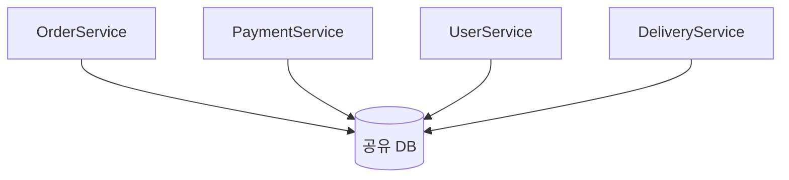
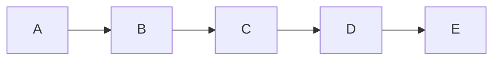
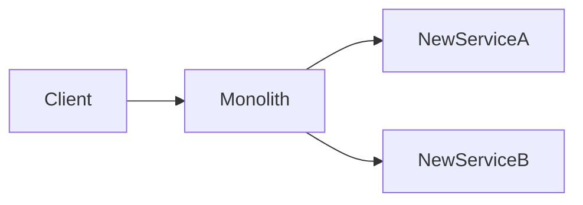
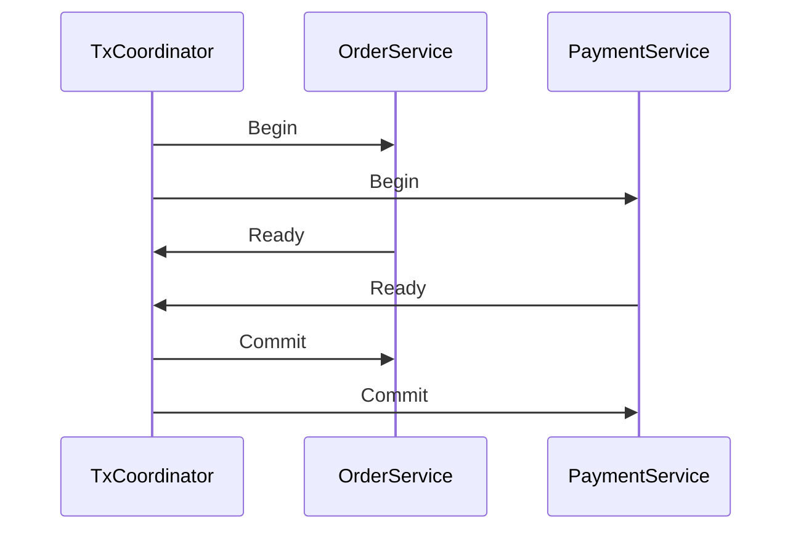

# 37장. 분산 모놀리스의 다양한 얼굴

지금까지 우리는 마이크로서비스를 설계하고
운영하는 방법을 보았다.

이제 마지막 부에서는 **함정**을 살펴본다.

가장 흔하고 가장 위험한 함정은 단 하나다.

> **나누었지만 결합은 그대로 남은 상태.**

이것이 분산 모놀리스다.

겉으로는 마이크로서비스처럼 보인다.
서비스가 여러 개고, 각자 배포되고, 각자 코드베이스를 가진다.
하지만 본질은 모놀리스다.

이 장에서는 분산 모놀리스가 가지는 여러 얼굴을 본다.

---

## 분산 모놀리스란

분산 모놀리스의 정의는 단순하다.

> 물리적으로는 분산되었지만
> 논리적으로는 하나로 묶여 있는 시스템.

징후:

* 한 서비스를 배포할 때 다른 서비스도 함께 배포해야 한다
* 한 서비스 장애가 다른 모든 서비스를 죽인다
* 코드 한 줄 바꾸려고 여러 서비스를 동시에 수정한다
* 서비스 간 호출 체인이 끝없이 길다

이 중 하나라도 해당된다면
이미 분산 모놀리스에 가깝다.

---

## 얼굴 1️⃣ — 공유 DB

가장 흔한 분산 모놀리스의 얼굴이다.



* 서비스는 나뉘었다
* DB는 하나다
* 서비스끼리 같은 테이블을 JOIN한다

### 왜 이렇게 되는가

* "서비스만 나누면 충분하다"는 오해
* DB 분리의 비용을 피하려 함
* 트랜잭션이 묶여야 한다고 생각함

### 증상

* 스키마 변경 시 여러 팀이 동시에 수정
* DB 장애가 모든 서비스로 전파
* 서비스 독립 확장이 불가능

### 해결

7장에서 다룬 데이터 분리를 단계적으로 진행한다.
이건 가장 비싼 일이지만, 가장 중요하다.

---

## 얼굴 2️⃣ — 긴 동기 호출 체인



서비스를 분리했는데
모든 호출이 동기 REST/RPC로 길게 이어진다.

### 왜 이렇게 되는가

* 비동기 설계에 대한 두려움
* "기다리지 않으면 어떻게 응답하지?"
* 이벤트 인프라가 없음

### 증상

* 한 서비스가 느려지면 전체가 느려진다
* 한 서비스가 죽으면 체인 전체가 죽는다
* 새 서비스가 추가될수록 응답 시간이 길어진다

13장에서 동기와 비동기의 결합도 차이를 다뤘다.

### 해결

* 동기 호출 체인 깊이를 제한
* 필요한 일은 이벤트로 분리
* Circuit Breaker로 전파 차단 (25장)

---

## 얼굴 3️⃣ — 함께 배포해야 하는 서비스들

"서비스 A를 배포할 때는 B와 C도 같이 배포해야 한다"

이 말이 자주 나온다면 분산 모놀리스다.

### 왜 이렇게 되는가

* API 변경이 호환되지 않는다
* 이벤트 스키마가 변경되었다
* 공유 라이브러리가 업데이트되었다

### 증상

* 배포가 다시 큰 이벤트가 된다
* 배포 일정 조율에 시간이 든다
* 한 팀이 다른 팀의 일정에 의존

### 해결

* API/이벤트 버전 관리
* 하위 호환을 보장하는 변경
* 공유 라이브러리 최소화

---

## 얼굴 4️⃣ — 공유 도메인 모델

```text
common-domain.jar
├─ User
├─ Order
├─ Payment
└─ ...
```

여러 서비스가 같은 도메인 모델 라이브러리를 쓴다.

* User 클래스를 모든 서비스가 import
* 라이브러리 버전을 다 같이 올린다

### 왜 이렇게 되는가

* "중복 코드 싫다"는 본능
* DDD를 잘못 이해함
* 코드 통일을 우선시함

### 증상

* 모델 변경이 모든 서비스의 변경
* 라이브러리 버전 충돌이 잦음
* 서비스 독립성이 사라짐

### 해결

> **각 Bounded Context는 자기 모델을 가진다.**

같은 이름의 개념도
각 서비스 안에서는 다른 형태일 수 있다.

이 원칙은 8장에서 다뤘다.

---

## 얼굴 5️⃣ — 모놀리스를 Gateway로 두는 구조



분리된 서비스들이 있지만
모든 입구는 모놀리스다.

### 왜 이렇게 되는가

* 변두리부터 떼어내다 보니 자연스럽게
* 인증·라우팅이 모놀리스에 묶여 있음
* Gateway 도입 비용을 미룸

### 증상

* 핵심 도메인 추출이 막힌다
* 모놀리스가 줄어들지 않는다
* 분리된 서비스의 독립성이 제한적

### 해결

6장에서 본 "Gateway를 위로 끌어올리기" 패턴.

---

## 얼굴 6️⃣ — 비즈니스 로직이 흩어져 있다

```text
주문 생성 로직:
- OrderService에 일부
- PaymentService에 일부
- API Gateway에 일부 검증
- BFF에 일부 변환
```

한 비즈니스 결정이 여러 서비스에 흩어진다.

### 왜 이렇게 되는가

* Gateway나 BFF에 로직을 슬쩍 넣음
* 서비스 경계가 책임이 아닌 기술로 나뉨
* 도메인 분석 없이 분리함

### 증상

* 비즈니스 변경 시 여러 서비스 수정
* 새 기능 추가가 점점 어려워짐
* 도메인 전문가가 코드를 못 따라감

### 해결

* 도메인 책임 단위로 경계 재정렬
* Gateway·BFF는 로직 없이 얇게 유지
* DDD의 Bounded Context 원칙 복귀

---

## 얼굴 7️⃣ — 분산 트랜잭션을 시도한다

서비스가 분리된 후
원래의 트랜잭션을 그대로 유지하려고 한다.



2PC, XA 같은 분산 트랜잭션을 사용한다.

### 왜 이렇게 되는가

* 최종 일관성을 받아들이지 못함
* "한 번에 끝내야 한다"는 강박
* Saga 패턴의 학습 비용을 피함

### 증상

* 시스템 전반의 성능 저하
* 락 경합 증가
* 가용성 하락
* 한 서비스 장애가 전체 트랜잭션 차단

### 해결

19장의 최종 일관성과
22장의 Saga 패턴을 받아들인다.

---

## 분산 모놀리스의 신호 — 자가 진단

다음 질문에 솔직하게 답해본다.

| 질문 | Yes / No |
|---|---|
| 한 서비스 배포가 종종 다른 서비스 변경을 요구한다 | |
| 한 서비스 장애가 전체 시스템을 멈춘다 | |
| 서비스끼리 같은 DB·테이블을 쓴다 | |
| 동기 호출 체인이 5단계 이상이다 | |
| 공유 도메인 라이브러리에 의존한다 | |
| 모놀리스가 여전히 입구 역할을 한다 | |
| 비즈니스 로직이 여러 서비스에 흩어져 있다 | |
| 2PC·XA 같은 분산 트랜잭션을 쓴다 | |

Yes가 3개 이상이면 분산 모놀리스에 가깝다.
4개 이상이면 그냥 분산 모놀리스다.

---

## 왜 분산 모놀리스가 가장 나쁜가

분산 모놀리스는 모놀리스보다 나쁘다.

| 구분 | 모놀리스 | 분산 모놀리스 | 마이크로서비스 |
|---|---|---|---|
| 운영 복잡도 | 낮음 | 높음 | 높음 |
| 결합도 | 높음 | 높음 | 낮음 |
| 독립 배포 | 불가 | 사실상 불가 | 가능 |
| 디버깅 | 쉬움 | 어려움 | 어려움 |
| 장애 격리 | 없음 | 없음 | 있음 |

분산 모놀리스는

* 모놀리스의 결합도를 가지면서
* 마이크로서비스의 운영 복잡도까지 짊어진다

> **둘 중 나쁜 점만 모은 구조다.**

---

## 빠져나오는 방법

분산 모놀리스에서 빠져나오는 길은
빅뱅 재구축이 아니다.

> **하나씩 결합도를 끊어 나간다.**

* 공유 DB라면 → 한 도메인의 데이터부터 분리
* 동기 체인이라면 → 한 호출을 이벤트로
* 함께 배포한다면 → 한 API의 호환성부터 잡기
* 공유 모델이라면 → 한 서비스의 모델부터 자기 모델로

빠져나오는 과정도 점진적이다.
그리고 4장에서 본 원칙이 그대로 적용된다.

---

## 이 장의 핵심

* 분산 모놀리스는 마이크로서비스 전환의 가장 흔한 실패 형태다
* 공유 DB, 긴 동기 호출, 함께 배포, 공유 모델, 모놀리스 Gateway, 흩어진 로직, 분산 트랜잭션 — 모두 같은 함정의 다른 얼굴이다
* 분산 모놀리스는 모놀리스의 결합도와 마이크로서비스의 운영 복잡도를 동시에 짊어진 상태다
* 빠져나오는 길은 빅뱅이 아니다 — 하나씩 결합도를 끊어 나간다
