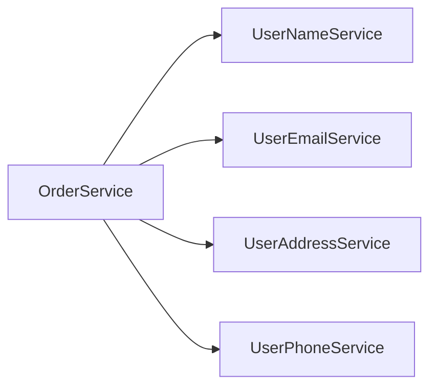

# 38장. Nanoservice — 너무 잘게 쪼갠 함정

37장에서 우리는 분산 모놀리스를 보았다.
"너무 안 나누어진" 상태의 함정이었다.

반대편에도 함정이 있다.

> **너무 잘게 나누어진 상태.**

이것이 Nanoservice다.

마이크로서비스라는 이름은 작음을 강조하지만
중요한 건 작음이 아니라 **독립성**이다.

작아지려고만 하면 다른 종류의 문제가 생긴다.

---

## Nanoservice란

Nanoservice는 보통 다음 특징을 가진다.

* 한 서비스의 책임이 하나의 함수 수준이다
* 단독으로는 비즈니스 의미가 없다
* 다른 서비스 없이는 동작하지 않는다
* 호출 빈도가 매우 잦다

예:

* `UserNameFetchService` — 사용자 이름 한 컬럼을 반환
* `EmailValidatorService` — 이메일 형식 한 가지 검증
* `PriceCalculatorService` — 가격 계산 한 가지

겉으로는 "단일 책임 원칙"이라고 부를 만하다.
하지만 마이크로서비스의 단위는 함수가 아니다.

---

## 왜 이런 일이 벌어지는가

### 1️⃣ "작을수록 좋다"는 오해

"마이크로"라는 말 때문에
작을수록 더 마이크로서비스적이라고 생각한다.

### 2️⃣ SRP를 잘못 적용

단일 책임 원칙(SRP)은 클래스 단위 원칙이다.
서비스 단위에 그대로 적용하면 너무 잘게 쪼갠다.

### 3️⃣ 재사용성에 대한 환상

"이 함수를 다른 데서도 쓸 거니까 서비스로 빼자."

대부분 그 "다른 데서"가 오지 않는다.
온다 해도 라이브러리로 충분하다.

### 4️⃣ 팀 분할의 과잉

"한 사람이 한 서비스를 맡으면 깔끔하지 않을까?"

조직 구조가 서비스 분할에 영향을 주는 건 자연스럽지만
극단으로 가면 서비스가 너무 많아진다.

---

## Nanoservice의 비용

### 1️⃣ 네트워크 호출이 폭증한다



한 주문을 처리하기 위해
사용자 정보 한 덩어리를 받으려고 4번 호출한다.

같은 일을 모놀리스에서는 함수 호출 4번이다.
함수 호출은 마이크로초.
네트워크 호출은 밀리초.

> **1000배 느려진다.**

### 2️⃣ 운영 부담이 폭증한다

서비스 100개와 서비스 10개의 운영 부담은
10배가 아니라 훨씬 더 크다.

* 100개의 배포 파이프라인
* 100개의 모니터링 대상
* 100개의 로그·메트릭
* 100개의 알람 룰

### 3️⃣ 변경이 더 어려워진다

작은 비즈니스 변경 하나가
여러 Nanoservice를 동시에 수정하게 만든다.

* 새 필드 추가 → 5개 서비스 수정
* API 변경 → 호환성 깨짐
* 함께 배포해야 한다

이러면 37장의 분산 모놀리스 함정에 빠진다.

> **너무 잘게 쪼개면 결국 분산 모놀리스가 된다.**

### 4️⃣ 디버깅이 악몽이 된다

한 요청이 20개 서비스를 거치면
어디서 문제가 났는지 찾기 어렵다.

27장의 관측 가능성이 필수가 되지만
관측해야 할 서비스가 너무 많아진다.

---

## 적절한 서비스 크기는

정답은 없다.
하지만 좋은 기준은 있다.

### 1️⃣ "두 피자 팀" 원칙

한 서비스는
**팀 하나가 책임질 수 있는 크기**여야 한다.

* 너무 작으면 한 사람도 남는다
* 너무 크면 한 팀이 다 못 본다

### 2️⃣ 비즈니스 책임 단위

한 서비스는
**비즈니스 사람에게 설명할 수 있는 단위**여야 한다.

* "이건 주문 서비스입니다" → OK
* "이건 사용자 이름 조회 서비스입니다" → 너무 작음

### 3️⃣ 독립 배포의 가치

서비스를 분리하는 비용 대비
독립 배포·확장의 가치가 있는가?

가치가 없다면 분리하지 않는다.

### 4️⃣ 단독으로 의미 있는가

서비스가 단독으로 비즈니스 가치를 만들어내는가?

* 주문 서비스 — 주문을 받는다 → OK
* 사용자 이름 서비스 — 이름을 반환한다 → 의미 없음

---

## Nanoservice를 통합하는 법

이미 너무 잘게 쪼개졌다면 어떻게 합칠 것인가.

### 단계 1 — 도메인 단위로 묶기

같은 도메인의 Nanoservice들을 묶는다.

```text
이전:
UserNameService
UserEmailService
UserAddressService
UserPhoneService

이후:
UserService (위 4개를 흡수)
```

### 단계 2 — 호출 빈도 기준으로 묶기

자주 함께 호출되는 서비스는
사실상 하나의 도메인일 가능성이 높다.

* 항상 같이 호출 → 합쳐도 된다
* 가끔 같이 호출 → 그대로 두기

### 단계 3 — 통합도 점진적으로

합치는 과정도 점진적이다.

* Strangler Fig를 거꾸로 적용
* 한 Nanoservice씩 흡수
* 호출 패턴이 안정될 때까지 검증

---

## 함수와 서비스의 차이

이 함정에서 빠져나오려면
함수와 서비스의 차이를 명확히 이해해야 한다.

| 구분 | 함수 | 서비스 |
|---|---|---|
| 단위 | 책임 한 줄 | 도메인 |
| 호출 비용 | 마이크로초 | 밀리초 |
| 배포 | 함께 | 독립 |
| 장애 격리 | 없음 | 있음 |
| 운영 부담 | 0 | 있음 |
| 단독 가치 | 없어도 됨 | 있어야 함 |

이 비용 차이를 인정하면
자연스럽게 서비스를 더 큰 단위로 그린다.

---

## "충분히 큰" 서비스의 모습

좋은 서비스 크기의 신호:

* 비즈니스 사람에게 한 마디로 설명 가능
* 한 팀이 책임지기에 적당
* 단독으로 의미 있는 일을 한다
* 외부 호출에 강하게 의존하지 않는다
* 자체 데이터 모델을 가진다

이 다섯 가지가 충족되면
서비스 크기는 적절하다.

---

## 이 장의 핵심

* 마이크로서비스의 단위는 함수가 아니라 비즈니스 책임이다
* 너무 잘게 쪼개면 네트워크 비용·운영 부담·변경 비용이 폭증한다
* Nanoservice는 결국 분산 모놀리스로 회귀한다
* 적절한 크기의 기준: 두 피자 팀, 비즈니스 단위, 독립 배포 가치, 단독 의미
* 이미 잘게 쪼개진 서비스는 도메인 단위로 다시 묶을 수 있다
